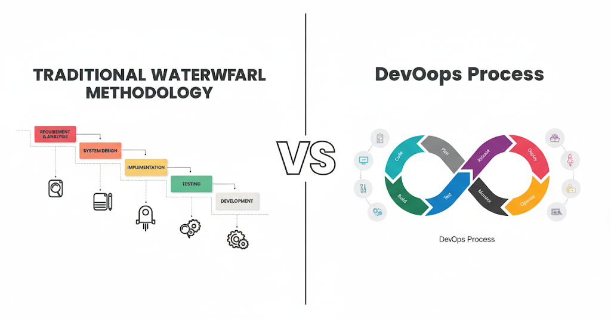
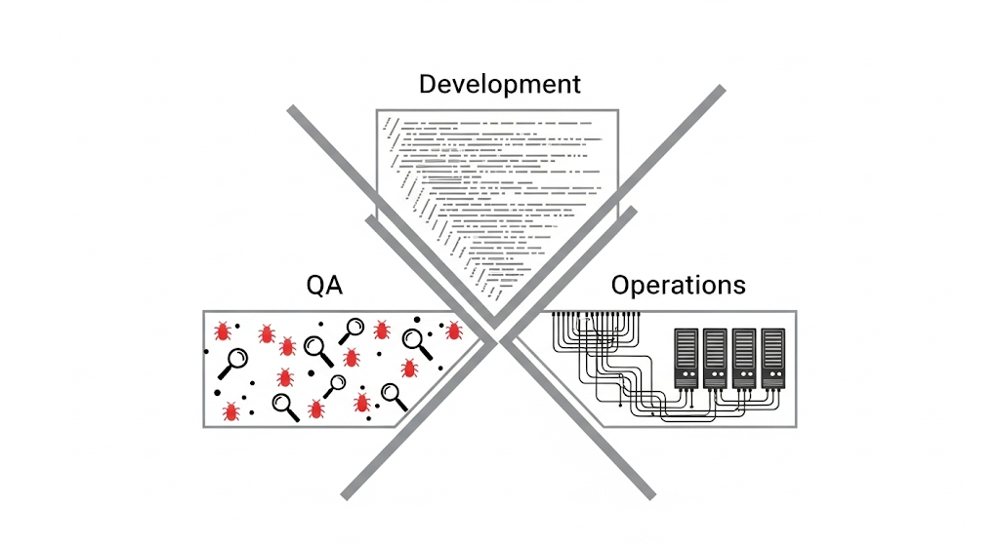

# Actividad 1: Introducción DevOps - DevSecOps

## Tiempo invertido
- Día 1: 01h:10min

## Desarrollo

### 1. DevOps vs Metodología Cascada Tradicional

DevOps representa una clara evolución respecto a la metodología cascada tradicional, especialmente para software en la nube. Mientras la cascada sigue un proceso lineal y secuencial donde debe completarse cada etapa antes de que pueda comenzar la siguiente, DevOps integra desarrollo y operaciones en ciclos continuos que permiten entregar aplicaciones y servicios a alta velocidad

#### DevOps acelera y reduce riesgo mediante:

- **Feedback continuo:** Los equipos DevOps obtienen visibilidad inmediata sobre cómo los usuarios en vivo interactúan con un sistema de software y usan esa información para desarrollar mejoras.
- **Automatización:** Los equipos usan un stack tecnológico y herramientas que les ayuda a evolucionar aplicaciones rapidamente y confiablemente.    

**Cascada Tradicional:** Sigue siendo razonable en sistemas con certificaciones regulatorias estrictas (aerospacial, dispositivos médicos) donde se requiere documentación exhaustiva y trazabilidad completa de cambios.

### 2. Ciclo tradicional de dos pasos y silos

#### Limitaciones del ciclo "construcción -> operación"

**1. Grandes cantidades y colas de defectos:**  La metodología cascada carece de adaptabilidad y el enfoque estricto en cumplir los requisitos originales desalienta errores y cambios.

**2. Asimetrías de información:** La falta de comunicación introduce interpretaciones muy variadas de requisitos y documentación entre miembros del equipo.

#### Anti-patrones identificados
**1. Throw over the wall:** Se entrega código sin contexto operativo, causando un ambiente tradicional de "nosotros" y "ellos" entre el equipo de desarrollo y operaciones.

**2. Seguridad como auditoría tardía:** Tradicionalmente las prácticas de seguridad como testing, escaneo de vulnerabilidades tendrían lugar al final, incrementando los costos de integración.

**Incidentes comunes**
- Retrabajos repetitivos: Sin feedback continuo, los mismos problemas de integración se repiten
- Degradaciones repetitivas: Sin integración continua, la estabilidad del código llega a cero muy rápido.

### 3. Principios y beneficios de DevOps

**CI/CD elementos clave:**

- **Tamaño de cambios pequeños:** DevOps promueve integración continua de código actualizado, binarios y dependencias en aplicaciones después de ser liberadas.

- **Pruebas automatizadas cercanas al código:** Se integran herramientas como "SonarQube, PHPStan, y OWASP Zap para análisis SAST y DAST" en el pipeline.

- **Colaboración:** Los equipos de desarrollo y operaciones colaboran cercanamente, comparten muchas responsabilidades y combinan sus flujos de trabajo.

#### Práctica alimentando decisiones del pipeline:
Las retrospectivas informan umbrales de quality gates: si las retrospectivas revelan 40% de bugs por validación insuficiente, se ajusta el umbral de cobertura de pruebas de 70% - 85% o dependiendo del equipo.

**Como recolectarlo:**
- Metadatos de PRs (timestamps de aprobación)
- Logs de CI/CD (timestamps de inicio/fin de despliegue)

### DevOps vs Cascade

La metodología Cascada Tradicional representa un proceso lineal y secuencial, donde cada fase se completa una tras otra sin retorno, lo que genera una colaboración limitada y entregas lentas. Por lo contrario, DevOps, simboliza un ciclo continuo e integrado, destacando la colaboración constante entre equipos, la entrega rápida de valor y la automatización de procesos clave, lo que se traduce en mayor agilidad y eficiencia.

### Silos equipos

Las secciones separadas simbolizan a los equipos de Desarrollo, QA (control de calidad) y Operaciones, cada uno aislado y enfocado en sus propias tareas, como las líneas de código, la detección de errores y la gestión de servidores. Las barreras en el centro ilustran la falta de comunicación y la desconexión entre ellos, lo que puede causar retrasos en el flujo de trabajo.