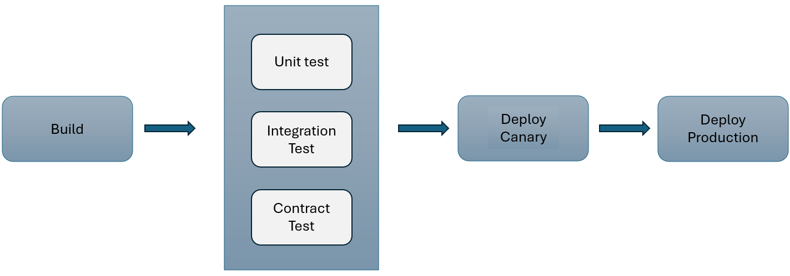
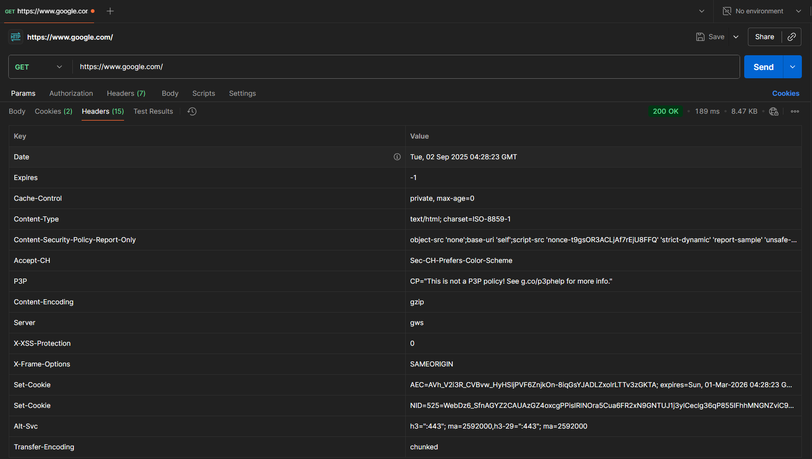
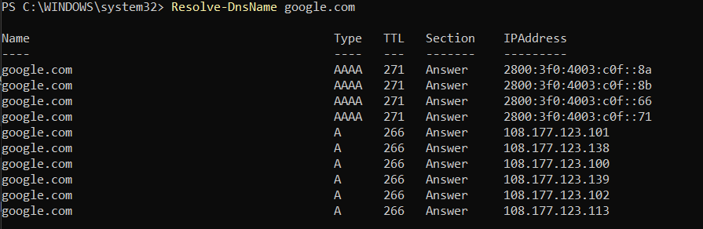
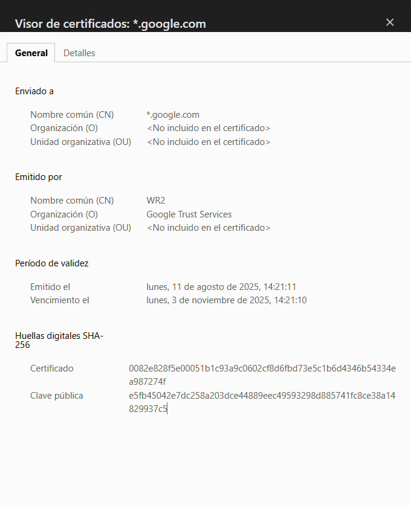
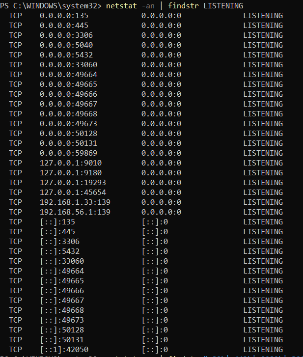
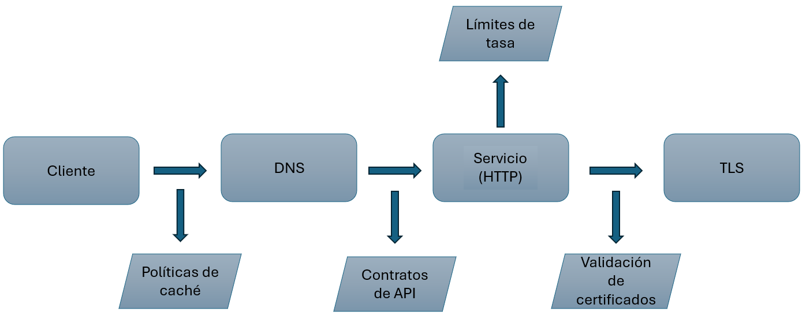

# Actividad 1: Introducción DevOps - DevSecOps

## Tiempo invertido
- Día 1: 01h:10min
- Día 2: 02:30min
- Día 3: 02:30min

## Desarrollo

## Día 1: Investigación y comparativos

### 1. DevOps vs Metodología Cascada Tradicional

DevOps representa una clara evolución respecto a la metodología cascada tradicional, especialmente para software en la nube. Mientras la cascada sigue un proceso lineal y secuencial donde debe completarse cada etapa antes de que pueda comenzar la siguiente, DevOps integra desarrollo y operaciones en ciclos continuos que permiten entregar aplicaciones y servicios a alta velocidad

#### DevOps acelera y reduce riesgo mediante:

- **Feedback continuo:** Los equipos DevOps obtienen visibilidad inmediata sobre cómo los usuarios en vivo interactúan con un sistema de software y usan esa información para desarrollar mejoras.
- **Automatización:** Los equipos usan un stack tecnológico y herramientas que les ayuda a evolucionar aplicaciones rapidamente y confiablemente.    

**Cascada Tradicional:** Sigue siendo razonable en sistemas con certificaciones regulatorias estrictas (aerospacial, dispositivos médicos) donde se requiere documentación exhaustiva y trazabilidad completa de cambios.

### 2. Ciclo tradicional de dos pasos y silos

#### Limitaciones del ciclo "construcción -> operación"

**1. Grandes cantidades y colas de defectos:**  La metodología cascada carece de adaptabilidad y el enfoque estricto en cumplir los requisitos originales desalienta errores y cambios.

**2. Asimetrías de información:** La falta de comunicación introduce interpretaciones muy variadas de requisitos y documentación entre miembros del equipo.

#### Anti-patrones identificados
**1. Throw over the wall:** Se entrega código sin contexto operativo, causando un ambiente tradicional de "nosotros" y "ellos" entre el equipo de desarrollo y operaciones.

**2. Seguridad como auditoría tardía:** Tradicionalmente las prácticas de seguridad como testing, escaneo de vulnerabilidades tendrían lugar al final, incrementando los costos de integración.

**Incidentes comunes**
- Retrabajos repetitivos: Sin feedback continuo, los mismos problemas de integración se repiten
- Degradaciones repetitivas: Sin integración continua, la estabilidad del código llega a cero muy rápido.

### 3. Principios y beneficios de DevOps

**CI/CD elementos clave:**

- **Tamaño de cambios pequeños:** DevOps promueve integración continua de código actualizado, binarios y dependencias en aplicaciones después de ser liberadas.

- **Pruebas automatizadas cercanas al código:** Se integran herramientas como "SonarQube, PHPStan, y OWASP Zap para análisis SAST y DAST" en el pipeline.

- **Colaboración:** Los equipos de desarrollo y operaciones colaboran cercanamente, comparten muchas responsabilidades y combinan sus flujos de trabajo.

#### Práctica alimentando decisiones del pipeline:
Las retrospectivas informan umbrales de quality gates: si las retrospectivas revelan 40% de bugs por validación insuficiente, se ajusta el umbral de cobertura de pruebas de 70% - 85% o dependiendo del equipo.

**Como recolectarlo:**
- Metadatos de PRs (timestamps de aprobación)
- Logs de CI/CD (timestamps de inicio/fin de despliegue)

### DevOps vs Cascade

La metodología Cascada Tradicional representa un proceso lineal y secuencial, donde cada fase se completa una tras otra sin retorno, lo que genera una colaboración limitada y entregas lentas. Por lo contrario, DevOps, simboliza un ciclo continuo e integrado, destacando la colaboración constante entre equipos, la entrega rápida de valor y la automatización de procesos clave, lo que se traduce en mayor agilidad y eficiencia.

### Silos equipos

Las secciones separadas simbolizan a los equipos de Desarrollo, QA (control de calidad) y Operaciones, cada uno aislado y enfocado en sus propias tareas, como las líneas de código, la detección de errores y la gestión de servidores. Las barreras en el centro ilustran la falta de comunicación y la desconexión entre ellos, lo que puede causar retrasos en el flujo de trabajo.

## Día 2: Seguridad y despliegue

### Evolución a DevSecOps

#### SAST vs DAST

- **SAST(Static Application Security Testing):** 
    - Estático: Se aplica al código fuente y no ejecuta el código que está escaneando.
    - Análisis de patrones: Las herramientas SAST analizan patrones de código, flujo de datos y puntos de inyección potenciales contra una base de datos de vulnerabilidades conocidas.
    - Ubicación: Pre commit y build stages del pipeline.

- **DAST (Dynamic Application Security Testing):**
    - Dinámico: Simula ataques del mundo real enviando solicitudes automatizadas y payloads a la aplicación (similar a lo que haría un atacante malicioso).
    - Testing de caja negra: Prueba aplicaciones web mientras están ejecutándose para identificar vulnerabilidades de seguridad.
    - Ubicación: Staging y pre-production stages del pipeline.

### Gate mínimo de seguridad con umbrales cuantitativos:

#### Gate 1 - SAST: Vulnerabilidades Críticas

- **Umbral:** Vulnerabilidades críticas en componentes expuestos bloquea la promoción.
- **Justificación:** Vulnerabilidades críticas como "inyecciones SQL" representan riesgos graves. 

#### Gate 2 - DAST: Cobertura Mínima 

- **Umbral:** >= 80% de cobertura de pruebas dinámicas en rutas críticas de API
- **Justificación:** Cubre la mayoría de funcionalidades, reduciendo riesgos como XSS

### Política de excepción con caducidad:

Se aplica cuando no es posible corregir un hallazgo inmediatamente:

- Autorización: Lead Security + Tech Lead.
- Duración máxima: 7 días calendario.
- Plan de corrección: Implementar mitigación temporal (WAF, rate limiting) + parche definitivo.
- Responsable: Tech Lead asignado debe reportar progreso diario.
- Re-evaluación: Escaneo DAST obligatorio antes del vencimiento.

    > ****Teach Lead***: Desarrollador más experimentado del equipo.*  
    > ****Lead Security***: Encargado de las estrategias, políticas y sistemas de seguridad.*  
    > ****WAF*** (Web application firewall)*

### Evitar "teatro de seguridad"

Señales de eficacia

1. Reducción de hallazgos repetidos
    - Métrica: <= 5% de vulnerabilidades recurrentes entre sprints consecutivos.
    - Medición: Comparar informes de SAST/DAST entre despliegues consecutivos.

2. Tiempo de remediación efectivo
    - Métrica: <= 48hrs para vulnerabilidades críticas (desde detección hasta fix verificado).
    - Medición: Timestamping en pipeline (detección) + commit fix + nuevo escaneo limpio.

## CI/CD y estrategias de despliegue

La estrategia elegida para microservicios de autenticación es **Canary**. El servicio de autenticación es crítico pero permite validación gradual. Canary permite actualizaciones rápidas y mejoras, llevando a mayor eficiencia, gastos reducidos y confiabilidad aumentada.

### Tabla de riesgos vs mitigaciones

| Riesgo | Mitigación | 
| :--- | :--- | 
| Regresión funcional en autenticación | Validación de contrato OAuth2/JWT antes de promover canary | 
| Costo operativo de doble despliegue | Límite temporal: canary máximo 2 horas de convivencia | 
| Manejo de sesiones | Session draining + compatibilidad backward de tokens | 

#### KPI primario para el Gate
- Métrica técnica: Tasa de errores HTTP 5xx <= 0.1% 
- Ventana de observación: 1hr post despliegue canary
- Umbral de rollback: Si >0.1% durante 10min consecutivos -> rollback automático    

#### ¿Por qué coexisten métricas técnicas y de producto?

Aunque el KPI técnico (latencia, errores) se mantenga estable, una caída en métrica de producto como tasa de conversión de login (de 95% a 80%) indica problemas funcionales o de UX que el monitoreo técnico no detecta.

> *Un KPI (Key Performance Indicator), es una metrica medible que se usa para evaluar si un proceso, sistema o equipo esta cumpliendo con un objetivo especifico.*

### Canary en pipeline

Esta imagen ilustra un pipeline de despliegue continuo que incorpora una estrategia de lanzamiento canary para minimizar riesgos. El proceso comienza con la fase de Build (construcción) del software. Una vez construido, pasa por rigurosas pruebas automatizadas que incluyen Unit Tests, Integration Tests y Contract Tests para asegurar su calidad. Solo después de superar estas pruebas, el software se envía a un Deploy Canary (despliegue canario), donde una pequeña porción del tráfico (indicado como 10%) es redirigida a la nueva versión para monitorear su rendimiento en un entorno real. Si esta fase canary es exitosa y estable, se procede al Deploy Production (despliegue a producción), donde la nueva versión se lanza completamente (100% Rollout) a todos los usuarios, completando un ciclo de entrega seguro y eficiente.

## Día 3: Evidencia práctica y cierre

### Fundamentos prácticos sin comandos

#### 1. HTTP - Contrato observable

**Hallazgos reportados** (usando Postman en `https://www.google.com/`):

- **Método:** GET
- **Código de estado:** 200 OK
- **Cabeceras clave identificadas:** 
    - Cache-control: Influye en rendimiento porque permite que clientes almacenen respuestas sin ir al servidor en cada peticion.
    - Content-Security-Policy-Report-Only: El modo "Report-Only" permite a Google monitorear violaciones de CSP sin bloquear funcionalidad

#### 2. DNS - Nombres y TTL

> *Para obtener este resultado usamos el comando* Resolve-DnsName google.com *en PowerShell de Windows.*

**Hallazgos reportados** (usando `Resolve-DnsName` en PowerShell):
- **Tipo de registro**: A (Address record - IPv4)
- **TTL observado**: 266 segundos (4.4 minutos)
- **Dominio consultado**: `google.com`
- **Múltiples IPs balanceadas**: `108.177.123.101`, `108.177.123.138`, etc.

**Interpretación del impacto en rollbacks:**
El TTL de 266 segundos significa que Google puede ejecutar **rollbacks DNS rápidos** (máximo 4.4 minutos de propagación) vs TTL típicos de 3600s (1 hora). Esto permite:
- **Ventanas de inconsistencia cortas**: Durante rollbacks, usuarios ven versión anterior máximo 266s
- **Agilidad operativa**: Cambios de infraestructura se reflejan globalmente en <5 minutos
- **Trade-off**: Mayor frecuencia de consultas DNS vs velocidad de cambios

#### 3. TLS - Seguridad en tránsito

**Hallazgos reportados** (usando visor de certificados del navegador en `https://www.google.com`):
- **CN (Common Name)**: `*.google.com`
- **Vigencia**: Desde 11 agosto 2025 hasta 3 noviembre 2025
- **Emisora**: Google Trust Services

**Interpretación del impacto de fallo de validación:**
Si **no valida** la cadena de certificados ocurre:
- **Errores de confianza**: Navegador muestra "Tu conexión no es privada", bloqueando acceso por defecto
- **Riesgo MITM**: Atacantes pueden interceptar tráfico con certificados falsos sin detección automática
- **Impacto UX**: Usuarios enfrentan warnings críticos, ~70% abandona el sitio según métricas de usabilidad

#### 4. Puertos - Estado de runtime

**Hallazgos reportados** (usando `netstat -an | findstr LISTENING` en PowerShell):
- **Puerto 3306**: MySQL Database Server 
- **Puerto 445**: SMB/File Sharing de Windows 

**Interpretación para diagnóstico de despliegues:**
Esta evidencia ayuda detectar:
- **Despliegues incompletos**: Si aplicación esperada en puerto 8080 no aparece en lista → servicio no inició correctamente
- **Conflictos de puerto**: Puerto 3306 ocupado por MySQL previene deployment de otra app en mismo puerto → port binding failure  
- **Health check directo**: Puertos en estado LISTENING confirman servicios activos antes de pruebas funcionales, diagnóstico rápido de "¿está corriendo el servicio?"

#### 5. 12-Factor - Port binding, configuración, logs

- **Port binding:** parametrizado por variable de entorno (PORT=8080) en la configuración externa.

- **Logs:** enviados a stdout/stderr entonces el sistema de orquestación los recolecta, no deben escribirse en archivos locales con rotacion manual, porque rompe la portabilidad y dificulta el monitoreo centralizado.

- **Anti-patron:** credenciales dentro del codigo compromete la seguridad y rompe reproducibilidad.

#### 6. Checklist de diagnóstico (incidente simulado)

**Escenario**: Usuarios reportan intermitencia. Algunos acceden normalmente, otros experimentan lentitud y errores eventuales.

**Checklist de 6 pasos ordenados:**

| **#** | **Objetivo** | **Evidencia Esperada** | **Interpretación** | **Acción Siguiente** |
|-------|-------------------|----------------------|---------------------|------------------|
| **1** | Validar contrato HTTP | Carga bien, <2 segundos | Error 500 → app rota; No carga → red | Si falla: Paso 2. Si OK: Paso 4 |
| **2** | Verificar resolución DNS | Encuentra la dirección correcta | IP incorrecta → problema DNS | Si falla: limpiar caché, revisar DNS |
| **3** | Inspeccionar certificado TLS | Candado verde, certificado válido | Vencido → "sitio no seguro" | Si falla: renovar certificado urgente |
| **4** | Confirmar puertos/servicios | App y base de datos activas | No corriendo → servicio apagado | Si falla: reiniciar servicios |
| **5** | Analizar logs aplicación | Logs muestran errores específicos | Errores indican causa exacta | Según error: reiniciar/arreglar código |
| **6** | Verificar config runtime | URLs, claves API correctas | Config mala → no conecta servicios | Si falla: corregir config, redesplegar |

### Desafíos y arquitectura

#### Desafíos de DevOps y mitigaciones

**Tres desafíos principales de migrar a DevOps:**

1. **Cultural**: 45% de empresas tienen resistencia al cambio - equipos acostumbrados a trabajar separados
2. **Técnico**: Demasiadas herramientas diferentes que no se comunican entre sí  
3. **Reglas**: Balancear la entrega rápida vs cumplimiento de regulaciones de seguridad

**Riesgos y cómo evitarlos:**

1. Error critico en produccion por codigo defectuoso

    - Mitigacion: Rollback automatizado como kubectl rollout undo, pipelines con reversion preconfigurada.

    - Decision: si la metrica de salud cae >30% en los primeros 5 min, activar rollback inmediato.

2. Impacto masivo en usuarios por cambios no validados

    - Mitigacion: Despliegues graduales (canary release).

    - Decision: si el error rate en canary >2% sobre baseline, detener y aislar el cambio.

3. Errores no detectados por sesgo individual

    - Mitigacion: Revision cruzada de codigo.

    - Decision: ningun merge directo a main; cambios sensibles limitados a un subconjunto de pods/zonas hasta validacion.

#### Arquitectura mínima para DevSecOps

**Contribucion de cada capa a despliegues seguros y reproducibles**

1. **Cliente -> DNS**

    * Permite descubrimiento confiable de servicios.

    * DNSSEC asegura integridad de la resolución de nombres.

2. **DNS -> Servicio (HTTP)**

    * HTTP provee el contrato de comunicacion.

    * Y las politicas de cache garantizan coherencia entre entornos (staging/produccion).

3. **Servicio (HTTP) -> TLS**

    * TLS asegura confidencialidad e integridad de los datos.

    * Certificados reproducibles entre entornos.

4. **Controles adicionales**

    * Limites de tasa y la segmentacion reducen impacto en caso de error o ataque.

    * Contratos de API garantizan compatibilidad y evitan los cambios sorpresivos.

**Relación 12-Factor:**

- **Config por entorno**: `DNS_SERVER` diferente dev/prod, código idéntico. No se “hardcodea” en el código sino se inyecta por variables de entorno por ejemplo, comparar *diffs* mínimos entre entornos.

- **Logs centralizados**: Todas las capas envían logs al mismo dashboard para análisis unificado.