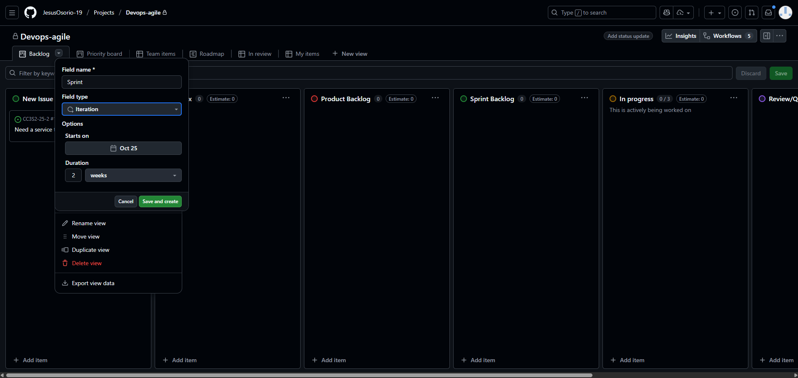
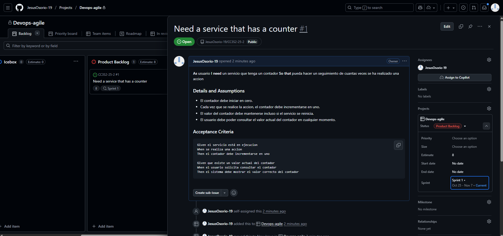
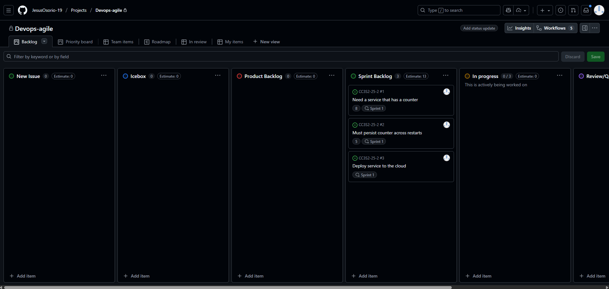
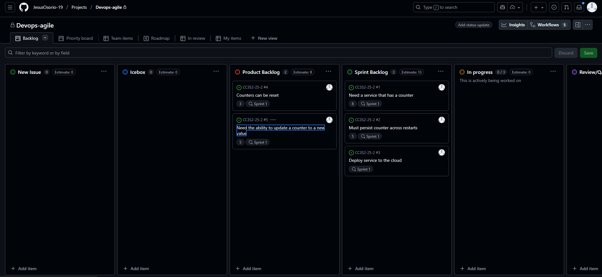

# Actividad 12: Gestión ágil de sprints con GitHub, planificación, ejecución y cierre de Sprints

## Introducción
En esta actividad, se configura sprints en GitHub, asigna story points a historias de usuario, se gestiona el sprint backlog eficientemente, se sigue el flujo diario para completar tareas, monitorear el progreso con un burndown chart y cerrar el sprint, manejando el trabajo incompleto y preparando el backlog para el próximo sprint.

## Parte 1

### 1. Configuración
GitHub configurará tres (3) sprints de forma predeterminada para poder comenzar. 
1. Para crear el sprint, hacemos click en el botón desplegable junto a Backlog. Luego, hacemos click en la flecha derecha junto a Fields y seleccionamos New field. 
2. Aparecerá una ventana emergente. Introducimos Sprint como el nombre del campo, eligimos Iteration como el tipo de campo, y dejamos la fecha de inicio en la fecha actual. 
3. Mantenemos la duración en dos semanas. Y finalmente, hacemos click en el botón Save and create.

### 2. Sprint plan

En esta parte, se creo un plan de sprint a partir de Product backlog. Esto normalmente se hace durante la reunión de planificación del sprint con todo el equipo, así que para este ejercicio, simularemos esa reunión.

### 3. Planificación

- La reunión de planificación del sprint ha avanzado bien. En las discusiones con el equipo de desarrollo, se ha estimado las siguientes dos historias en el Product Backlog y han determinado que ambas pueden caber en el sprint actual. Seleccionamos cada una de las siguientes historias en el Product Backlog, asígnamos los puntos de historia correspondientes y el mismo Sprint, y arrástramos al Sprint Backlog en el mismo orden.

- Basado en la velocidad del equipo, el equipo de desarrollo ha decidido que hay suficientes historias en el sprint, pero queda algo de tiempo en la reunión de planificación del sprint para estimar más historias. Añadimos las siguientes estimaciones a las historias en el Product Backlog.

> Kanban board final Parte 1.