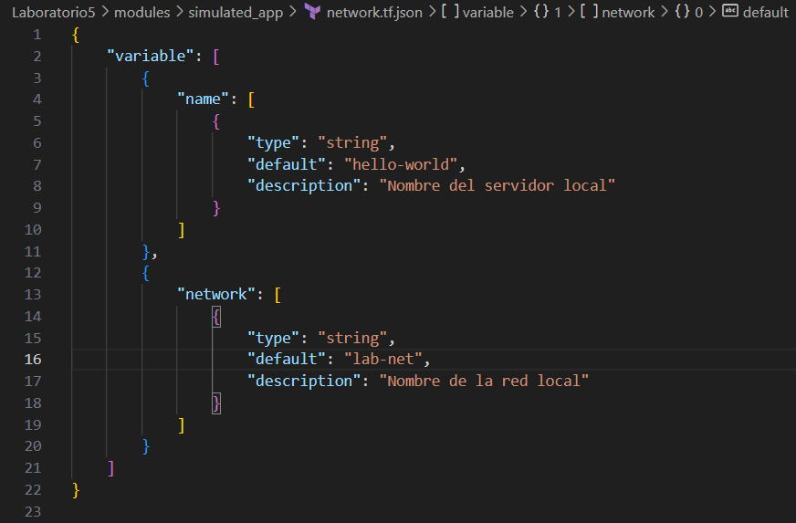

# Actividad 13: Escribiendo infraestructura como código en un entorno local con Terraform

## Objetivo

El objetivo principal es dominar los fundamentos de la Infraestructura como Código (IaC) usando Terraform en un entorno local. La actividad se enfoca en aprender a definir infraestructura, gestionar "drift" y migrar sistemas legacy a código versionable.

## Estructura de mi Actividad13

```
Actividad13-CC3S2/
├── Laboratorio5
|  ├── modules/
|  │   └── simulated_app/
|  |       ├── loadbalancer.tf.json    # drift avanzado (ejercicio 1)
|  │       ├── network.tf.json
|  │       └── main.tf.json
|  ├── environments/
|  │   ├── app1/
|  │   │   ├── network.tf.json
|  │   │   └── main.tf.json
|  │   ├── app2/
|  │   │   ├── network.tf.json
|  │   │   └── main.tf.json
|  |   ├── env3/                 # env3 depende de env2 (ejercicio 5 de la tabla fase3)
|  │   │   ├── network.tf.json
|  │   │   └── main.tf.json
|  |   ├── legacy-migrated/
|  │   │   ├── network.tf.json
|  │   │   └── main.tf.json
|  |   ├── staging1/             # entornos con prefijo "staging" y puerto 3000 (ejercicio 2)
|  │   │   ├── network.tf.json
|  │   │   └── main.tf.json
|  |   ├── staging2/             # entornos con prefijo "staging" y puerto 3000 (ejercicio 2)
|  │   │   ├── network.tf.json
|  │   │   └── main.tf.json
|  │   └── staging3/             # entornos con prefijo "staging" y puerto 3000 (ejercicio 2)
|  │       ├── network.tf.json
|  │       └── main.tf.json
|  ├── legacy/             # mini-reto migrando a iac
|  │   ├── config.cfg
|  │   └── run.sh
|  ├── scripts/
|  │   └── gitops_regenerate.sh  # Para GitOps Local (ejercicio 4)
|  ├── generate_envs.py
|  ├── terraform_schema.json     # Validacion de esquema JSON (ejercicio 3 )
|  └── migrate_legacy_to_iac     # migrando a iac
|
└── README.md
```

## Fase 0: Preparación 

1. **Revisa** el [laboratorio 5](https://github.com/kapumota/Curso-CC3S2/tree/main/labs/Laboratorio5)  :

   ```
   modules/simulated_app/
     ├─ network.tf.json
     └─ main.tf.json
   generate_envs.py
   ```
2. **Verifica** que puedes ejecutar:

   ```bash
   python generate_envs.py
   cd environments/app1
   terraform init
   ```

- Verificamos que podemos generar los entornos e iniciar `terraform`.
   

3. **Objetivo**: conocer la plantilla base y el generador en Python.

##  Fase 1: Expresando el cambio de infraestructura

* **Concepto**
Cuando cambian variables de configuración, Terraform los mapea a **triggers** que, a su vez, reconcilian el estado (variables ->triggers ->recursos).

* **Actividad**

  - Modifica en `modules/simulated_app/network.tf.json` el `default` de `"network"` a `"lab-net"`.

   - Modificamos
      

  - Regenera `environments/app1` con `python generate_envs.py`.

   - Al regenerar, vemos que `terraform plan` no detecta cambios ya que inicialmente nuestro `generate_envs.py` esta hardcodeado, así que modificamos para que tenga referencias a variables.

      - Este es el error que tenemos, `terraform plan` detecta net1 siempre y ese no es la modificación que hicimos.

         

      - Así que modificamos lo siguiente en `generate_envs.py`.

         

  - `terraform plan` observa que **solo** cambia el trigger en `null_resource`.

      - Ahora si hacemos `terraform plan` y observamos los cambios en el trigger en `null_resource`.

         

* **Pregunta**

  * ¿Cómo interpreta Terraform el cambio de variable?  
   Terraform interpreta el cambio de variable mediante un proceso de reconciliación que compara tres estados diferentes. Primero, Terraform lee el estado deseado definido en los archivos de configuración. Cuando encuentra una expresión como `${var.network}` en el archivo `main.tf.json`, busca la definición de esa variable en `network.tf.json` y obtiene su valor default, que en este caso es "lab-net". Luego, Terraform compara este estado deseado con el estado actual almacenado en el archivo `terraform.tfstate`. Si no existe un estado previo o si el valor ha cambiado, Terraform detecta esta diferencia. Finalmente, Terraform mapea este cambio de variable al atributo correspondiente del recurso, en este caso al trigger "network" del null_resource. Este proceso de reconciliación permite que Terraform entienda que aunque solo modificamos una variable, esto impacta directamente en el recurso que la utiliza, y por lo tanto, debe reflejar ese cambio en el plan de ejecución.

  * ¿Qué diferencia hay entre modificar el JSON vs. parchear directamente el recurso?  
   La diferencia principal radica en los principios de IaC. Cuando modificamos el JSON de configuración, estamos trabajando de manera declarativa siguiendo el paradigma de IaC. Esto significa que nuestros cambios quedan versionados en Git, permitiendo un historial completo de modificaciones, quién las hizo y cuándo. Además, estos cambios son reproducibles porque cualquier persona puede regenerar el mismo estado ejecutando el script de generación. Por otro lado, parchear directamente el recurso significa editar manualmente los archivos generados en la carpeta environments. Esto es problemático porque los cambios no quedan registrados en el código fuente, no son reproducibles, y lo peor es que la próxima vez que alguien ejecute `python generate_envs.py`, los cambios manuales realizados serán completamente sobreescritos y perdidos. El enfoque de modificar el JSON mantiene la integridad del código como fuente verídica, mientras que parchear directamente rompe este principio fundamental de IaC.
  
  * ¿Por qué Terraform no recrea todo el recurso, sino que aplica el cambio "in-place"?  
   Bueno en este caso específico, Terraform sí recrea el recurso completo, no aplica un cambio in-place. Esto se debe a que los triggers en un null_resource son atributos inmutables por diseño. Cuando el valor de un trigger cambia, Terraform no puede simplemente actualizar ese valor en el recurso existente, sino que debe destruir el recurso antiguo y crear uno nuevo con los nuevos valores de triggers. Esto es lo que vimos en el plan cuando apareció el símbolo "+" indicando "create". Los triggers están diseñados específicamente para forzar la recreación de recursos cuando ciertos valores cambian, lo cual es útil cuando quieres que un recurso se "re-ejecute" basándose en cambios de configuración.

  * ¿Qué pasa si editas directamente `main.tf.json` en lugar de la plantilla de variables?  
   Si editamos directamente el archivo `main.tf.json` en la carpeta environments/app1/, enfrentariamos varios problemas serios que violan los principios de IaC. El problema más inmediato es la pérdida de cambios: cuando se ejecute `python generate_envs.py` nuevamente, el script sobreescribirá completamente el archivo `main.tf.json` con los valores generados desde la plantilla, y nuestra edición manual desaparecerá sin dejar rastro. Además, se perdería la parametrización porque dejamos de usar variables y volvería a valores hardcodeados, lo que elimina toda la flexibilidad que proporcionan las variables. Esto también crearía inconsistencias entre entornos, porque mientras app1 puede tener los cambios manuales, app2, app3 y los demás entornos seguirán con los valores generados por el script, creando un estado impredecible del sistema. 

## Fase 2: Entendiendo la inmutabilidad

#### A. Remediación de 'drift' (out-of-band changes)

1. **Simulación**

   ```bash
   cd environments/app2
   # edita manualmente main.tf.json: cambiar "name":"app2" ->"hacked-app"
   ```

   - Hacemos el cambio.
   
      

2. Ejecuta:

   ```bash
   terraform plan
   ```

    Verás un plan que propone **revertir** ese cambio.
   
   - Ejecutamos `terraform plan`.

      

3. **Aplica**

   ```bash
   terraform apply
   ```
    Y comprueba que vuelve a "app2".

   - Comprobamos que regresa a "app2".

      
   

#### B. Migrando a IaC

* **Mini-reto**
 1. Crea en un nuevo directorio `legacy/` un simple `run.sh` + `config.cfg` con parámetros (p.ej. puerto, ruta).

   ```
     echo 'PORT=8080' > legacy/config.cfg
     echo '#!/bin/bash' > legacy/run.sh
     echo 'echo "Arrancando $PORT"' >> legacy/run.sh
     chmod +x legacy/run.sh
   ```

   - Creamos `run.sh` y `config.cfg`.

      | `run.sh`   | `config.cfg` |
      | -------- | ------- |
      |   |     |
      
  2. Escribe un script Python que:

     * Lea `config.cfg` y `run.sh`.
     * Genere **automáticamente** un par `network.tf.json` + `main.tf.json` equivalente.
     * Verifique con `terraform plan` que el resultado es igual al script legacy.

      - Archivo `migrate_legacy_to_iac.py`

         

         - Vemos que la migración a sido correcta, aplicamos `terraform init`, `plan` y `apply` luego de ejecutar nuestro `migrate_legacy_to_iac.py`.

            

            Comprobamos con nuestro script `run.sh` y nos da el mismo output.

            

## Fase 3: Escribiendo código limpio en IaC 

| Conceptos                       | Ejercicio rápido                                                                                               |
| ------------------------------------------ | -------------------------------------------------------------------------------------------------------------- |
| **Control de versiones comunica contexto** | - Haz 2 commits: uno que cambie `default` de `name`; otro que cambie `description`. Revisar mensajes claros. |
| **Linting y formateo**                     | - Instala `jq`. Ejecutar `jq . network.tf.json > tmp && mv tmp network.tf.json`. ¿Qué cambió?                 |
| **Nomenclatura de recursos**               | - Renombra en `main.tf.json` el recurso `null_resource` a `local_server`. Ajustar generador Python.           |
| **Variables y constantes**                 | - Añade variable `port` en `network.tf.json` y usarla en el `command`. Regenerar entorno.                     |
| **Parametrizar dependencias**              | - Genera `env3` de modo que su `network` dependa de `env2` (p.ej. `net2-peered`). Implementarlo en Python.    |
| **Mantener en secreto**                    | - Marca `api_key` como **sensitive** en el JSON y leerla desde `os.environ`, sin volcarla en disco.           |


1. Control de versiones comunica contexto  

   - Hacemos los dos commits con los cambios respectivos.

      

2. Linting y formateo

   Lo que cambió fue los espacios que hay en las lineas.  

   Para instalar `jq` en Ubuntu colocamos:

   ```sh
   sudo apt install -y jq
   ```

   - Vemos que hay mucho espacio entre el inicio de la línea

      

   - Al ejecutar `jq`.

      

3. Nomenclatura de recursos

   - Hacemos los cambios en `main.tf.json` y `generate_envs.py`.

      

   - Generamos nuevamente los entornos para verificar los cambios. Ahora sale `local_server` en lugar de `null_resource`.

      

4. Variables y constantes

   - AÑadimos la variable `port`.

      

   - Generamos nuevamente los entornos. Verificamos que ahora se muestra el puerto y que se use en command.

      

5. Parametrizar dependencias

   - Añadimos env3 con dependencia de env2.

      

   - Regeneramos entornos, pero antes modificamos `generate_envs.py` para que `network.tf.json` genere dinámicamente valores del entorno.

      

   - Verificamos la dependencia de network.

      

6. Mantener en secreto

   - Añadimos la variable api_key.

      

   - Añadimos la variable api_key en network_config.

      

   - Configuramos la variable de entorno y regeneramos los entornos.
      ```py
      export API_KEY="mi-api-key-super-secreta-123"
      ```

      Verificamos:

      
      
#### Fase 4: Integración final y discusión

1. **Recorrido** por:

   * Detección de drift (*remediation*).
   * Migración de legacy.
   * Estructura limpia, módulos, variables sensibles.
2. **Preguntas abiertas**:

   * ¿Cómo extenderías este patrón para 50 módulos y 100 entornos?

      Para escalar este patrón, adoptaría un diseño modular y jerárquico, reemplazando el script monolítico por un sistema de configuración centralizado (como YAML o JSON) que defina los 100 entornos y permita la herencia de configuraciones para evitar la duplicación. Gestionaría los 50 módulos en un catálogo o registro centralizado organizados por funcionalidad (redes, cómputo). La automatización se lograría con un pipeline de CI/CD para generar, validar (con esquemas JSON) y desplegar. Este proceso de generación se optimizaría usando paralelismo y un sistema de caché inteligente para regenerar solo los entornos modificados. Finalmente, establecería una nomenclatura y un sistema de etiquetado para organizar y filtrar los entornos.

   * ¿Qué prácticas de revisión de código aplicarías a los `.tf.json`?

      Para revisar los archivos .tf.json, implementaría un proceso que comienza con la automatización, usando `terraform fmt` para el formato y `terraform validate` para la sintaxis. Añadiría hooks con `jq` para validar la estructura JSON y en el proceso de pull request, exigiría explicaciones claras  (2+ personas para producción). El pipeline de CI/CD debe ejecutar `terraform plan` para que se vea el impacto real, complementado con un análisis de drift automático.

   * ¿Cómo gestionarías secretos en producción (sin Vault)?

      Mi enfoque se basaría en nunca almacenar secretos en Git, usando en su lugar variables de entorno. Para el desarrollo local, propondría usar archivos no versionados (como `~/.config/secure.json`), mientras que en producción se deben usar los servicios nativos del proveedor de nube (ej. AWS Secrets Manager, Google Secret Manager) para almacenar, rotar y auditar secretos. El acceso se controlaría estrictamente mediante el principio de privilegio mínimo con roles de IAM. Para Terraform, todas las variables sensibles se marcarían con `sensitive = true` para ocultarlas en logs y planes. La distribución de secretos al equipo se haría por canales encriptados (como 1Password) y se usarían credenciales diferentes para cada entorno (dev, prod) para aislar riesgos.

   * ¿Qué workflows de revisión aplicarías a los JSON generados?

      Combinaría una validación automatizada multinivel con una supervisión humana centrada en el impacto. El proceso iniciaría localmente con pre-commit hooks que usan `jq` para formatear, `jsonschema` para validar la estructura, y `terraform validate` para la sintaxis. Luego, el pipeline de CI/CD ejecuta `terraform plan -detailed-exitcode` para detectar cualquier cambio y lo compara con versiones anteriores. La revisión humana sería obligatoria para cambios en los módulos base o en el script generador, y los humanos deben inspeccionar el *diff* completo de los archivos generados, no solo el script. Para cambios grandes, exigiría un plan de impacto que muestre todos los entornos y una aprobación adicional. El despliegue sería gradual (dev/staging/prod), seguido de smoke tests automáticos post-aplicación.

#### Ejercicios

1. **Drift avanzado**

   * Crea un recurso "load\_balancer" que dependa de dos `local_server`. Simula drift en uno de ellos y observa el plan.

      - Simulamos el drift creando un entorno de prueba `environments/lb-test`. Cambiamos el trigger de `server1` del name. En `environments/lb-test/main.tf.json`.

         

      - Verificamos con `terraform plan`. El trigger `name` cambió y en consecuencia `load_balancer` como depende del ID de `server1`, tambien se marca para reemplazo

         

2. **CLI Interactiva**

   * Refactoriza `generate_envs.py` con `click` para aceptar:

     ```bash
     python generate_envs.py --count 3 --prefix staging --port 3000
     ```

      - Instalamos click.
      
      ```sh
      pip install click
      ```

      - Implementamos `click` en `generate_envs.py`.

         

      - Comprobamos que se generan nuevos entornos con prefijo staging y el puerto 3000.

         

3. **Validación de Esquema JSON**

   * Diseña un JSON Schema que valide la estructura de ambos TF files.
   * Lanza la validación antes de escribir cada archivo en Python.

      - Instalamos jsonchema.
      
      ```sh
      pip install jsonschema
      ```

      - Creamos el esquema de validación `terraform_schema.json` en la raíz del proyecto.

      - Lanzamos la validación.

         - Validamos antes de escribir.
         

         - Probamos la validación
         

4. **GitOps Local**

   * Implementa un script que, al detectar cambios en `modules/simulated_app/`, regenere **todas** las carpetas bajo `environments/`.
         
      - Implementamos el script `scripts/gitops_regenerate.sh` para que detecte los cambios y regenere todos los entornos si hay algún cambio.

      - Hacemos un commit con algún cambio en `modules/simulated_app/network.tf.json` para verificar que nuestro script funcione. Antes de esto le damos permisos de ejecución.

         ```sh
         chmod +x scripts/gitops_regenerate.sh
         ``` 

         Probamos: Hice un cambio mínimo en la línea de description de port que fue eliminar "la" e hice commit.

         
         Acá también notamos que nuestro hook de pre-commit ya está juncionando, el cual ejecuta `jq --check` por eso vemos que nos dice *Todos archivos JSON son válidos*.

         Luego ejecuté el script. Y vemos que regenera los entornos.

         

   * Añade un hook de pre-commit que ejecute `jq --check` sobre los JSON.

      - Creamos nuestro hook en `.git/hooks/pre-commit`

         

      - Creamos un archivo JSON de prueba para verificar el funcionamiento de nuestro hook.

         
         Vemos que el commit no se hizo porque un archivo JSON no es válido.

### Commits realizados

Realicé algunos commits necesarios para realizar la actividad.

   