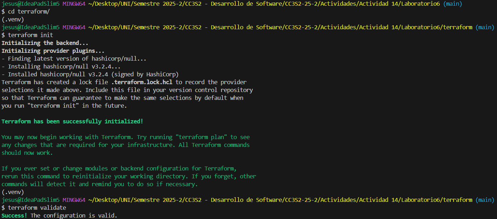
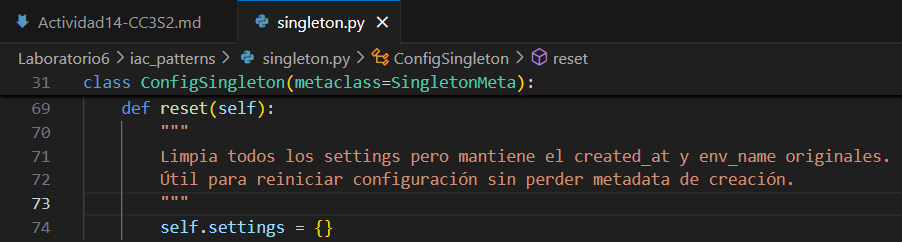
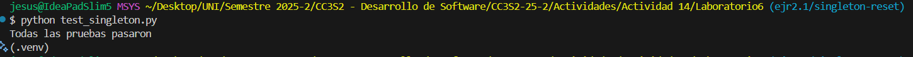
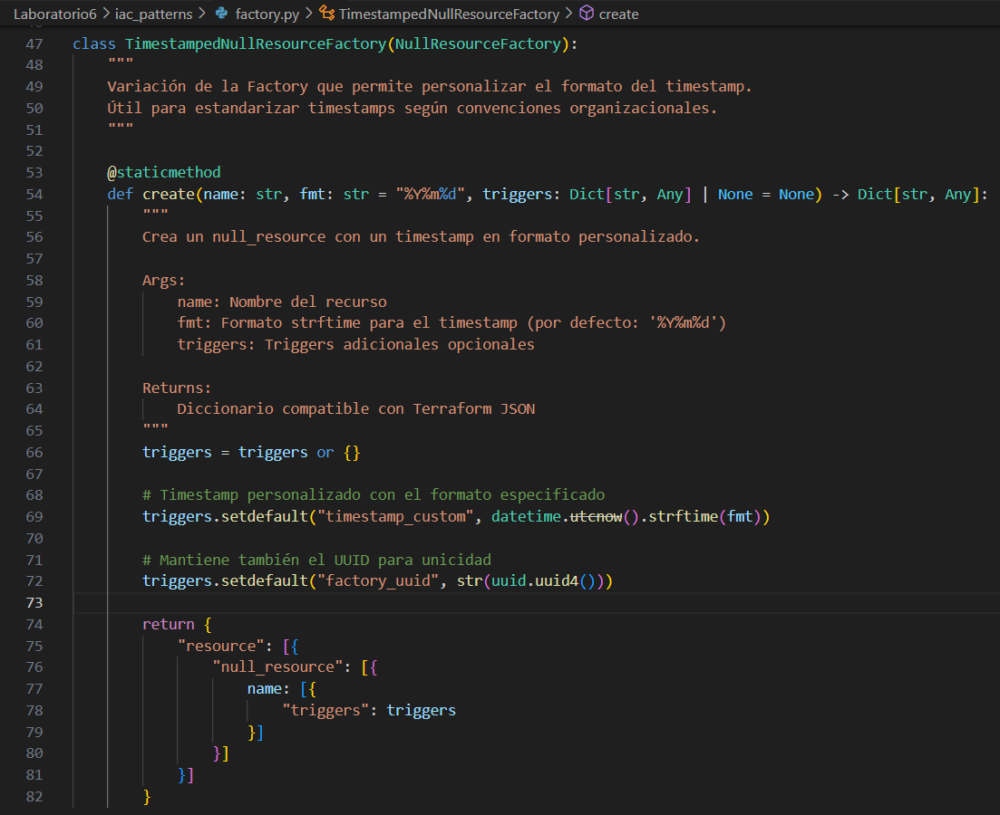
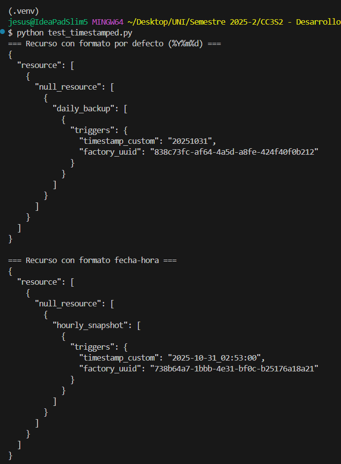
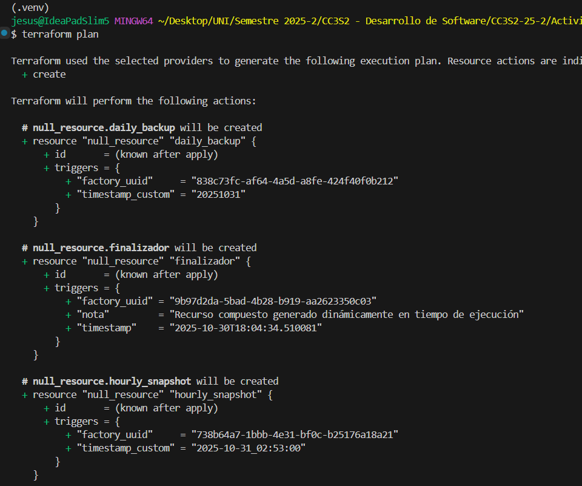
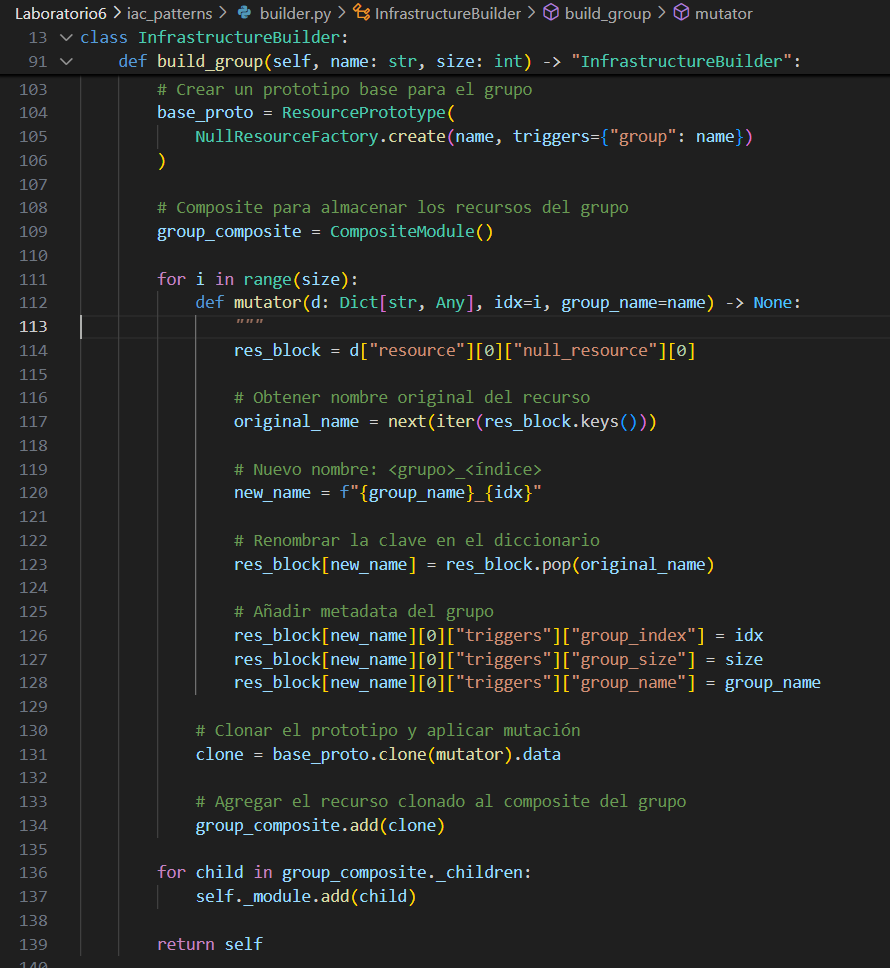
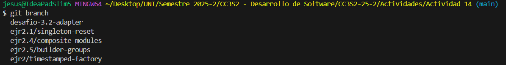

# Actividad:14 Patrones para módulos de infraestructura

## Fase 0: Preparación
Utiliza para esta actividad el siguiente [Laboratorio 6](https://github.com/kapumota/Curso-CC3S2/tree/main/labs/Laboratorio6) como referencia.

1. **Configura** el entorno virtual:

   ```bash
   python -m venv .venv && source .venv/bin/activate
   pip install --upgrade pip
   ```

2. **Genera** la infraestructura base y valida:

   ```bash
   python generate_infra.py
   cd terraform
   terraform init
   terraform validate
   ```

   - Luego de ejecutar `generate_infra.py` hacemos terraform init y validate.

      

3. **Inspecciona** `terraform/main.tf.json` para ver los bloques `null_resource` generados.


## Fase 1: Exploración y análisis

Para cada patrón, localiza el archivo correspondiente y responde (los códigos son de referencia):

### 1. Singleton

[Laboratorio6/iac_patterns/singleton.py](https://github.com/kapumota/Curso-CC3S2/blob/main/labs/Laboratorio6/iac_patterns/singleton.py)

* **Tarea**: Explica cómo `SingletonMeta` garantiza una sola instancia y el rol del `lock`.

  - La clase _SingletonMeta_ implementa el patrón singleton de manera **thread-safe** usando dos mecanismos clave:

    - Diccionario de instancias 
        ```py
        _instances: Dict[type, "ConfigSingleton"] = {}
        ```
        Almacena una única instancia por clase, comparte memoria ya que todas las llamadas a la clase consultan este diccionario y antes de crear una instancia, verifica si ya existe una instancia.

    - El método call controlado

        ```py
        def __call__(cls, *args, **kwargs):
            with cls._lock:
                if cls not in cls._instances:
                    cls._instances[cls] = super().__call__(*args, **kwargs)
            return cls._instances[cls]
        ```
        Verifica si la clase ya tiene una instancia en `_instances`. Si no existe una instancia lo crea y si existe siempre devolverá la misma instancia.

  - El `with cls._lock` nos garantiza que:

      - Solo un hilo pueda ejecutar la verificación y creación simultáneamente.        
      - La operación _verificar + crear_ sea indivisible.
      - El estado de `_instances` siempre sea coherente.           

    Esta implementación de lock nos garantiza que `ConfigSingleton` tenga solamente una instancia sin importar cuántos hilos se intenten crear en simultáneo.

### 2. Factory

[Laboratorio6/iac_patterns/factory.py](https://github.com/kapumota/Curso-CC3S2/blob/main/labs/Laboratorio6/iac_patterns/factory.py)

* **Tarea**: Detalla cómo factory encapsula la creación de `null_resource` y el propósito de sus `triggers`.

  La  clase `NullResourceFactory` encapsula por completo la creación de recursos Terraform mediante:

    - La abstracción de la complejidad estructural

        ```py
        return {
            "resource": [{
                "null_resource": [{
                    name: [{
                        "triggers": triggers
                    }]
                }]
            }]
        }
        ```

    - Método estático simple
        - Un solo método `create` para todos los recursos.
        - Solo requiere `name` ya que los triggers son opcionales.
        - Factory añade de forma automática triggers que son esenciales.
    
    - La estructura JSON se genera automaticamente. Factory construye la estructura que Terraform espera.

    Los triggers en `null_resource` son fundamentales para el control de estado en Terraform:

    - Detecta cambios
        ```py
        triggers.setdefault("factory_uuid", str(uuid.uuid4()))
        triggers.setdefault("timestamp", datetime.utcnow().isoformat())
        ```
        Esto funciona de la siguiente manera:
        - Compara los valores de triggers entre ejecuciones.
        - Si cualquier trigger cambia, el recurso se recrea.
        - Y si no cambian pues permanecen intacto.

    - Triggers automáticos por defecto
        ```json
        "factory_uuid": "41e29381-c52e-4bc7-a06a-50cd40189be6"
        ```
        Como vemos en `terraform/main.tf.json` se define un identificador único para todos los bloques de `null_resource`. Esto nos garantiza unicidad de recurso.

        ```json
        "timestamp": "2025-10-30T18:04:34.510081"
        ```
        Tenemos una marca temporal con el propósito de rastrear cuando se generó el recurso y que nos permite forzar recreación basada en tiempo.

### 3. Prototype

[Laboratorio6/iac_patterns/prototype.py](https://github.com/kapumota/Curso-CC3S2/blob/main/labs/Laboratorio6/iac_patterns/prototype.py)

* **Tarea**: Explica cómo el **mutator** permite personalizar cada instancia.

  - El parámetro `mutator` en el método `clone` implementa un patrón de callback que permite modificar cada clon de forma única y controlada.

      ```py
      def clone(self, mutator=lambda d: d) -> "ResourcePrototype":
      # 1. Crea una copia profunda independiente
      new_dict = copy.deepcopy(self._resource_dict)
        
      # 2. Aplica la función mutadora al clon
      mutator(new_dict)
        
      # 3. Retorna nuevo prototipo con cambios aplicados
      return ResourcePrototype(new_dict)
      ```
        
      Le asigna un valor por defecto, función identidad.
      ```py
      mutator=lambda d: d  # No modifica nada, retorna el dict tal como está
      ```
      Entonces, el mutator es lo que convierte un prototipo estático en un factory flexible de recursos personalizados, manteniendo la integridad del original mientras permite variaciones ilimitadas en los clones.

### 4. Composite

[Laboratorio6/iac_patterns/composite.py](https://github.com/kapumota/Curso-CC3S2/blob/main/labs/Laboratorio6/iac_patterns/composite.py)

* **Tarea**: Describe cómo `CompositeModule` agrupa múltiples bloques en un solo JSON válido para Terraform.

  - La clase `CompositeModule` implementa el patrón Composite para unificar recursos individuales de Terraform en una estructura JSON válida.

    ```py
    def __init__(self) -> None:
    self._children: List[Dict[str, Any]] = []
    ```
    Crea una lista para almacenar recursos individuales que puede contener cualquier número de recursos.

    ```py
    def add(self, resource_dict: Dict[str, Any]) -> None:
    self._children.append(resource_dict)
    ```
    Y acá es donde se agrupa los recursos.

### 5. Builder

[Laboratorio6/iac_patterns/builder.py](https://github.com/kapumota/Curso-CC3S2/blob/main/labs/Laboratorio6/iac_patterns/builder.py)

* **Tarea**: Explica cómo `InfrastructureBuilder` orquesta Factory -> Prototype -> Composite y genera el archivo JSON final.

  - La clase `InfrastructureBuilder` implementa el patrón Builder que coordina Factory -> Prototype -> Composite en una secuencia fluida generando configuraciones Terraform completas. 

    **Flujo de orquestación:**  

    1. **Factory**: Recreación del recurso base
        ```python
        # En build_null_fleet()
        base_proto = ResourcePrototype(
        NullResourceFactory.create("placeholder")  # Factory crea el template
        )
        ```
        Se genera un `null_resource` estándar con triggers por defecto, proporciona la estructura base que será clonada múltiples veces y encapsula la complejidad de la estructura JSON de Terraform.

    2. **Prototype**: Clonación y personalización
        ```python
        for i in range(count):
        def mutator(d: Dict[str, Any], idx=i) -> None:
        res_block = d["resource"][0]["null_resource"][0]
        original_name = next(iter(res_block.keys()))
        new_name = f"{original_name}_{idx}"  # placeholder_0, placeholder_1, etc.
                
        # Renombra y personaliza
        res_block[new_name] = res_block.pop(original_name)
        res_block[new_name][0]["triggers"]["index"] = idx

        clone = base_proto.clone(mutator).data  # Prototype clona y muta
        ```
        Se clona el recurso base sin modificar el original, personaliza cada clon con nombre único (`placeholder_0`, `placeholder_1`, etc.) y añade triggers específicos (índice único por recurso).

    3. **Composite**: Agregación en módulo
        ```python
        # Agregamos el recurso clonado al módulo compuesto
        self._module.add(clone)  # Composite agrega cada recurso
        ```
        Se recolecta todos los recursos individuales, mantiene la estructura unificada y prepara para exportación como JSON único.


## Fase 2: Ejercicios prácticos 

### Ejercicio 2.1: Extensión del Singleton

* **Objetivo**: Añadir un método `reset()` que limpie `settings` pero mantenga `created_at`.

    - Se añade método `reset()`:

        
        Solo limpiamos `settings` ya que los atributos `created_at` y `env_name` son metadata de la instancia singleton que debe persistir.


    - Se añade un archivo de validación `test_singleton.py` y ejecutamos:
    


### Ejercicio 2.2: Variación de la Factory

* **Objetivo**: Crear `TimestampedNullResourceFactory` que acepte un `fmt: str`.

    - Implementamos esta nueva clase en `factory.py` la cual hereda de `NullResourceFactory` para reutilizar la lógica base. El uso del `strftime` convierte el datetime a string según el formato. Y mantiene UUID para asegurar unicidad aunque el timestamp sea el mismo.

        

* **Prueba**: Genera recurso con formato `'%Y%m%d'` y aplica `terraform plan`.

    - Generamos los recursos con el formato requerido:

        

    - Aplicamos `terraform plan`.

        

### Ejercicio 2.3: Mutaciones avanzadas con Prototype

* **Objetivo**: Clonar un prototipo y, en el mutator, añadir un bloque `local_file`.
* **Referencia**:

  ```python
  def add_welcome_file(block: dict):
      block["resource"]["null_resource"]["app_0"]["triggers"]["welcome"] = "¡Hola!"
      block["resource"]["local_file"] = {
          "welcome_txt": {
              "content": "Bienvenido",
              "filename": "${path.module}/bienvenida.txt"
          }
      }
  ```
* **Resultado**: Al `terraform apply`, genera `bienvenida.txt`.

### Ejercicio 2.4: Submódulos con Composite

* **Objetivo**: Modificar `CompositeModule.add()` para soportar submódulos:

    - Modificamos `composite.py` para que el método `export()` soporte tanto recursos(`resource`) como módulos(`module`).

        

### Ejercicio 2.5: Builder personalizado

* **Objetivo**: En `InfrastructureBuilder`, implementar `build_group(name: str, size: int)`:

    - Implementamos el nuevo método `build_group(name: str, size: int)` en `builder.py`:

        


## Fase 3: Desafíos teórico-prácticos

### 3.1 Comparativa Factory vs Prototype

* **Contenido** (\~300 palabras): cuándo elegir cada patrón para IaC, costes de serialización profundas vs creación directa y mantenimiento.

    - Archivo creado `Actividad 14/Comparativa_Factory_vs_Prototype.md` 

### 3.2 Patrones avanzados: Adapter (código de referencia)

* **Implementación**:

    - Se implementa el nuevo patrón adapter en `Laboratorio6/iac_patterns/adapter.py`

* **Prueba**: Inserta en builder y exporta un recurso `mock_cloud_bucket`.

    - Para esto añadimos la prueba en `Laboratorio6/test_adapter.py`, este archivo tiene 3 test:

        1. `test_basic_adapter()`: Demuestra la transformación básica null_resource → mock_cloud_bucket
        2. `test_adapter_in_composite()`: Muestra cómo usar múltiples adapters en un Composite
        3. `test_adapter_in_builder()`:  Cumple lo que pide el desafío - inserta mock_cloud_bucket en el Builder y exporta

### 3.3 Tests automatizados con pytest

* **Ejemplos**:

  ```python
  def test_singleton_meta():
      a = ConfigSingleton("X"); b = ConfigSingleton("Y")
      assert a is b

  def test_prototype_clone_independent():
      proto = ResourcePrototype(NullResourceFactory.create("app"))
      c1 = proto.clone(lambda b: b.__setitem__("f1", 1))
      c2 = proto.clone(lambda b: b.__setitem__("b1", 2))
      assert "f1" not in c2 and "b1" not in c1
  ```

### 3.4 Escalabilidad de JSON

* **Tarea**: Mide tamaño de `terraform/main.tf.json` para `build_null_fleet(15)` vs `(150)`.
* **Discusión**: impacto en CI/CD, posibles estrategias de fragmentación.

## Documentación

Agregamos distintas ramas para la solución de los ejercicios y algunos desafíos de la fase 3. Los cuales no están completos por falta de conocimiento.



Los ejercicos de la fase 2 tienen un archivo de prueba que ejecuta lo pedido, ejecutamos cada uno de estos para ver los resultados explicados en cada ejercicio respectivamente.

```sh
python test_singleton.py        # Ejr 2.1
python test_factory.py          # Ejr 2.2
python test_adapter.py          # Desafío 3.2
```