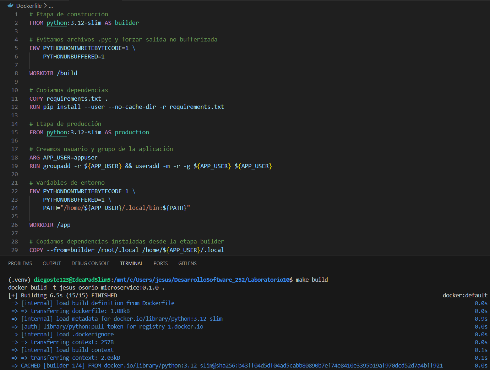
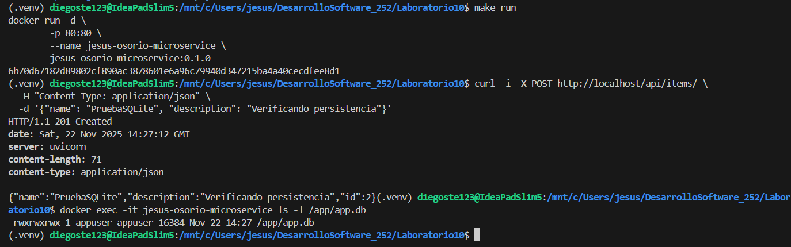
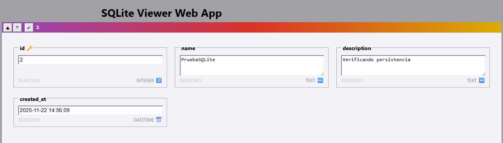
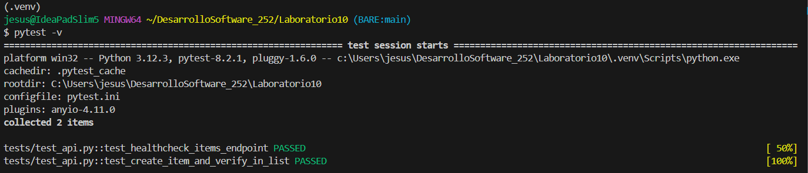
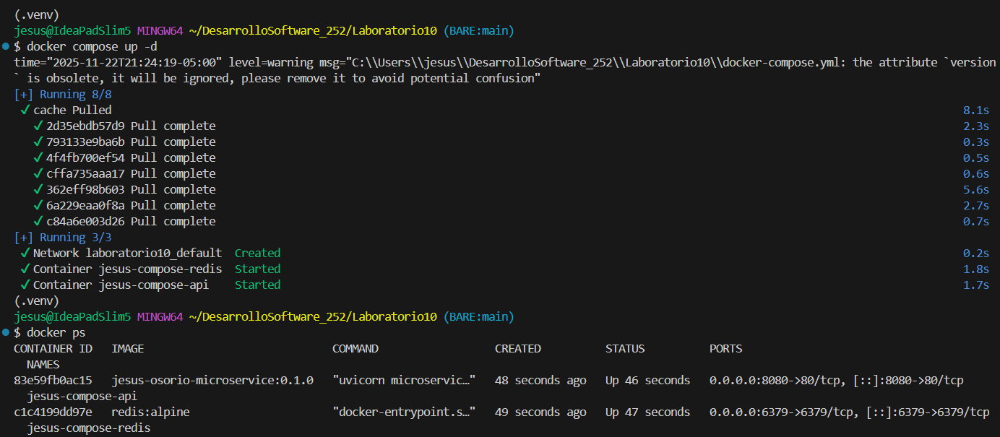
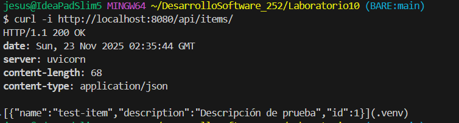
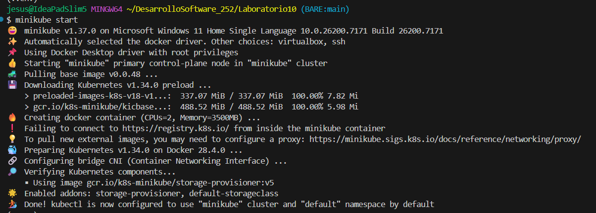
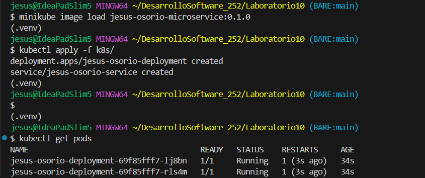
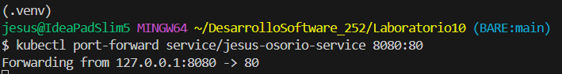

# Actividad 19: Arquitectura y desarrollo de microservicios con Docker (base) y Kubernetes

## Conceptualización de microservicios

### ¿Por qué microservicios?

- Explica la evolución: **Monolito -> SOA -> Microservicios.**

    La evolución de la arquitectura de software comienza con el **Monolito**, donde toda la lógica de negocio, interfaz y acceso a datos residen en una única unidad de despliegue, lo que simplifica el inicio pero genera un fuerte acoplamiento y dificultades para escalar al crecer. Luego de esto, surgió **SOA (Arquitectura Orientada a Servicios)**, el cual intentó dividir estas funciones en servicios reutilizables conectados por un bus central, aunque esto a veces resultaba en infraestructuras pesadas y cuellos de botella. Finalmente, se adoptó los **Microservicios**, los cuales perfeccionan la descentralización mediante unidades pequeñas y autónomas que poseen su propia base de datos y se comunican a través de protocolos ligeros (API REST), permitiendo así despliegues independientes, tolerancia a fallos y escalado granular.

- Presenta **2 casos** (por ejemplo, e-commerce con picos estacionales, SaaS multi-tenant) donde el monolito se vuelve costoso de operar.

    - **Caso 1: E-commerce con picos estacionales (Black Friday/Cyber Days)**  
        
        Durante un evento de alto tráfico (como los mencionados), tal vez solo el módulo de _Búsqueda de productos_ recibe el 90% de la carga. En un monolito, estás obligado a duplicar (escalar) toda la aplicación gigante (incluyendo módulos que nadie usa, como _Gestión de inventario_) solo para aguantar las búsquedas. Esto desperdicia enormes cantidades de CPU, RAM y dinero.  

        La solución más óptima sería el uso de **Microservicios** donde solo escalariamos el servicio de "Catálogo/Búsqueda", optimizando recursos.
    
    - **Caso 2: Plataformas SaaS de rápido crecimiento (Software as a Service)**

        Se tiene un equipo de 100 desarrolladores tocando el mismo código base. Entonces, si un equipo como el de _Pagos_ comete un error, puede bloquear el despliegue de las nuevas funciones del equipo de _Reportes_, retrasando el **Time-to-Market**.  
        
        Nuevamente la solución sería el uso de **Microservicios**, ya que cada equipo es dueño de su servicio. El equipo de _Pagos_ puede desplegar 10 veces al día sin bloquear ni coordinar con el equipo de _Reportes_.

### Definiciones clave

- Microservicio: unidad de despliegue independiente, una capacidad de negocio por servicio, contrato definido por API.

- Aplicación de microservicios: colección de servicios + gateway, balanceo de carga, observabilidad (métricas, logs, trazas).

### Críticas al monolito

- Dos problemas típicos: **cadencia de despliegue** reducida y **acoplamiento** que impide escalar partes de forma independiente.

### Popularidad y beneficios

- Cita por qué empresas grandes los adoptaron (por ejemplo, **aislamiento de fallos**, **escalado granular**, **autonomía de equipos**).

    - **Aislamiento de fallos**: Esto permite que si un servicio específico colapsa (por un error de código o sobrecarga), el error quede contenido allí y el resto del sistema siga operando, evitando así una caída total de la plataforma de negocio.

    - **Escalado granular**: A diferencia del monolito, nos permite asignar más recursos computacionales (CPU/RAM) a los servicios que tienen alta demanda en ese momento, optimizando costos e infraestructura.

    - **Autonomía de equipos**: Facilita que distintos equipos de desarrollo trabajen de forma separada, permitiéndoles elegir sus propias tecnologías y desplegar cambios en sus servicios sin necesidad de coordinar con toda la organización, lo que acelera la velocidad de entrega.

### Desventajas y retos

- Menciona 4 desafíos: **redes/seguridad**, **orquestación**, **consistencia de datos**, **testing distribuido**.

    La adopción de microservicios introduce complejidades a los sistemas distribuidos que no existen en los monolitos:

    - **Redes y Seguridad**: La comunicación entre módulos ya no es una llamada de función en memoria, sino tráfico de red que añade latencia y requiere cifrado y gestión de accesos entre servicios.

    - **Orquestación**: Gestionar el ciclo de vida, despliegue y escalado de cientos de contenedores manualmente es imposible, requiriendo herramientas como Kubernetes.

    - **Consistencia de datos**: Mantener la integridad de los datos es difícil porque las transacciones distribuidas no cumplen ACID(Atomicidad, Consistencia, Aislamiento, Durabilidad) fácilmente; un fallo en un servicio a mitad de un proceso puede dejar datos inconsistentes en otros.

    - **Testing distribuido**: Validar flujos de negocio que atraviesan múltiples servicios es mucho más complejo y frágil que probar una aplicación monolítica.

- Mitigaciones: **OpenAPI/contratos**, **pruebas contractuales**, **trazabilidad (Jaeger)**, **patrones de sagas**.

    Para contrarrestar estos desafíos, se aplican prácticas y patrones:

    - Uso de **OpenAPI** para definir contratos claros entre servicios.

    - Implementación de **pruebas contractuales** para asegurar que los cambios en un servicio no rompan a los consumidores.

    - Herramientas de **trazabilidad** (como Jaeger) para seguir el rastro de una petición a través de la red de servicios.

    - Uso de **patrones de sagas** para manejar transacciones distribuidas y compensar fallos en la consistencia de datos.

### Principios de diseño

- **DDD**: límites contextuales para delimitar servicios.
- **DRY** en microservicios: equilibrar librerías comunes vs **duplicación controlada** para reducir acoplamiento.
- Criterios de tamaño: **una capacidad de negocio por servicio** es mejor que reglas rígidas (evita dogmas como "una tabla por servicio").

## Bloque 1 y Bloque 2

1. `Dockerfile` modificado utilizando Multi-stage como pide la actividad, con etapas builder y production para que la imagen final no sea tan grande. Se implementa la creación de un usuario sin privilegios (appuser) y se asignan permisos (chown) sobre el directorio de trabajo para garantizar que el servicio pueda escribir en la base de datos SQLite ‘app.db’ sin ejecutarse como root.

    

2. Mostramos el funcionamiento del microservicio y la persistencia de datos. Vemos:

    1. La respuesta ‘HTTP 201 Created’ tras una petición POST manual con curl, confirmando la inserción de un nuevo registro.
    2. La verificación mediante ‘ls -l’ dentro del contenedor, que confirma la existencia del archivo ‘app.db’ con los permisos de lectura y escritura asignados correctamente al usuario appuser, validando la configuración del Dockerfile.

        

    Vemos que la `db` a sido creada.

    

3. Pytest exitoso. Se validan los dos escenarios de las pruebas: el endpoint de salud (healthcheck) y el flujo completo de creación y verificación de un ítem en la lista. El estado ‘PASSED’ en ambas pruebas confirma que la lógica y la integración con la base de datos SQLite funcionan correctamente dentro del entorno contenedorizado.

    

## Desarrollo y despliegue

### Docker Compose para desarrollo

**Teórico**

* Ventajas sobre `docker run` aislado: **declaratividad**, gestión automática de **redes**, **dependencias entre servicios**, soporte para **perfiles** (`profiles`) y entornos reproducibles.
* Conceptos clave: `services`, `volumes`, `networks`, `depends_on`, variables de entorno, **bind mounts** (para recarga en vivo) vs **named volumes** (para datos persistentes).

**Ejercicios (redacción)**

1. **Tres escenarios donde Compose mejora el flujo diario**:
   - **Staging local**: simular producción con múltiples servicios (API + caché + base de datos) en una sola instrucción.
   - **Pruebas de integración**: orquestar dependencias reales (por ejemplo Redis) sin configurar manualmente contenedores.
   - **Recarga en vivo**: bind mount del código fuente para desarrollo rápido con `uvicorn --reload`.

2. **Por qué usar perfiles**:
   - Separa entornos: `dev` (con recarga y volúmenes locales) vs `test` (imágenes limpias, sin bind mounts).
   - Evita ejecutar servicios innecesarios: `docker compose --profile test up`.

3. **Fragmento conceptual de `docker-compose.yml`** (sin código completo):
   - Servicio **api**: imagen personalizada, puerto `8080:80`, bind mount `./app:/app`, comando `uvicorn main:app --reload --host 0.0.0.0 --port 80`.
   - Servicio **cache** (por ejemplo Redis): imagen oficial, puerto interno 6379.
   - `depends_on: [cache]` en el servicio API para garantizar orden de arranque.

        ```yaml
        services:
        api:
            image: tu-nombre-microservice:0.1.0
            ports:
            - "8080:80"
            volumes:
            - ./app:/app
            command: uvicorn main:app --reload --host 0.0.0.0 --port 80
            depends_on:
            - cache

        cache:
            image: redis:alpine
            ports:
            - "6379"
        ```

## Bonus

- `docker-compose.yml` funcional y documentado.

    Comprobamos que nuestro `docker-compose.yml` levanta la imagen y el contenedor correctamente.

    

    - Hacemos una prueba rápida con `curl`, y como el puerto ahora es el 8080 debe ser así:

        

- Manifiestos K8s en `k8s/` con `kind` o `minikube` verificados.

    - Iniciamos `minikube`.

        

    - Ahora cargamos la imagen creada en `Minikube`. Este paso es importante ya que construimos la imagen en Docker local, Minikube no la "ve" automáticamente porque tiene su propio motor de Docker aislado. Tenemos que pasársela explícitamente:

        ```bash
        minikube image load jesus-osorio-microservice:0.1.0
        ```

    - Aplicamos los manifiestos con:

        ```bash
        kubectl apply -f k8s/
        ```

    - Y luego verificamos como se crearon los contenedores con `kubectl get pods` y que estén en estado `Running`.

        

    - Usamos el "Port Forward" el cual es un comando que crea un puente directo desde nuestra máquina al servicio de Kubernetes (hacemos esto ya que el método común de obtener URL [`minikube service jesus-osorio-service --url`] no me funcionaba):

        

    - Y para terminar probamos el servicio directamente en nuestro navegador de preferencia entrando a `http://localhost:8080/api/items/`.

        
        Con esto comprobamos que Minikube está ejecutando nuestro Pod.


> TODOS LOS ARCHIVOS ESTÁN EN [Lab10](https://github.com/JesusOsorio-19/CC3S2-25-2/tree/main/Laboratorios/Laboratorio10)