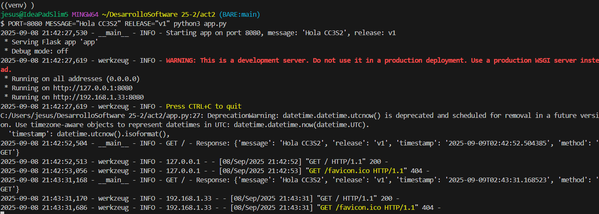
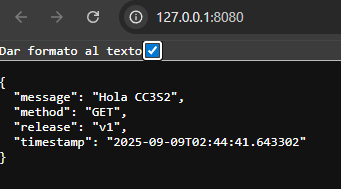
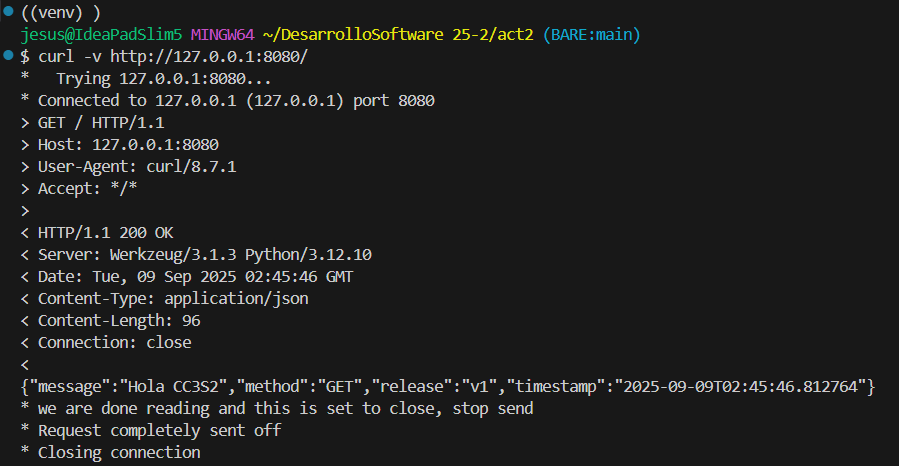
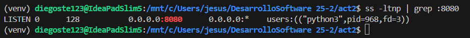
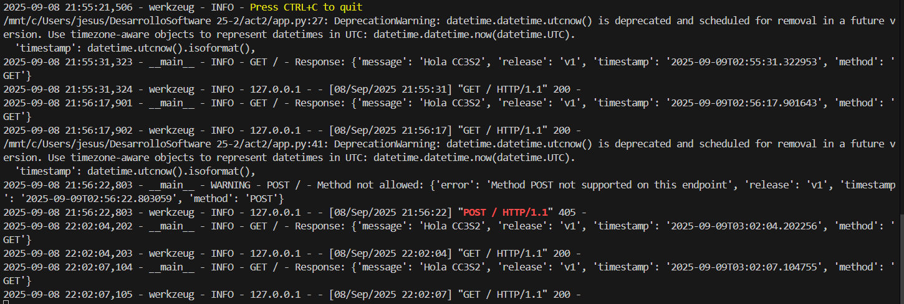
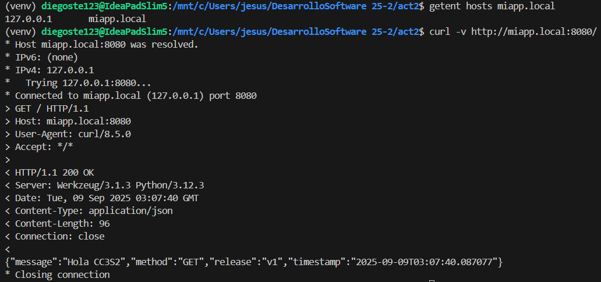
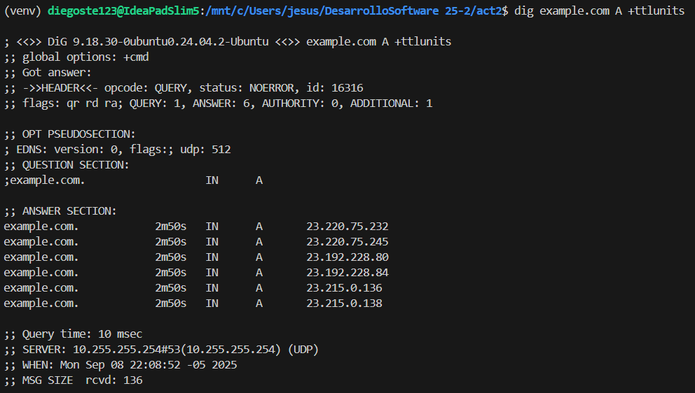

# Actividad 2: HTTP, DNS, TLS y 12-Factor (port binding, configuración, logs)

## 1) HTTP: Fundamentos y herramientas

1. **Levanta la app** con variables de entorno (12-Factor):
   `PORT=8080 MESSAGE="Hola CC3S2" RELEASE="v1" python3 app.py` (usa tu *venv*). 

    Creamos nuestro entorno virtual e instalamos flask con:  
    
    ```sh
    pip install flask
    ```

    Probamos la aplicación básica ejecutando

    ```sh
    PORT=8080 MESSAGE="Hola CC3S2" RELEASE="v1" python3 app.py
    ```

   

   Observamos que la app se ejecuta en el puerto 8080, los logs aparecen en stdout y mensaje de inicio en la configuración.

   Y verificamos que esté levantada.

   

2. **Inspección con `curl`:**

    * `curl -v http://127.0.0.1:8080/` (cabeceras, código de estado, cuerpo JSON).

    

    * `curl -i -X POST http://127.0.0.1:8080/` 

    

    En este caso no soportaria el metodo `POST` por eso nos muestra el codigo `405` y significa que *"el recurso existe, pero no admite ese método"* y muestra que solo esta permitodo `GET`, `HEAD` y `OPTIONS`.

    * **Pregunta guía:** ¿Qué campos de respuesta cambian si actualizas `MESSAGE`/`RELEASE` sin reiniciar el proceso?   

        Si actualizamos MESSAGE o RELEASE sin reiniciar la aplicación, la respuesta HTTP no cambia, seguira mostrando los valores iniciales porque las variables de entorno se leen solo al arrancar el proceso y se mantienen en memoria. 
        Para que la respuesta refleje los nuevos valores, es necesario detener y reiniciar la app con las variables actualizadas y esto es porque la configuración en 12-Factor App se inyecta en el arranque del proceso y no se recarga dinamicamente.

3. **Puertos abiertos con `ss`:**

    * `ss -ltnp | grep :8080` (evidencia del proceso y socket).

        

        - -ltnp es:
            - -l -> listening
            - -t -> TCP
            - -n -> no resuelve nombres
            - -p -> muestra procesos

4. **Logs como flujo:** Demuestra que los logs salen por stdout (pega 2–3 líneas). Explica por qué **no** se escriben en archivo (12-Factor).

    

## 2) DNS: nombres, registros y caché

**Meta:** resolver `miapp.local` y observar TTL/caché.

1. **Hosts local:** agrega `127.0.0.1 miapp.local` (Linux y/o Windows según tu entorno).

2. **Comprueba resolución:**

   * `getent hosts miapp.local` (muestra la base de resolución del sistema).

     

3. **TTL/caché (conceptual):** con `dig example.com A +ttlunits` explica cómo el TTL afecta respuestas repetidas (no cambies DNS público, solo observa).

    

4. **Pregunta guía:** ¿Qué diferencia hay entre **/etc/hosts** y una zona DNS autoritativa? ¿Por qué el *hosts* sirve para laboratorio?

    |                  | /etc/hosts           | Zona DNS autoritativa    |
    |------------------|----------------------|--------------------------|
    | Alcance          | Local (1 equipo)     | Red/global               |
    | Administra       | Usuario local        | Admin de red/servidor    |
    | Uso común        | Pruebas, desarrollo  | Resolución oficial       |

    El *hosts* sirve para laboratorio porque:

    - Permite realizar pruebas de resolución de nombres sin necesidad de tener un servidor DNS desplegado.

    - Es rápido de editar y los cambios son inmediatos (no requiere propagar configuraciones como el DNS).