# Solución con el script Respuesta-actividad2.sh

Este script es la solución completa y automatizada de la actividad 2. Automatiza todo el flujo end-to-end, desde la creación de la app hasta las pruebas TLS. Se puede ejecutar por partes o completo, particularmente opté ejecutarlo por partes.

## 1. Creamos venv y app.py

Primero hacemos ejecutable el script con el comando:
```sh
chmod +x Respuestas-actividad2.sh
```

Luego ejecutamos:
```sh
./Respuestas-actividad2.sh prepare
```

Se crea el entorno virtual en `miapp/.venv` y también la aplicación `miapp/app.py`

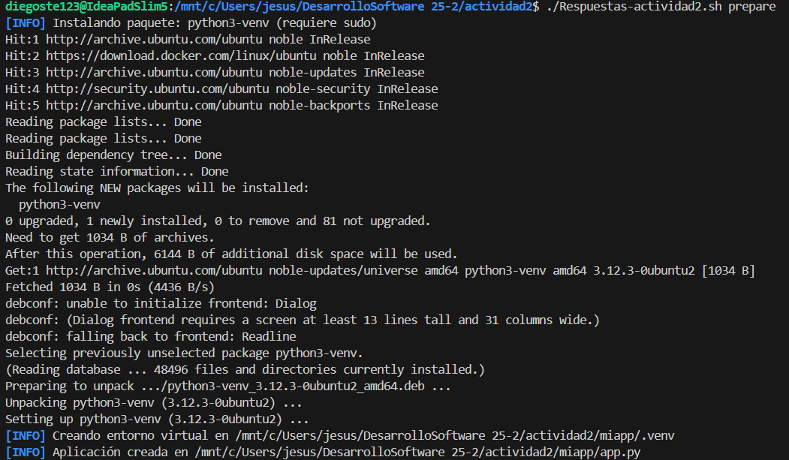

## 2. Iniciamos Flask en $PORT

Ejecutamos:

```sh
./Respuestas-actividad2.sh run
```

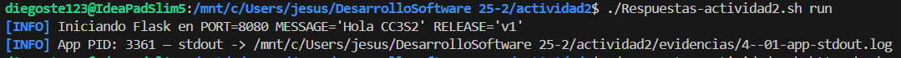

## 3. Evidenciamos con curl y ss

Ejecutamos:

```sh
./Respuestas-actividad2.sh http-checks
```

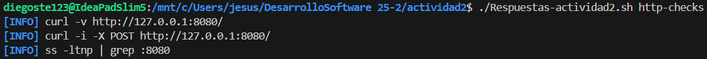

Añadimos `127.0.0.1 miapp.local` 

```sh
./Respuestas-actividad2.sh hosts-setup
```

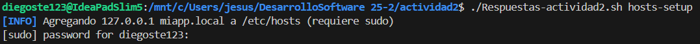

Comprobamos que a sido agregado.

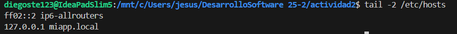

Ejecutamos 

```sh
./Respuestas-actividad2.sh dns-demo
```

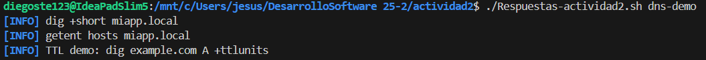

## Generamos certificados

```sh
./Respuestas-actividad2.sh tls-cert
```

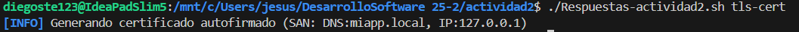

Encontraremos los certificados en `certs/`.

## Comprobamos nginx

En este paso fue donde obtuve problemas.

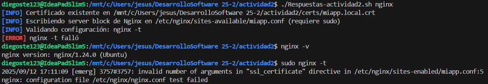

A pesar de tener nginx ya instalado me generaba un error. Al ejecutar `sudo nginx -t` nos sale un error, que nos indica que probablemente falta la ruta al archivo del certificado o hay un error de sintáxis.

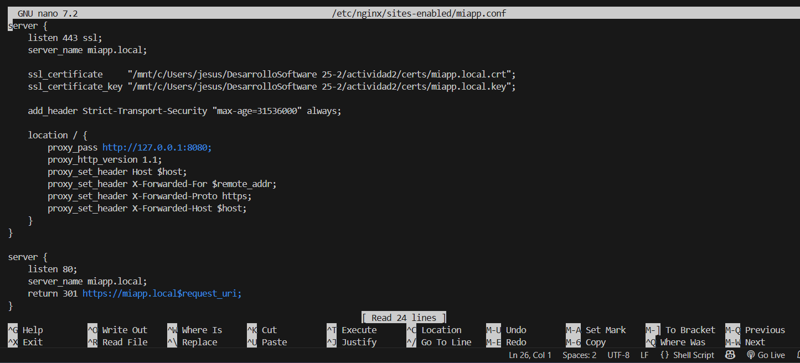

Revisando la ruta de los certificados, solucionamos el error colocando la ruta entre comillas. Tanto de `ssl_certificate` y `ssl_certificate_key`

Con esto `sudo nginx -t` ya no me daba un error.

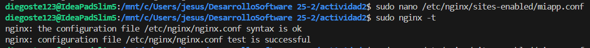

Al hacer esto y no tener error pensé que ya estaba solucionado, sin embargo el error persistia. 

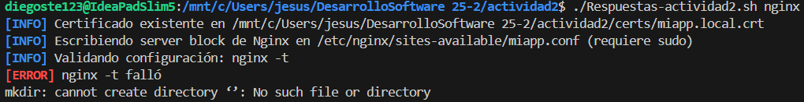

Ya que persiste el error, revisamos el archivo log generado por el script para ver el mensaje real de nginx -t. Luego de revisar esto nos indica que, aunque corregí la ruta en el archivo manualmente, el script la vuelve a escribir sin comillas, por lo que el problema regresa cada vez que ejecuto el script.

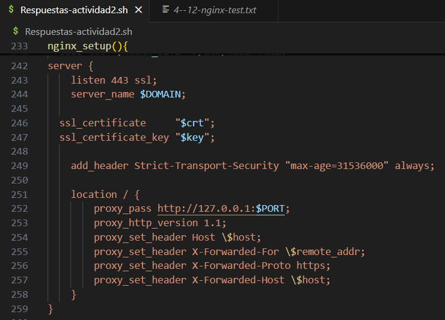

Añadimos comillas a `$crt` y `$key`. Ahora si funciona correctamente.

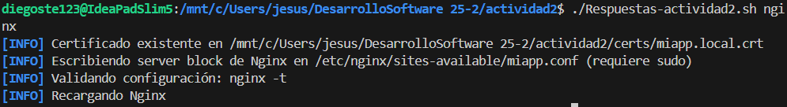

Verificamos en `evidencias/4--12-nginx-test.txt` que todo funciona correctamente.

