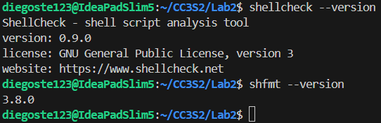

# Actividad 5: Construyendo un pipeline DevOps con Make y Bash

## Parte 1: Construir - Makefile y Bash desde cero

### Ejercicios

1. Ejecuta `make help` y guarda la salida para análisis. Luego inspecciona `.DEFAULT_GOAL` y `.PHONY` dentro del Makefile.  
   Comandos:

      ```bash
      mkdir -p logs evidencia
      make help | tee logs/make-help.txt
      grep -E '^\.(DEFAULT_GOAL|PHONY):' -n Makefile | tee -a logs/make-help.txt
      ```

   - Entrega: redacta 5-8 líneas explicando qué imprime `help`, por qué `.DEFAULT_GOAL := help` muestra ayuda al correr `make` sin argumentos, y la utilidad de declarar PHONY.

      El comando `make help` nos imprime una lista de los comandos disponibles en nuestro **Makefile**. `.DEFAULT_GOAL := help` le dice a make que cuando se ejectue solo `make` ejecuta automáticamente `make help`. Sin esta línea make ejecutaría el primer target que encuentre en **Makefile**, es una convención útil para que los usuarios vean inmediatamente qué pueden hacer. Los targets declarados como `.PHONY` no crean archivos con esos nombres. Sin `.PHONY` si existiera un archivo llamado `test`, make pensaría que el target ya está "actualizado", `make test` no se ejecutaría porque el archivo `test` existe. Y con `.PHONY` make ignora si existe un archivo con ese nombre.

2. Comprueba la generación e idempotencia de `build`. Limpia salidas previas, ejecuta `build`, verifica el contenido y repite `build` para constatar que no rehace nada si no cambió la fuente.
   Comandos:

   ```bash
   rm -rf out dist
   make build | tee logs/build-run1.txt
   cat out/hello.txt | tee evidencia/out-hello-run1.txt
   make build | tee logs/build-run2.txt
   stat -c '%y %n' out/hello.txt | tee -a logs/build-run2.txt
   ```

   - Entrega: explica en 4-6 líneas la diferencia entre la primera y la segunda corrida, relacionándolo con el grafo de dependencias y marcas de tiempo.

      En la 1ra corrida el archivo `out/hello.txt` no existe, por lo que make se ejecuta por completa. Crea el directorio `out/` y genera el archivo ejecutando el script Python. Y en la 2da corrida make compara las marcas de tiempo (timestamps), como `out/hello.txt` fue creado después que la última modificación de `src/hello.py`, make determina que el target está actualizado. Make usa esta regla de decisión:
      - Si el target no existe → se ejecuta
      - Si la dependencia es más nueva que el target → se ejecuta
      - Si el target es más nuevo que todas las dependencias → no hacer nada

3. Fuerza un fallo controlado para observar el modo estricto del shell y `.DELETE_ON_ERROR`. Sobrescribe `PYTHON` con un intérprete inexistente y verifica que no quede artefacto corrupto.
   Comandos:

   ```bash
   rm -f out/hello.txt
   PYTHON=python4 make build ; echo "exit=$?" | tee logs/fallo-python4.txt || echo "falló (esperado)"
   ls -l out/hello.txt | tee -a logs/fallo-python4.txt || echo "no existe (correcto)"
   ```

   - Entrega: en 5-7 líneas, comenta cómo `-e -u -o pipefail` y `.DELETE_ON_ERROR` evitan estados inconsistentes.

      - `-e`: Detiene la ejecución inmediatamente al primer comando que falle (código de salida ≠ 0). Sin -e, los comandos subsiguientes seguirían ejecutándose aún después de un error, pudiendo crear artefactos parciales o corruptos.
      - `-u`: Aborta si se referencia una variable no definida. Previene comportamientos impredecibles cuando una variable vacía se expande silenciosamente, como `rm -rf /*`.
      - `-o pipefail`: Propaga el código de error del primer comando que falle en un pipeline. Sin pipefail, `false | true` retorna 0 (éxito) porque solo importa el último comando. Con pipefail, detecta el fallo del primer comando y retorna error.
      - `.DELETE_ON_ERROR`: Elimina automáticamente el archivo target si su receta falla. Si `$(PYTHON) $< > $@` falla a medias, el archivo de salida queda truncado o corrupto. `.DELETE_ON_ERROR` lo borra para evitar que Make lo considere "actualizado" en ejecuciones posteriores.

4. Realiza un "ensayo" (dry-run) y una depuración detallada para observar el razonamiento de Make al decidir si rehacer o no.
   Comandos:

   ```bash
   make -n build | tee logs/dry-run-build.txt
   make -d build |& tee logs/make-d.txt
   grep -n "Considerando el archivo objetivo 'out/hello.txt'" logs/make-d.txt
   ```

   - Entrega: resume en 6-8 líneas qué significan fragmentos resultantes.

      El dry-run (make -n) muestra los comandos que se ejecutarían sin realizarlas, permitiendo anticipar cambios. La depuracion (make -d) detalla el proceso de decision de Make mostrando como evalua dependencias, marcas de tiempo y reglas para determinar si debe rehacer un objetivo.

5. Demuestra la incrementalidad con marcas de tiempo. Primero toca la **fuente** y luego el **target** para comparar comportamientos.
   Comandos:

   ```bash
   touch src/hello.py
   make build | tee logs/rebuild-after-touch-src.txt

   touch out/hello.txt
   make build | tee logs/no-rebuild-after-touch-out.txt
   ```

   - Entrega: explica en 5-7 líneas por qué cambiar la fuente obliga a rehacer, mientras que tocar el target no forja trabajo extra.

      Al cambiar la fuente se obliga a rehacer la ejecución `touch src/hello.py`, se actualiza su timestamp haciéndolo más reciente que `out/hello.txt`. Make sigue su regla, si una dependencia es más nueva que el target, debe rehacerse porque el target está "desactualizado". Make interpreta que el código fuente cambió y el archivo de salida ya no refleja la versión actual.  
      Tocar algún target no genera trabajo, al ejecutar `touch out/hello.py`, actualiza su timestamp haciéndolo más reciente que `src/hello.py`. Make determina que el target está "actualizado" respecto a sus dependencias. No hay necesidad de regenerarlo.

6. Ejecuta verificación de estilo/formato **manual** (sin objetivos `lint/tools`). Si las herramientas están instaladas, muestra sus diagnósticos; si no, deja evidencia de su ausencia.
   Comandos:

   ```bash
   command -v shellcheck >/dev/null && shellcheck scripts/run_tests.sh | tee logs/lint-shellcheck.txt || echo "shellcheck no instalado" | tee logs/lint-shellcheck.txt
   command -v shfmt >/dev/null && shfmt -d scripts/run_tests.sh | tee logs/format-shfmt.txt || echo "shfmt no instalado" | tee logs/format-shfmt.txt
   ```

   - Entrega: en 4-6 líneas, interpreta advertencias/sugerencias (o comenta la ausencia de herramientas y cómo instalarlas en tu entorno).

      - Para `shellcheck` no encontró problemas en `scripts/run_tests.sh`. El script está bien escrito sin errores de sintaxis, variables sin definir.
      - Para `shfmt -d` tampoco se encontró salida, es decir, el script ya está correctamente formateado según el estilo estándar. No necesita cambios de indentación, espaciado o estructura.

      Se comprueba tener instalado `shellcheck` y `shfmt -d`.

      

7. Construye un paquete **reproducible** de forma manual, fijando metadatos para que el hash no cambie entre corridas idénticas. Repite el empaquetado y compara hashes.
   Comandos:

   ```bash
   mkdir -p dist
   tar --sort=name --mtime='@0' --owner=0 --group=0 --numeric-owner -cf dist/app.tar src/hello.py
   gzip -n -9 -c dist/app.tar > dist/app.tar.gz
   sha256sum dist/app.tar.gz | tee logs/sha256-1.txt

   rm -f dist/app.tar.gz
   tar --sort=name --mtime='@0' --owner=0 --group=0 --numeric-owner -cf dist/app.tar src/hello.py
   gzip -n -9 -c dist/app.tar > dist/app.tar.gz
   sha256sum dist/app.tar.gz | tee logs/sha256-2.txt

   diff -u logs/sha256-1.txt logs/sha256-2.txt | tee logs/sha256-diff.txt || true
   ```

   - Entrega: pega el hash y explica en 5-7 líneas cómo `--sort=name`, `--mtime=@0`, `--numeric-owner` y `gzip -n` eliminan variabilidad.

      `da0ee78e63abe78a9ea0dd4d8962f2ae636d2fddef082ff9fa115a60df236882`

      - `--sort=name`, elimina variabilidad del orden de archivos:
         - Sin `--sort`: `tar` puede agregar archivos en el orden que los encuentra el sistema de archivos.
         - Con `--sort=name`: Ordena alfabéticamente los archivos siempre en el mismo orden.
         - Resultado: El contenido del archivo .tar es idéntico independientemente del orden de lectura del filesystem.
      - `--mtime=@0`, elimina variabilidad de timestamps:
         - Sin `--mtime`: Cada archivo mantiene su timestamp real (momento de creación/modificación).
         - Con `--mtime='@0'`:  Fuerza todos los timestamps a la época Unix (1 enero 1970).
         - Resultado: Los metadatos temporales son constantes, no importa cuándo se creó realmente el archivo.
      - `--numeric-owner`, elimina variabilidad de propiedad:
         - Sin estas flags: `tar` incluye nombres de usuario del creador, en mi caso diego.
         - Con `--numeric-owner --owner=0 --group=0`: Fuerza propietario a UID=0, GID=0 (root).
         - Resultado: Misma propiedad sin importar quién ejecute el comando o en qué sistema.
      - `gzip -n`, elimina variabilidad de compresión:
         - Sin `-n`: `gzip` incluye timestamp y nombre del archivo original en el header.
         - Con `-n`: No incluye nombre ni timestamp en los metadatos del archivo comprimido.

8. Reproduce el error clásico "missing separator" **sin tocar el Makefile original**. Crea una copia, cambia el TAB inicial de una receta por espacios, y confirma el error.
   Comandos:

   ```bash
   cp Makefile Makefile_bad
   # (Edita Makefile_bad: en la línea de la receta de out/hello.txt, reemplaza el TAB inicial por espacios)
   make -f Makefile_bad build |& tee evidencia/missing-separator.txt || echo "error reproducido (correcto)"
   ```

   - Entrega: explica en 4-6 líneas por qué Make exige TAB al inicio de líneas de receta y cómo diagnosticarlo rápido.
      Make usa TAB como delimitador sintáctico para distinguir entre:
      - Líneas de dependencias (sin TAB inicial): `target: prerequisite`.
      - Líneas de receta (con TAB inicial): comandos a ejecutar
      Esta distinción es crítica porque Make debe saber qué ejecutar vs. qué son solo declaraciones de dependencias. El TAB es un carácter único e inequívoco, mientras que los espacios son ambiguos en cantidad. Al ejecutar make y al tener el error de `Makefile_bad:25: *** missing separator.` buscamos las líneas problemáticas por número con `sed -n '22p' Makefile_bad | cat -A`, al tenerlos identificado colocamos el comando `sed -i '22,23s/^    /\t/' Makefile_bad` que reemplaza espacios por TAB en las líneas específicadas.

## Parte 2: Leer - Analizar un repositorio completo

> Para esta sección de la actividad utiliza de referencia el laboratorio 2 del curso entregado [aquí](https://github.com/kapumota/Curso-CC3S2/tree/main/labs/Laboratorio2).

### Ejercicios:

* Ejecuta `make -n all` para un dry-run que muestre comandos sin ejecutarlos; identifica expansiones `$@` y `$<`, el orden de objetivos y cómo `all` encadena `tools`, `lint`, `build`, `test`, `package`.  
   
   `$@` se expande al nombre del target actual (ej: `out/hello.txt`, `dist/app.tar.gz`). `$<` se expande al primer prerequisito (ej: `src/hello.py` para el target `out/hello.txt`). El target `all` declara dependencias en orden específico: `all: tools lint build test package`. Make respetará este orden y las dependencias transitivas, asegurando que cada target se complete antes del siguiente.

* Ejecuta `make -d build` y localiza líneas "Considerando el archivo objetivo" y "Debe deshacerse",  explica por qué recompila o no `out/hello.txt` usando marcas de tiempo y cómo `mkdir -p $(@D)` garantiza el directorio.

   Make determina que no debe recompilar `out/hello.txt` porque el archivo `out/hello.tx` ya existe y su timestamp es más reciente que `src/hello.p`. Por lo tanto, el target está "actualizado".  
   `mkdir -p $(@D)`:
   - `$(@D)` extrae el directorio del target (out de `out/hello.txt`).
   - `mkdir -p` crea el directorio si no existe, si existe no lo crea. `-p` crea crea directorios padre necesarios.

* Fuerza un entorno con BSD tar en PATH y corre `make tools`; comprueba el fallo con "Se requiere GNU tar" y razona por qué `--sort`, `--numeric-owner` y `--mtime` son imprescindibles para reproducibilidad determinista.

   Para forzar este fallo, creamos un script BSD tar simulado. Luego ejecutamos make tools con PATH modificado.
   ```bash
   PATH="/tmp/fake-bsd-tar:$PATH" make tools | tee logs/bsd-tar-fail.txt
   ```
   Obtenemos el resultado esperado.
   ```
   Se requiere GNU tar
   make: *** [Makefile:50: tools] Error 1
   ```
   Y `--sort`, `--numeric-owner` y `--mtime` son imprescindibles porque:
   - `--sort=name`: BSD tar no garantiza orden consistente de archivos en el archivo tar. El orden puede variar según el filesystem, cache del SO, o implementación. Sin un orden determinista, el mismo contenido produce hashes diferentes.
   - `--numeric-owner`: BSD tar maneja ownership de forma diferente y puede incluir nombres de usuario en lugar de IDs numéricos.
   - `--mtime`: BSD tar no soporta esta sintaxis específica para fijar timestamps. Sin timestamps fijos, cada build incluye marcas de tiempo reales, rompiendo reproducibilidad.

* Ejecuta `make verify-repro`; observa que genera dos artefactos y compara `SHA256_1` y `SHA256_2`. Si difieren, hipótesis: zona horaria, versión de tar, contenido no determinista o variables de entorno no fijadas.

   `SHA256_1` y `SHA256_2` son iguales, lo que demuestra que el build es 100% reproducible. Las variables de entorno (`LC_ALL=C`, `LANG=C`, `TZ=UTC`) están correctamente fijadas en el Makefile. Si hubieran diferido, las hipótesis serían: zona horaria no fijada, BSD tar en lugar de GNU tar, contenido no determinista por timestamps reales, o variables de entorno contaminadas por el sistema.

* Corre `make clean && make all`, cronometrando; repite `make all` sin cambios y compara tiempos y logs. Explica por qué la segunda es más rápida gracias a timestamps y relaciones de dependencia bien declaradas.

   Make usa análisis de timestamps para determinar qué targets necesitan reconstruirse:
   
   1. `make clean && make all`: Ejecuta todas las recetas porque no existen artefactos (`out/hello.txt`, `dist/app.tar.gz`)
   
   2. `make all`: Make compara timestamps y detecta que:
      - `out/hello.txt` es más reciente que `src/hello.py` → **omite** `build`
      - `dist/app.tar.gz` es más reciente que `out/hello.txt` → **omite** `package`  
   
   Las relaciones de dependencia bien declaradas en el Makefile (`$(OUT_DIR)/hello.txt: $(SRC_DIR)/hello.py`, `$(DIST_DIR)/app.tar.gz: $(OUT_DIR)/hello.txt`) permiten que Make tome decisiones precisas sobre qué omitir. El resultado es trabajo mínimo: solo verificaciones de timestamps y ejecución de targets `.PHONY` que no generan archivos.

* Ejecuta `PYTHON=python3.12 make test` (si existe). Verifica con `python3.12 --version` y mensajes que el override funciona gracias a `?=` y a `PY="${PYTHON:-python3}"` en el script; confirma que el artefacto final no cambia respecto al intérprete por defecto.

   El operador `?=` permite override desde línea de comandos sin sobrescribir valores ya definidos. El script `run_tests.sh` usa `PY="${PYTHON:-python3}"`, expansión bash que usa `$PYTHON` si está definida, o `python3` como fallback.  
   El contenido de `out/hello.txt` permanece idéntico porque `src/hello.py` genera la misma salida independientemente de la versión de Python.

* Ejecuta `make test`; describe cómo primero corre `scripts/run_tests.sh` y luego `python -m unittest`. Determina el comportamiento si el script de pruebas falla y cómo se propaga el error a la tarea global.

   1. `scripts/run_tests.sh`:
      - El `pipefail` demuestra comportamiento con/sin detección de fallos en pipelines
      - Ejecuta el test funcional el cual verifica que `out/hello.txt` contenga "Hello, World!"
   
   2. `python3 -m unittest`:
      - Solo se ejecuta si el script Bash tiene éxito (exit code 0)
      - Descubre y ejecuta tests unitarios en `tests/`
   
   **Propagación de errores:**
   - Si `scripts/run_tests.sh` falla (exit ≠ 0), Make aborta inmediatamente
   - No se ejecuta `python3 -m unittest` si el script Bash falla
   - `make test` retorna el código de error del primer comando que falle

* Ejecuta `touch src/hello.py` y luego `make all`; identifica qué objetivos se rehacen (`build`, `test`, `package`) y relaciona el comportamiento con el timestamp actualizado y la cadena de dependencias especificada.

   - `tools`: Se ejecuta siempre, ya que es `.PHONY`
   - `lint`:  Se ejecuta siempre, ya que es `.PHONY` 
   - `build`: se rehace, ejecuta `python3 src/hello.py > out/hello.txt`
   - `test`: se rehace, ejecuta scripts y unittest
   - `package`: se rehace implícitamente, no visible pero se ejecutó

* Ejecuta `make -j4 all` y observa ejecución concurrente de objetivos independientes; confirma resultados idénticos a modo secuencial y explica cómo `mkdir -p $(@D)` y dependencias precisas evitan condiciones de carrera.

   **Resultados idénticos:**
   - Mismo output que modo secuencial
   - Todos los tests pasan
   - Artefactos generados correctamente
   - No hay condiciones de carrera detectadas

   **`mkdir -p $(@D)` es thread-safe:**  
   - Múltiples procesos pueden ejecutar `mkdir -p out` simultáneamente
   - Si el directorio ya existe, no falla

* Ejecuta `make lint` y luego `make format`; interpreta diagnósticos de `shellcheck`, revisa diferencias aplicadas por `shfmt` y, si está disponible, considera la salida de `ruff` sobre `src/` antes de empaquetar.

   1. `shellcheck scripts/run_tests.sh`: 
      - **Sin salida** = sin problemas detectados
      - El script está bien escrito: sin errores de sintaxis, variables sin definir, o problemas de quoting

   2. `shfmt -d scripts/run_tests.sh`: 
      - **Sin salida en modo diff** = el script ya estaba correctamente formateado
      - No necesitaba cambios de indentación, espaciado, o estructura

   3. `shfmt -w scripts/run_tests.sh`: 
      - **Sin salida** = aplicó formato in-place exitosamente
      - El flag `-w` modifica el archivo directamente (equivalente a `--write`)
      - Como no había diferencias, la operación fue silenciosa

   4. `ruff no instalado; omitiendo lint Python`:
      - `ruff` es opcional y no está disponible en el sistema

## Incidencias y mitigaciones: cualquier problema y cómo lo resolviste

- Durante la instalacion de herramientas como shellcheck, shfmt y ruff tuve problemas de permisos insuficientes y rutas no incluidas en el PATH. Lo resolvi ejecutando los instaladores con privilegios de administrador y añadiendo las rutas correspondientes al PATH.
- En WSL detecte lentitud al trabajar en /mnt/c, por lo que migre el proyecto a ~/CC3S2 para mejorar el rendimiento.

## Conclusión operativa

- El pipeline es apto para CI/CD porque garantiza reproducibilidad, deteccion temprana de errores y limpieza de artefactos, facilitando integraciones automaticas y despliegues confiables, ademas, la validacion de dependencias y pruebas asegura calidad y consistencia en cada entrega.