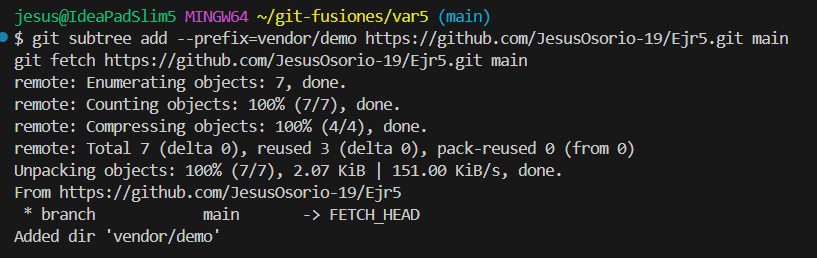

# **Actividad 7: Explorando estrategias de fusión en Git**

**Entrega:** sube **todas** las respuestas y evidencias en la carpeta **`Actividad7-CC3S2/`**.

## Resumen de estrategias

* **Fast-forward (`--ff`)**: mueve el puntero sin crear merge commit. Historial **lineal** y limpio. Ideal en trabajo individual o secuencial.
* **No-fast-forward (`--no-ff`)**: crea **merge commit** con **dos padres** (preserva punto de integración). Útil en colaboración y auditorías.
* **Squash (`--squash`)**: **aplana** varios commits de la feature en **uno** en `main`. Mantiene `main` limpia; **no** crea merge commit ni enlaza la rama en el DAG (se pierde detalle intermedio).

## Ejemplos prácticos (con evidencias)

### 1) Fusión **Fast-forward** (`git merge --ff`)

   La fusión fast-forward es la forma más simple de combinar ramas en Git. Solo es posible cuando la rama base no ha recibido nuevos commits desde que se creó la rama feature.

   - **Ventajas del fast-forward**
      - Historial limpio y lineal.
      - Fácil de leer y seguir.
      - No introduce commits innecesarios.

   - **Desventajas del fast-forward**
      - Se pierde la referencia de que alguna vez existió una rama separada.(Para proyectos grandes, a veces esto es beneficioso ya que queremos ver estos puntos de unión).

      

#### 2) Fusión **No-fast-forward** (`git merge --no-ff`)

   La fusión no-fast-forward crea un nuevo commit de fusión. Es útil para preservar el contexto de la fusión, especialmente en equipos donde se requiere más claridad en el historial de cambios.

   - **Ventajas del fast-forward**
      - Historial más explícito y con más semántica.
      - Facilita revisar el código en pull requests (se ve el bloque de cambios asociado a la rama).
      - Da soporte natural a flujos de trabajo como Git Flow o GitHub Flow.

   - **Desventajas del fast-forward**
      - El historial puede volverse más ramificado y "ruidoso".
      - Si se abusa, puede generar commits de merge innecesarios complicando la lectura.

      

#### 3) Fusión **Squash** (`git merge --squash`)

   La fusión squash combina todos los cambios de una rama en un solo commit en la rama principal. Este método es útil cuando se quiere mantener un historial de commits limpio.

   - **Ventajas del fast-forward**
      - Historial limpio y reducido, en main veremos solo un commit por cada feature y no la lluvia de commits intermedios.
      - Mensajes más claros, en lugar de muchos commits pequeños tenemos un mensaje bien redactado que resume el feature.

   - **Desventajas del fast-forward**
      - Se pierde el detalle de commits intermedios
      - Puede complicar el análisis histórico si necesitamos rastrear exactamente cuándo se introdujo un bug
      - El commit resultante puede ser enorme si la rama feature es muy grande.

      

### Ejercicios guiados (responde en `README.md`)

#### A) Evitar (o no) `--ff`

* Ejecuta una fusión FF real (ver 1).
* **Pregunta:** ¿Cuándo **evitarías** `--ff` en un equipo y por qué?

   Evitaría `--ff` cuando la preservación del contexto y la trazabilidad explícita son más importantes que mantener un historial completamente lineal. En equipos grandes, la información adicional que proporcionan los merge commits suele ser más valiosa que la simplicidad del fast-forward.

#### B) Trabajo en equipo con `--no-ff`

* Crea dos ramas con cambios paralelos y **fusiónalas con `--no-ff`**.
* **Preguntas:** ¿Qué ventajas de trazabilidad aporta? ¿Qué problemas surgen con **exceso** de merges?

   - **Ventajas:**
      - Se mantiene la información de que existieron ramas paralelas de desarrollo
      - Permite ver claramente quién trabajó en qué rama y cuándo se integró
      - Los merge commits permiten revertir features completas de una sola vez

   - **Problemas que surgen:**
      - El grafo se vuelve visualmente complejo y difícil de leer
      - Demasiados merge commits pueden ocultar los commits realmente importantes
      - Dificulta el seguimiento del flujo principal de desarrollo
      - Incrementa el tamaño del repositorio innecesariamente

#### C) Squash con muchos commits

* Haz 3-4 commits en `feature-3` y aplánalos con `--squash`.
* **Preguntas:** ¿Cuándo conviene? ¿Qué se **pierde** respecto a merges estándar?
   - **Cuando conviene:**
      - Cuando se hace muchos commits pequeños durante el desarrollo (commits de "work in progress", fixes menores, experimentos) y no aportan mucho valor histórico.
      - En proyectos donde `main` debe tener solo commits "finales" bien documentados.
      - Desarrollos largos que generaron muchos commits de refinamiento.

   - **¿Qué se pierde?**
      - Se pierden todos los commits intermedios y su cronología real. Se pierde información sobre el proceso de trabajo del desarrollador
      - Imposible hacer `git bisect` eficiente dentro de la feature para encontrar bugs o problemas específicos.
      - Se pierde el contexto de por qué se tomaron ciertas decisiones durante el desarrollo.

## Conflictos reales con **no-fast-forward**

**Preguntas**

* ¿Qué pasos adicionales hiciste para resolverlo?

   Git no puede resolver automáticamente los conflictos, así que tenemos que hacerlo manualmente eliminando las líneas de conflicto generadas por Git (`<<<<<<<`, `=======`, `>>>>>>>`). Agregamos el archivo corregido y completamos la fusión y por último, verificamos el historial para confirmar la fusión y el commit de la resolución de conflictos.

* ¿Qué prácticas (convenciones, PRs pequeñas, tests) lo evitarían?
   Para evitar conflictos podemos implementar prácticas como Pull Requests (PRs) pequeñas y frecuentes el cual ayuda a reducir el tiempo que una rama está separada de `main` y facilita la revisión e integración rápida.

### Comparar historiales tras cada método

Genera y guarda estas vistas (**usa dos guiones `--`**):

* **Fast-forward (first-parent):**

  ```bash
  git log --graph --oneline --decorate --all --first-parent > evidencias/05-compare-fastforward.log
  ```
* **Solo merges (destaca no-ff):**

  ```bash
  git log --graph --oneline --merges --decorate > evidencias/06-compare-noff.log
  ```
* **Vista completa (útil tras squash):**

  ```bash
  git log --graph --oneline --decorate --all > evidencias/07-compare-squash.log
  ```

**Preguntas**

* ¿Cómo se ve el DAG en cada caso?

   - `05-compare-fastforward.log`:
      - Muestra solo la línea principal de desarrollo (first-parent)
      - Se ve lineal desde la perspectiva de main
      - Los commits de feature aparecen como "ramas laterales"
      - Ideal para seguir el flujo principal sin distracciones

   - `06-compare-noff.log`:
      - Solo muestra los merge commits
      - Vista muy limpia para auditorías y release notes

   - `07-compare-squash.log`
      - Vista completa del grafo con todas las ramas y commits
      - Se ven claramente las bifurcaciones y convergencias
      - Dos líneas paralelas que se unen en el merge commit
      - El símbolo |\ indica la creación de ramas
      - El símbolo |/ indica la convergencia/merge

* ¿Qué método prefieres para: trabajo individual, equipo grande, repos con auditoría estricta?
   - Para trabajo individual elegiría `--ff` porque:
      - Historial lineal y limpio, fácil de seguir
      - Sin commits innecesarios, no hay "ruido" de merges
      - Simplicidad, menos complejidad para un solo desarrollador
      - Trabajo progresivo sin ramas paralelas
   
   - Para equipo grande elegiría `--no-ff` porque:
      - Trazabilidad completa, se preserva quién hizo qué y cuándo
      - Puntos de integración claros, cada merge representa una feature completa
      - Se puede revertir features completas de una vez
      - Soporte para Git Flow/GitHub Flow
      - Se ve claramente la colaboración

**Sugerencia visual**
Usa `gitk --all` o sube el repo a GitHub y captura el network graph en `evidencias/capturas/`.

## Revertir una fusión (solo si **HEAD es un merge commit**)

1. Asegura un **merge commit** reciente (del ejercicio `--no-ff`).
2. Verifica que `HEAD` tiene **dos padres**:

   ```bash
   git show -s --format=%P HEAD
   ```
3. Revertir manteniendo la base como **mainline / parent primario (#1)**:

   ```bash
   git revert -m 1 HEAD
   ```
4. Evidencia:

   ```bash
   git log --graph --oneline --decorate --all > evidencias/08-revert-merge.log
   ```

**Preguntas**

* ¿Cuándo usar `git revert` en vez de `git reset`?
   - Cuando el historial ya fue publicado (push a remote) en colaboración con otros desarrolladores
   - El historial es público y no se debe alterar
   - Mantiene trazabilidad completa de lo que pasó

* ¿Impacto en un repo compartido con historial público?
   Podemos decir que `git revert` nos trae impactos positivos, mientras que `git reset` impactos negativos
   - `git revert`
      - No rompe la colaboración, otros desarrolladores pueden seguir trabajando normalmente
      - Preserva integridad, el historial público permanece intacto
      - Queda registro de qué se revirtió, cuándo y por qué
      - Permite deshacer cambios problemáticos sin afectar el flujo de trabajo
   - `git reset`
      - Genera conflictos masivos
      - Pérdida de historial, información valiosa desaparece permanentemente
      - Requiere force push, operación que afecta a todos

## Variantes útiles para DevOps/DevSecOps

> **Entrega:** agrega estos archivos a `Actividad7-CC3S2/evidencias/`:
> `09-ff-only.log`, `10-rebase-ff.log`, `11-pre-commit-merge.log`, `12-octopus.log`, `13-subtree.log`, `14-x-strategy.log`, `15-signed-merge.log`

### A) Fast-Forward **Only** (merge seguro)

**Objetivo:** evitar merges implícitos; si no es FF, falla.
**Pasos**

1. Crea `feature-ffonly` desde `main`, añade 1 commit.
2. En `main`: `git merge --ff-only feature-ffonly` (debe pasar).
   
   

3. Para forzar un fallo didáctico: crea un commit en `main` tras crear la rama e intenta de nuevo (fallará).

   

4. Evidencia:

   ```bash
   git log --graph --oneline --decorate --all --first-parent > evidencias/09-ff-only.log
   ```

### B) **Rebase + FF** (historial lineal con PRs)

**Objetivo:** linealidad sin merge commit.
**Pasos**

1. `git checkout feature-rebase` (con 2-3 commits), actualiza base:

   ```bash
   git fetch origin && git rebase origin/main
   ```

   

2. Integra:

   ```bash
   git checkout main && git merge feature-rebase
   ```

   

3. Evidencia:

   ```bash
   git log --graph --oneline --decorate --all --first-parent > evidencias/10-rebase-ff.log
   ```

### C) Merge con **validación previa** (sin commitear)

**Objetivo:** correr linters/tests/escáneres **antes** de sellar el merge.
**Pasos**

1. `git merge --no-commit --no-ff feature-validate`

   

2. Validaciones reproducibles mínimas (elige según tu proyecto):

   ```bash
   bash -n script.sh              # lint básico de shell
   python -m pyflakes || true     # si hay Python, lint suave
   # o tu pipeline local:
   make test && make lint
   ```

      

3. Si todo ok: `git commit`
   
   

4. Evidencia:

   ```bash
   git log --graph --oneline --decorate --all > evidencias/11-pre-commit-merge.log
   ```

### D) **Octopus Merge** (varias ramas a la vez)

**Objetivo:** integrar ramas **triviales** sin conflictos.
**Pasos**

1. Prepara `feat-a`, `feat-b` (commits pequeños, sin tocar mismas líneas).

   


2. `git checkout main && git merge feat-a feat-b`

   

3. Evidencia:

   ```bash
   git log --graph --oneline --merges --decorate > evidencias/12-octopus.log
   ```

### E) **Subtree** (integrar subproyecto conservando historial)

**Objetivo:** vendorizar/incrustar un repo externo en un subdirectorio.
**Pasos**

1. Opción liviana (recomendado): usa un repo mínimo propio para no descargar mucho:

   ```bash
   git subtree add --prefix=vendor/demo https://github.com/tu-usuario/repo-minimo.git main
   ```

   

2. Sincroniza:

   ```bash
   git subtree pull --prefix=vendor/demo https://github.com/tu-usuario/repo-minimo.git main
   ```

   

3. Evidencia:

   ```bash
   git log --graph --oneline --decorate --all > evidencias/13-subtree.log
   ```

### F) Sesgos de resolución y normalización (algoritmo ORT)

**Objetivo:** demostrar opciones del merge resolver.
**Pasos**

* Sólo en conflictos:

  ```bash
  git merge -X ours  feature-x
  git merge -X theirs feature-x
  ```

   

   

* Sensibilidad a renombrados:

  ```bash
  git merge -X find-renames=90% feature-rename
  ```

   

* EOL mixtos:

  ```bash
  git merge -X renormalize feature-eol
  ```

   

**Evidencia:**

```bash
git log --graph --oneline --decorate --all > evidencias/14-x-strategy.log
```

*(En `README.md` explica qué opción usaste y por qué.)*

### G) **Firmar** merges/commits (auditoría y cumplimiento)

**Objetivo:** trazabilidad criptográfica.
**Pasos**

1. Configura firma (GPG o Sigstore). **Asegúrate de que el email de la firma coincide con `git config user.email`** para que la plataforma valide la firma.
2. Merge firmado:

   ```bash
   git merge --no-ff --gpg-sign feature-signed
   ```

   

3. Verifica y guarda:

   ```bash
   git log --show-signature -1 > evidencias/15-signed-merge.log
   ```

