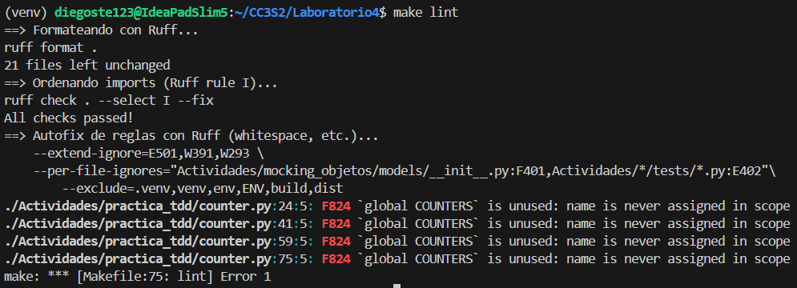
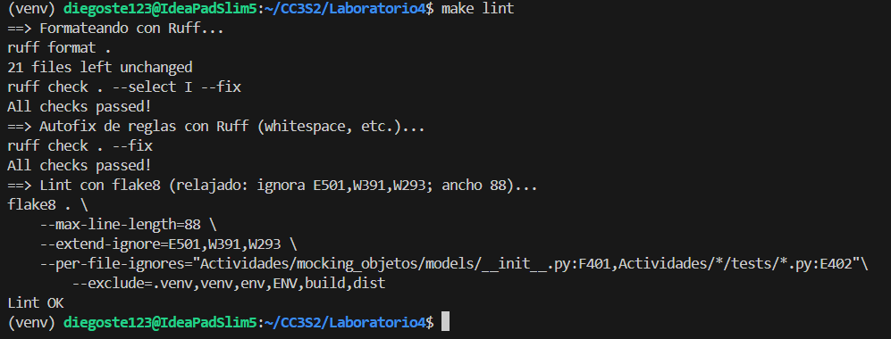

# Actividad 9: pytest + coverage + fixtures + factories + mocking + TDD

## Descripción

Esta actividad demuestra el dominio de herramientas modernas de testing en Python, resolviendo 7 sub-actividades que cubren:

- Aserciones con pytest
- Fixtures y datos de prueba
- Análisis de cobertura (coverage)
- Factory Pattern & Fakes
- Mocking y Patching
- Ciclo TDD (Test-Driven Development)

## Como ejecutar

1. Creamos el entorno virtual.

```bash
make venv
# o manualmente
python3 -m venv venv
```

Activamos el entorno virtual.

2. Instalamos dependencias

```bash
make deps
```

## Técnicas utilizadas

### 1. **Aserciones**
Utilicé aserciones de pytest (`assert`, `pytest.raises`, `pytest.approx`) para validar comportamientos esperados y manejo de excepciones en cada test.

### 2. **Fixtures**
Implementé fixtures con diferentes scopes (function, module) para reutilizar configuraciones y garantizar teardown con `yield`.

### 3. **Coverage**
Alcancé en la mayoría de pruebas un resultado mayor a **95% de cobertura** usando `pytest-cov`. Estrategia: identificar líneas faltantes con `--cov-report html`.

### 4. **Factories/Fakes**
- **Factory Pattern:** Clases que generan objetos complejos con valores por defecto
- **Fakes:** Implementaciones simples (ej: FakeDB) para evitar dependencias externas en tests

### 5. **Mocking**
Usé `unittest.mock.patch` para aislar dependencias externas (APIs, filesystem, tiempo). Esto permitió tests rápidos y deterministas sin llamadas reales.

### 6. **Ciclo TDD**
Seguí **Red-Green-Refactor** en `practica_tdd`:
1. Escribir test que falla
2. Implementación mínima para pasar
3. Refactorizar manteniendo tests verdes

## Observaciones

Probando los targets del Makefile de [Laboratorio4](https://github.com/kapumota/Curso-CC3S2/tree/main/labs/Laboratorio4) solo obtuve un problema con el target `make lint`. Sucedía que el `requirements.txt` no tenía `flake8`, se solucionó instalando independientemente `flake8` y añadiéndolo también al `requirements.txt`. Una vez ejecutado `make lint` solo se obtuvo error con el archivo `practica_tdd/counter.py`.



Se solucionó borrando las declaraciones `global COUNTERS`, ya que eran innecesarias porque solo muta el dict.

