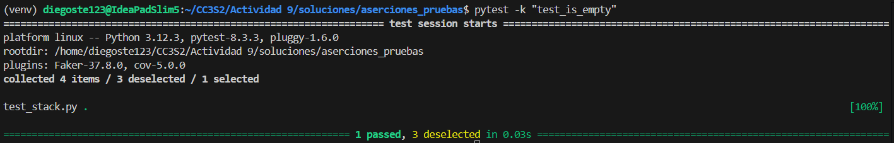

### Escribir aserciones en pruebas con pytest

En esta actividad aprenderás cómo escribir aserciones de pruebas utilizando *pytest* y otros complementos actualizados.

Después de completar esta actividad, serás capaz de:

- Ejecutar casos de prueba con *pytest**
- Identificar los casos de prueba que fallan
- Escribir pruebas unitarias utilizando aserciones
- Generar informes de cobertura usando pytest-cov

**Paso 1: Instalación de pytest y pytest-cov**

Se realizó una instalación de todo lo necesario con:

```bash
pip install -r requirements.txt 
```

**Paso 2: Archivos de prueba**

Usaremos dos archivos para esta actividad: `stack.py` y `test_stack.py`.

- `stack.py`: Contiene la implementación de una pila (stack) que queremos probar.
- `test_stack.py`: Contiene el esqueleto de las pruebas para los métodos `push()`, `pop()`, `peek()`, y `is_empty()`.

Antes de escribir los casos de prueba, revisemos los métodos de la clase `Stack`:

```python
class Stack:
    def push(self, data: Any) -> None:
        ...
    def pop(self) -> Any:
        ...
    def peek(self) -> Any:
        ...
    def is_empty(self) -> bool:
        ...
```
Descripción de funciones:

- `push()`: Añade un elemento a la parte superior de la pila.
- `pop()`: Elimina y devuelve el elemento en la parte superior de la pila.
- `peek()`: Devuelve el valor del elemento en la parte superior de la pila sin eliminarlo.
- `is_empty()`: Devuelve True si la pila está vacía y False si no lo está.

Ten en cuenta que todos los métodos, excepto `is_empty()`, operan sobre el elemento que se encuentra en la parte superior de la pila. Por lo tanto, para que tus casos de prueba sean exhaustivos, debe haber dos o más elementos en la pila para garantizar que esté manipulando el elemento superior y no el inferior.

**Paso 3: Escribiendo aserciones para el método `is_empty()`**

Vamos a comenzar con la prueba del método `is_empty()`. Este método devuelve True si la pila está vacía y False si no lo está.

**Paso 4: Ejecuta pytest para verificar `is_empty()`**

Ejecuta pytest para verificar si la prueba del método `is_empty()` pasa:



**Paso 5: Escribiendo aserciones para el método `peek()`**

El siguiente método que vamos a probar es `peek()`. Este método devuelve el valor en la parte superior de la pila sin eliminarlo.


**Paso 6: Escribiendo aserciones para el `método pop()`**

El método `pop()` elimina y devuelve el valor en la parte superior de la pila. Para asegurarte de que la prueba es útil, debes agregar al menos dos valores a la pila.


**Paso 7: Escribiendo aserciones para el `método push()`**

Finalmente, vamos a probar el método `push()`, que añade un valor a la pila.


**Paso 8: Ejecuta pytest para verificar todas las pruebas**
Ejecuta pytest nuevamente para asegurarte de que todas las pruebas pasan:


**Paso 9: Agregando cobertura de pruebas con pytest-cov**

Para asegurarte de que tus pruebas cubren suficiente código, puedes generar un informe de cobertura utilizando pytest-cov. Ejecuta el siguiente comando para generar un informe de cobertura:


