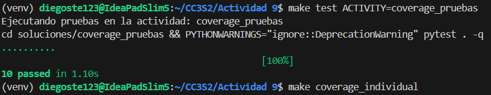
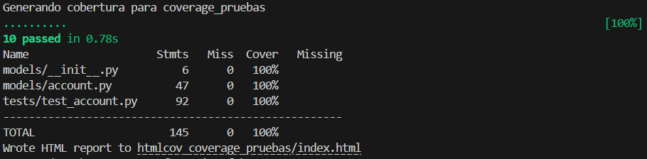
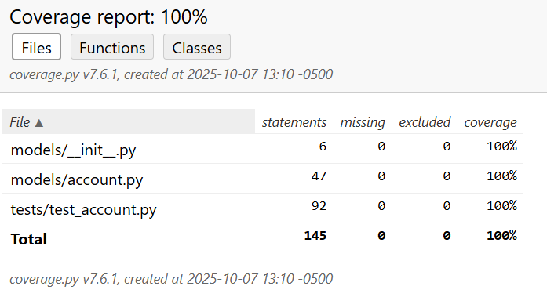
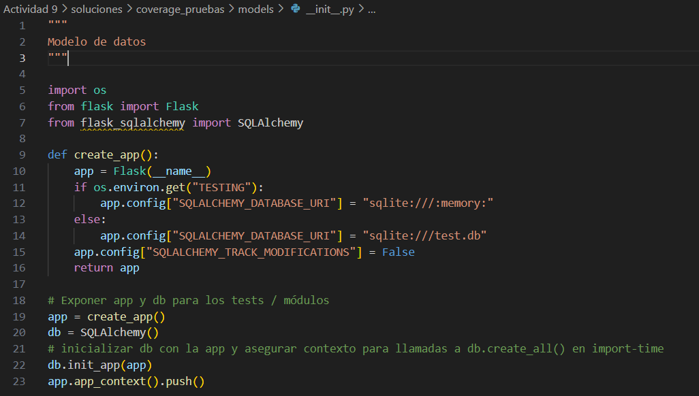
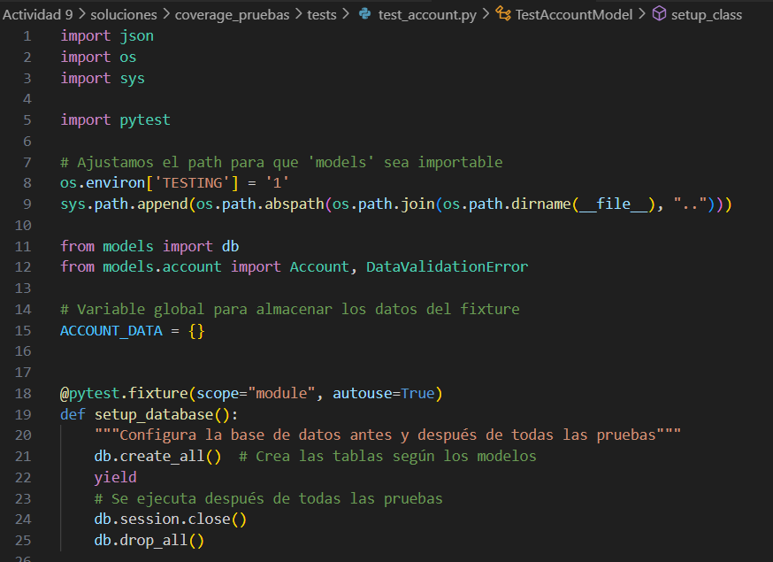
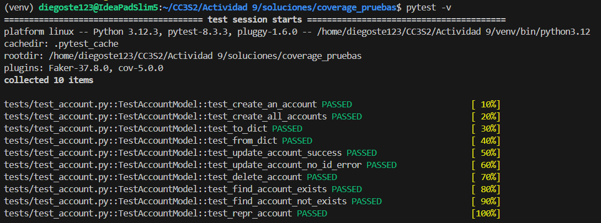
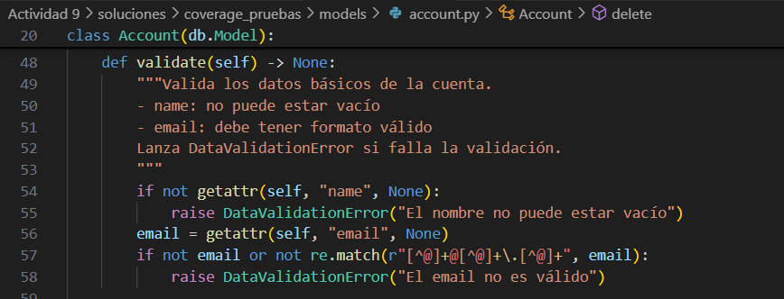
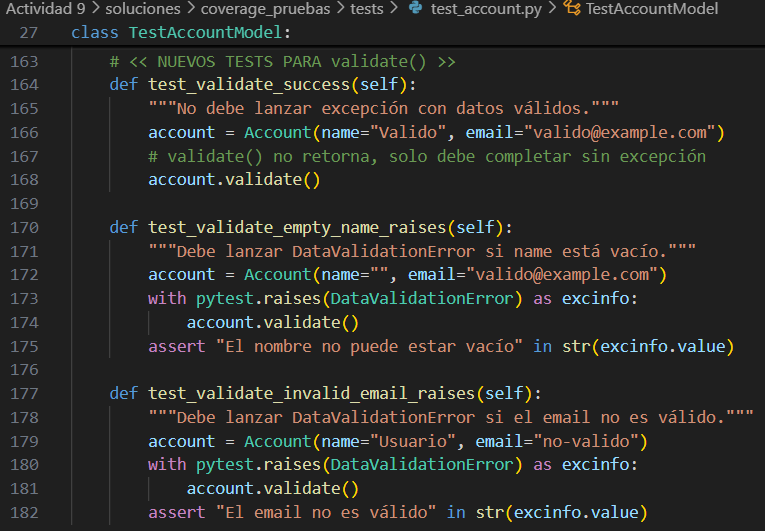
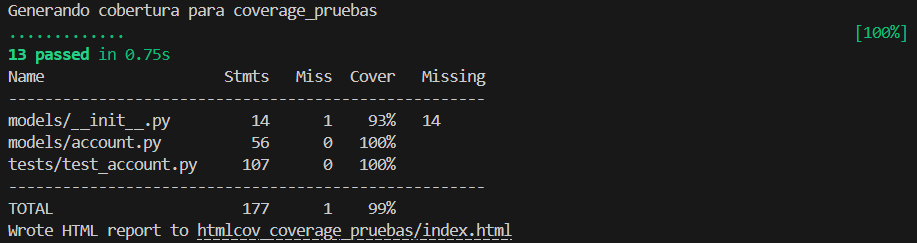
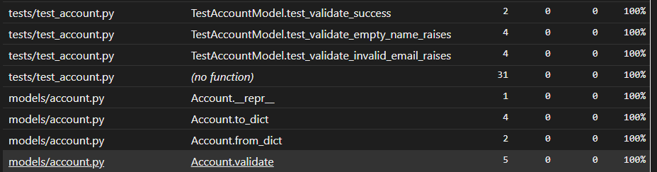

## Cobertura de pruebas

### 3. Propuesta de actividad práctica

#### Objetivos:
- Comprender los distintos tipos de cobertura de código.
- Aprender a generar reportes de cobertura utilizando **coverage.py**.
- Entender la importancia de los Makefiles para automatizar procesos en el ciclo de desarrollo.

##### Instrucciones:

1. **Preparación del entorno:**
   - Clona el repositorio que contenga el Makefile y la estructura de actividades.
   - Ejecuta `make install` para instalar las dependencias necesarias (según el target `install`).

2. **Ejecución de tests y generación de cobertura:**
   - Ejecuta `make test` para correr los tests de la actividad por defecto o de la actividad que especifiques usando `ACTIVITY=nombre_actividad`.

      

   - Ejecuta `make coverage_individual` para generar, de manera individual, los reportes de cobertura de cada actividad. Verifica en los directorios generados (`htmlcov_aserciones_pruebas`, `htmlcov_coverage_pruebas`, etc.) la visualización de los reportes HTML.

      

3. **Análisis del reporte de cobertura:**
   - Abre uno de los reportes HTML en tu navegador.
   - Identifica las áreas del código que tienen menos cobertura. Observa las métricas de cobertura de sentencias, ramas y funciones.
   - Reflexiona sobre qué partes del código podrían necesitar más tests (por ejemplo, ramas condicionales no ejecutadas).

      
      Vemos que la cobertura es de 100%. Así que no necesita modificaciones.

#### Ejercicios

#### Ejercicio 1: Análisis y evaluación de la cobertura actual

**Objetivo:**  
Conocer el estado actual de la cobertura y detectar áreas del código que podrían necesitar pruebas adicionales.

**Pasos:**

1. **Ejecutar el makefile de cobertura individual:**  
   Utiliza el comando:  

   ```bash
   make coverage_individual
   ```  

   

2. **Abrir los reportes HTML:**  
   Revisa, por ejemplo, el reporte en `htmlcov_pruebas` abriéndolo en tu navegador.  
   
   

3. **Documentar las observaciones:**  
   
   Vemos que la cobertura es de 100%. Así que no necesita alguna modificación de mejora.

#### Ejercicio 2: Ampliar las pruebas para mejorar la cobertura

**Objetivo:**  
Aumentar la cobertura de pruebas escribiendo tests que exploren casos adicionales y validen el comportamiento de cada método del modelo `Account`.

**Propuestas:**

1. **Pruebas para métodos de serialización/deserialización:**
   - **`to_dict`:**  
     - Verificar que se incluyan todas las columnas, incluso si algunos valores son `None`.  
     - Asegurarse de que los tipos de datos sean los esperados.
     
   - **`from_dict`:**  
     - Probar el caso en el que el diccionario está incompleto y cómo se comporta el método.
     - Evaluar qué sucede cuando se pasan claves inesperadas (por ejemplo, claves que no pertenecen al modelo).

2. **Pruebas de comportamiento de métodos CRUD:**
   - **`create`:**  
     - Verificar que se genere un ID tras la creación.
   - **`update`:**  
     - Además del caso de error (cuando no hay ID), agregar un test en el que se intente actualizar varias propiedades y confirmar que la base de datos refleje esos cambios.
   - **`delete`:**  
     - Confirmar que tras la eliminación, la cuenta ya no esté disponible mediante el método `find` o `all`.

3. **Pruebas para métodos de clase:**
   - **`all`:**  
     - Probar el comportamiento cuando no hay cuentas en la base de datos.
   - **`find`:**  
     - Además del caso en el que la cuenta existe y no existe, probar casos límite (por ejemplo, pasando un ID no entero o un valor inesperado, si es que la implementación lo permite).

4. **Prueba del método especial `__repr__`:**
   - Verificar que el formato del string sea exactamente el esperado.

#### Ejercicio 3: Integración y pruebas con una base de datos temporal

**Objetivo:**  
Implementar pruebas de integración utilizando una base de datos temporal para evitar interferir con datos reales.

**Propuestas:**

1. **Configurar una base de datos temporal para pruebas:**
   - En el archivo `__init__.py` del modelo, podrías condicionar la configuración de la base de datos para que, en modo de test, se use una base de datos en memoria o un archivo temporal:
    
   

2. **Modificar el Fixture de la base de datos en `test_account.py`:**
   - Establecer la variable de entorno `TESTING` para que se use la base de datos temporal durante las pruebas:
   
   

3. **Verificar en las pruebas:**
   - Ejecuta de nuevo todas las pruebas y asegúrate de que no se están escribiendo datos en `test.db`, sino en una base en memoria que se destruye al finalizar.

   

### Ejercicio 4: Refactorización y adición de funcionalidades

**Objetivo:**  
Extender la funcionalidad del modelo y a su vez, la cobertura de pruebas.

**Propuesta:**

1. **Agregar un método de validación:**  
   - Por ejemplo, podrías agregar un método `validate` que verifique que el correo electrónico tenga un formato válido y que el nombre no esté vacío:
     
   

2. **Escribir tests para el nuevo método:**  
   
   

3. **Actualizar la cobertura:**  
   - Ejecuta nuevamente `make test` y `make coverage_individual` para verificar que el nuevo método está completamente cubierto por pruebas.

   
   Verificamos que el nuevo método también tiene el 100% de cobertura por las pruebas.

   