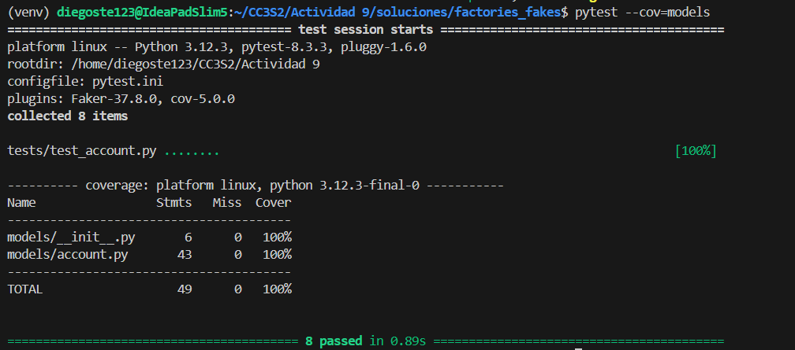
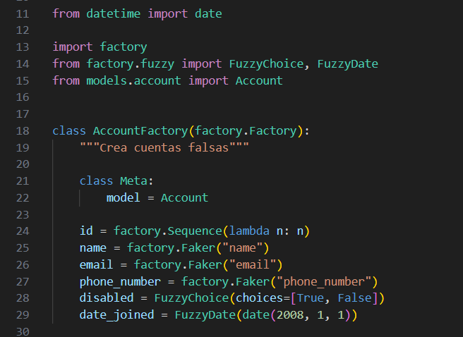
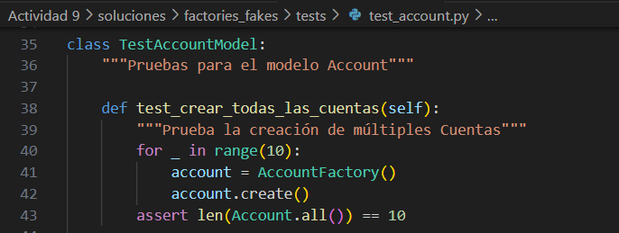
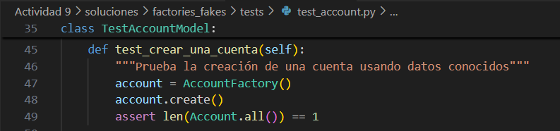
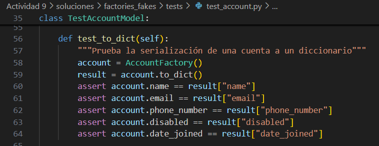
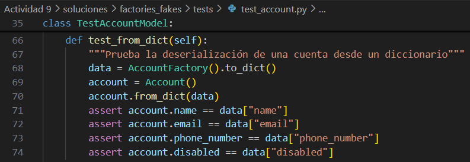
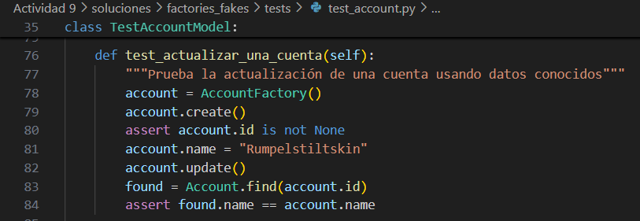
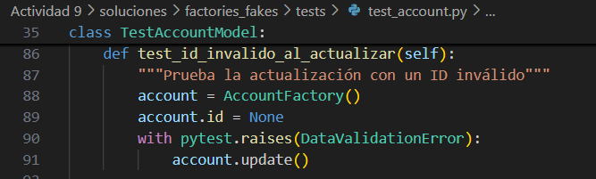
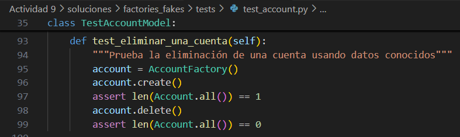

## Factory y fakes

#### Paso 1: Ejecutar pytest

Antes de realizar cualquier cambio en el código, quieres asegurarte de que todos los casos de prueba están pasando. De lo contrario, podrías encontrarte con casos de prueba fallidos más adelante y no sabrás si los causaste al fallar o si ya estaban fallando antes de cambiar algo.

Ejecutemos `pytest` y aseguremos que todas las pruebas están pasando con una cobertura de prueba del **100%**.



#### Paso 2: Crear una clase `AccountFactory`

En este paso, crearemos una clase `AccountFactory`.

Abre el archivo `models/account.py` para familiarizarte con los atributos de la clase `Account`. Estos son los mismos atributos que necesitarás agregar a la clase `AccountFactory`.

Abre el archivo `tests/factories.py` en tu editor de código.

Queremos aprovechar el hecho de que **FactoryBoy** viene con la clase **Faker**, que tiene [proveedores falsos](https://faker.readthedocs.io/en/master/providers/baseprovider.html) y una serie de [atributos Fuzzy](https://factoryboy.readthedocs.io/en/stable/fuzzy.html).

Aquí hay algunos proveedores útiles para la clase Faker:

```python
Faker("name")
Faker("email")
Faker("phone_number")
```

Aquí hay algunos atributos Fuzzy que podrían ser útiles:

```python
FuzzyChoice(choices=[True, False])
FuzzyDate(date(2008, 1, 1))
```

Usa los proveedores de **Faker** y los atributos **Fuzzy** para crear datos falsos para los campos `id`, `name`, `email`, `phone_number`, `disabled` y `date_joined` agregándolos a la clase `AccountFactory`.



#### Paso 3: Actualizar los casos de prueba

En este paso, actualizaremos los casos de prueba para usar la nueva `AccountFactory` que creaste en el paso anterior.

Abre el archivo `tests/test_account.py`. Luego, agrega la siguiente importación cerca de la parte superior del archivo, después de las otras importaciones. Esto importará tu nueva clase `AccountFactory` desde el módulo `factories`:

```python
from factories import AccountFactory
```

En los pasos restantes, queremos cambiar todas las referencias a `Account` para que ahora usen `AccountFactory`. Haremos esto una prueba a la vez.

Comencemos con la prueba `test_crear_todas_las_cuentas()`. Elimina las referencias a `ACCOUNT_DATA` y `Account` y reemplázalas con `AccountFactory`. Además, cambia el código para crear 10 Cuentas.



#### Paso 4: Actualizar `test_crear_una_cuenta()`

En este paso, actualizaremos la prueba `test_crear_una_cuenta()`. Modifica el código para eliminar las referencias a `ACCOUNT_DATA` y `Account` y reemplázalas con `AccountFactory`.



#### Paso 5: Actualizar `test_to_dict()`

En este paso, actualizaremos la prueba `test_to_dict()`. Modifica el código para eliminar las referencias a `ACCOUNT_DATA` y `Account` y reemplázalas con `AccountFactory`.



#### Paso 6: Actualizar `test_from_dict()`

En este paso, actualizaremos la prueba `test_from_dict()`. Modifica el código para eliminar las referencias a `ACCOUNT_DATA` y `Account` y reemplázalas con `AccountFactory`.



#### Paso 7: Actualizar `test_actualizar_una_cuenta()`

En este paso, actualizaremos la prueba `test_actualizar_una_cuenta()`. Modifica el código para eliminar las referencias a `ACCOUNT_DATA` y `Account` y reemplázalas con `AccountFactory`.



#### Paso 8: Actualizar `test_id_invalido_al_actualizar()`

En este paso, actualizaremos la prueba `test_id_invalido_al_actualizar()`. Modifica el código para eliminar las referencias a `ACCOUNT_DATA` y `Account` y reemplázalas con `AccountFactory`.



#### Paso 9: Actualizar `test_eliminar_una_cuenta()`

En este paso, actualizaremos la prueba `test_eliminar_una_cuenta()`. Modifica el código para eliminar las referencias a `ACCOUNT_DATA` y `Account` y reemplázalas con `AccountFactory`.



Guarda tus cambios y ejecuta `pytest` una última vez para asegurarte de que los casos de prueba aún pasan.


