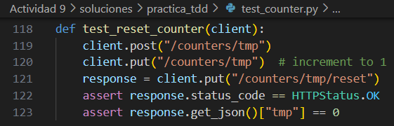

### Práctica del ciclo TDD

#### 3. Ejercicios adicionales

##### 3.1. Incrementar un contador (ruta dedicada)

1. **Prueba (Red):**  
   
    

2. **Implementación (Green):**  
   
    

    - Nueva ruta

    

##### 3.2. Establecer valor específico

1. **Prueba (Red):**  
   
    

2. **Implementación (Green):**  

   

##### 3.3. Listar todos los contadores

1. **Prueba (Red):**  

   

2. **Implementación (Green):**  

   

##### 3.4. Reiniciar un contador

1. **Prueba (Red):**  

   

2. **Implementación (Green):**  
   
   

Vemos que todos las pruebas agregadas pasan correctamente 

Resultados del `make coverage_individual`. HTML generado.

