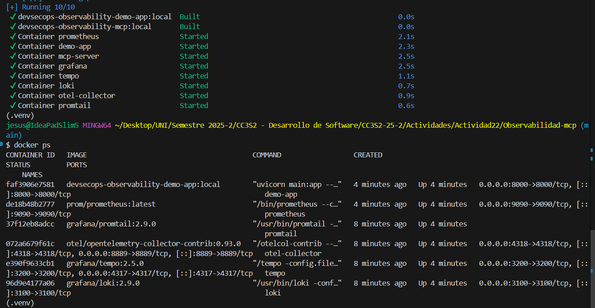
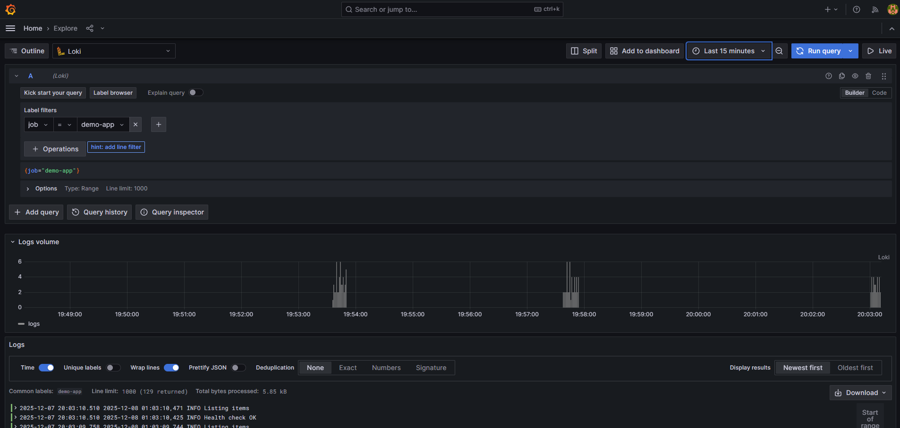

# Actividad: Observabilidad y Telemetría con Prometheus, Loki, Tempo y MCP

## 1. Levantar el stack y generar telemetría

### 1.1. Levantar todo el stack

Desde `Observabilidad-mcp/`:

```bash
make up
```

Esto levanta: `app`, `otel-collector`, `prometheus`, `loki`, `promtail`, `tempo`, `grafana`, `mcp-server`.

Verificamos con `docker ps`



### 1.2. Generar tráfico (métricas, logs, trazas)

Ejecutamos varias veces durante la actividad:

```bash
bash scripts/demo-traffic.sh
```

> Para esto hicimos cambios en `main.py` ya que las métricas HTTP no aparecían en Prometheus porque la aplicación solo tenía instrumentación de trazas, pero **no de métricas**.

- Verificamos peticiones en Grafana

   

- Verificamos el OTEL collector en Prometheus

   

- Hacemos unas consultas sencillas en PromQL

   
   

- Mostramos el contador total de peticiones HTTP recibidas en la aplicación

   

Cada ejecución envía peticiones a:

* `/healthz`
* `/api/v1/items`
* `/api/v1/work`
* `/api/v1/error` (genera errores 500)

## 2. Parte A - Observabilidad y tipos de telemetría

### Tarea A1

- Archivo:

   ```text
   Actividad22/observabilidad-telemetria.md
   ```

## 3. Parte B - Métricas con Prometheus y PromQL

### Tarea B1 

1. Abre Prometheus: [http://localhost:9090](http://localhost:9090).
2. Menú **Status -> Target health**.
3. Verifica que aparezca `otel-collector` con estado **UP**.

   
   Verificamos que está en estado **UP**
   
4. En `Actividad22/metrics-prometheus.md`, anota:

   * Captura de pantalla o descripción del target.
   * Explicación de qué significa `job="otel-collector"` e `instance="otel-collector:8889"`.

### Tarea B2 - Consultas PromQL básicas

En la pestaña **Query** de Prometheus:

1. Ejecuta:

   ```promql
   up
   ```

2. Ejecuta:

   ```promql
   up{job="otel-collector"}
   ```

3. Explora métricas que empiecen por `http`:

   * Escribe `http` en el autocompletado de métricas.
   * Elige alguna que tenga datos (por ejemplo `http_server_requests_total` o similar).
   * Ejecuta la consulta sin filtros.
   * Luego añade filtros por labels (por ejemplo `service_name="demo-app"` si existe).

En `metrics-prometheus.md`:

* Copia las expresiones PromQL usadas.
* Explica qué tipo de métrica es (counter, gauge, histogram…) y qué representa.

### Tarea B3 - Error rate 5xx (y cómo depurarlo si sale vacío)

1. Intenta construir una consulta de tasa de errores 5xx por servicio, por ejemplo:

   ```promql
   sum by (service_name) (
     rate(
       http_server_requests_total{
         service_name="demo-app",
         http_status_code=~"5.."
       }[5m]
     )
   )
   ```

2. Si ves **"Empty query result"**:

   * Quita filtros hasta ver datos (por ejemplo, empieza solo con `http_server_requests_total`).
   * Mira los labels reales que tiene esa métrica (haz clic sobre una serie).
   * Ajusta la expresión usando los labels **reales** (quizá se llame distinto, como `http.status_code` o `status_code`).

En `metrics-prometheus.md`:

* Documenta:

  * La expresión final que sí devuelve datos.
  * Una explicación de cómo la fuiste simplificando hasta encontrar algo útil.
* Explica brevemente las **mejores prácticas**:

  * Usar **counters** para errores (no gauges).
  * Normalizar nombres de métricas.
  * Incluir labels significativos pero sin explotar la cardinalidad.

#### 5. Parte C - Logs con Loki y LogQL

#### Tarea C1 - Ver logs de la app

1. Abre Grafana: [http://localhost:3000](http://localhost:3000)
   Login: `admin / devsecops`.
2. Ve a **Explore** y elige el data source **Loki** (como en tu captura de pantalla).
3. Haz clic en **Label browser**:

   * Selecciona el label `job`.
   * Elige el valor correspondiente a la app (`demo-app` o similar).
   * Haz clic en **Run query**.

Esto construirá algo como:

```logql
{job="demo-app"}
```

Si no ves líneas:

* Ejecuta de nuevo:

  ```bash
  ./scripts/demo-traffic.sh
  ```

* Asegúrate de que el rango de tiempo (arriba a la derecha) incluya el momento actual (por ejemplo, "Last 15 minutes").

#### Tarea C2 - Filtrado por severidad y mensajes

En el mismo panel de Explore (Loki):

1. En "Line contains", escribe `ERROR` y ejecuta.
2. Luego prueba con `WARNING` o con el texto de algún endpoint (`/api/v1/error`).

En `Actividad22/logs-loki-logql.md`:

* Escribe:

  * Las expresiones LogQL que usaste (con labels + `|=` para texto si lo utilizas).
  * Un ejemplo de línea de log de error (copiada o resumida).
* Contesta:

  * ¿Cómo podrías usar estos logs en un contexto **DevSecOps**? (por ejemplo, detección de patrones sospechosos, errores recurrentes, etc.)

### 4. Parte D - Trazas distribuidas con Tempo y TraceQL

#### Tarea D1 - Búsqueda básica con TraceQL

1. En Grafana, ve a **Explore -> Tempo** (como en tu captura).

2. Cambia `Query type` a **TraceQL**.

3. Ejecuta una consulta como:

   ```text
   { service.name = "demo-app" }
   ```

4. Asegúrate de que el rango de tiempo incluya la última ejecución de `./scripts/demo-traffic.sh`.

5. Deberías ver una tabla con trazas en la parte inferior.

6. Haz clic en una traza y explora los spans.

#### Tarea D2 - Trazas de errores

Intenta filtrar trazas de peticiones al endpoint de error, por ejemplo (ajusta según atributos reales):

```text
{ service.name = "demo-app", http.target = "/api/v1/error" }
```

En `Actividad22/traces-tempo-traceql.md`:

* Incluye las consultas TraceQL usadas.
* Describe:

  * Qué spans se ven en una traza típica.
  * Cómo se relaciona esto con los logs de Loki y las métricas de Prometheus.
* Menciona brevemente los **protocolos de seguimiento (tracing)** que se usan:

  * OpenTelemetry.
  * Propagación de contexto (trace-id, span-id).

### 5. Parte E - Grafana stack y alertas

#### Tarea E1 - Dashboard de observabilidad

En Grafana:

1. Crea un dashboard nuevo llamado:
   `Dashboard Actividad 22 - demo-app`.
2. Añade al menos **3 paneles**:

   * Panel 1: **RPS** (requests por segundo) de la app.
   * Panel 2: **Error rate 5xx**.
   * Panel 3: **p95 o p99 de latencia** (si las métricas lo permiten) o alguna métrica relevante de tiempo.

Puedes combinar datos de:

* Prometheus (métricas).
* Loki (conteo de logs de error).
* Tempo (conteo de trazas, si cómodo).

Exporta el dashboard como JSON y guárdalo en:

```text
Actividad22/dashboard-actividad22.json
```

#### Tarea E2 - Grafana Alerting

1. Elige uno de tus paneles (por ejemplo, **error rate**).

2. Crea una regla de alerta en Grafana, por ejemplo:

   * Condición: `error_rate_5xx > UMBRAL` durante `5m`.
   * Etiquetas: `severity="critical"`.
   * Mensaje: "La demo-app está devolviendo demasiados 5xx".

3. No es necesario configurar **contact points** reales, pero documenta la regla.
   > En Grafana, un contact point es el destino al que se envía la alerta cuando se dispara la regla. Por ejemplo: un correo (`equipo-sre@empresa.com`).
   
En `Actividad22/grafana-alerting.md`:

* Describe:

  * Qué métrica usas para la alerta.
  * Qué condición y duración escogiste y por qué.

* Explica cómo encajaría esta alerta en:
  * Un equipo **DevOps/DevSecOps**.
  * Un equipo de **blue team / SRE**.

### 6. Parte F - Ciclo de vida DevSecOps con observabilidad y métricas

En `Actividad22/devsecops-observabilidad.md` escribe un texto (1-2 páginas) respondiendo:

1. ¿Cómo se integra la observabilidad en cada fase del ciclo:

   * Planificación / Diseño.
   * Construcción y pruebas (CI).
   * Despliegue (CD).
   * Operación / Respuesta a incidentes.
   * Aprendizaje / Mejora continua.

2. Propón **al menos 3 "gates" DevSecOps** donde usarías métricas/logs/trazas, por ejemplo:

   * Gate antes de despliegue: `up{job="otel-collector"} == 1` y `error rate ≈ 0` en un entorno de staging.
   * Gate post-deploy: no pasar a siguiente fase si el panel de error rate supera cierto umbral en los primeros N minutos.
   * Gate de seguridad: crear alertas sobre patrones sospechosos en logs (LogQL) o latencias extrañas (traceQL/PromQL).

3. Explica dónde podría entrar el servidor **MCP**:

   * Como fuente de resumen para un agente/LLM que ayuda al SRE.
   * Como API que consolida métricas/logs/trazas en un solo JSON.
