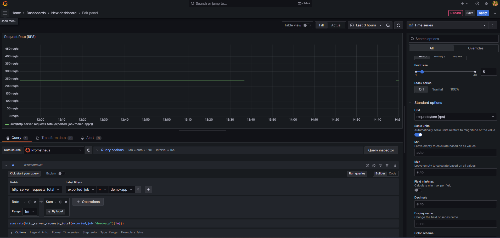
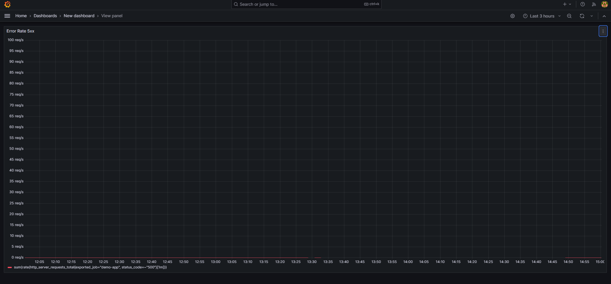
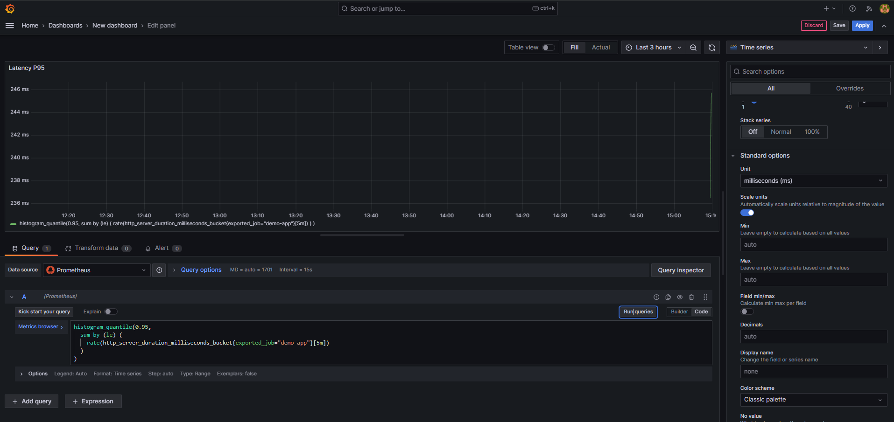
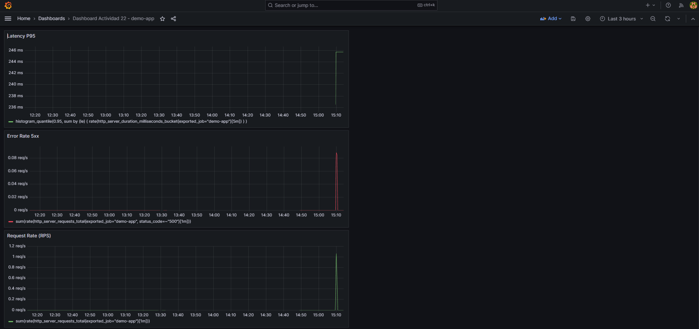
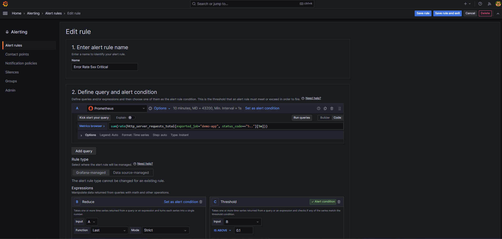
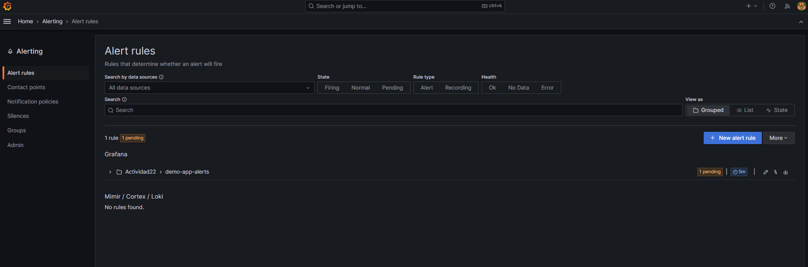

# Grafana stack y alertas

## Tarea E1 - Dashboard de observabilidad

### Panel 1 - Request Rate (RPS)
**Query**:



Muestra las peticiones por segundo recibidas por la aplicación.

### Panel 2 - Error Rate 5xx
**Query**:

Muestra la tasa de errores 5xx por segundo.

### Panel 3 - Latency P95
**Query**:

Muestra el percentil 95 de latencia (95% de peticiones por debajo de este valor).

## Captura del dashboard



## Archivo JSON

El dashboard exportado se encuentra en: [`dashboard-actividad22.json`](dashboard-actividad22.json)

## Tarea E2 - Grafana Alerting

### Regla de alerta creada

#### Métrica utilizada

**Query**:



Tasa de errores HTTP 5xx por segundo en los últimos 5 minutos.

#### Condición y duración

- **Threshold**: `> 0.1` (más de 0.1 errores/segundo = 6 errores/minuto)
- **For duration**: `5m` (alerta solo si persiste 5 minutos)
- **Evaluation interval**: `1m` (evalúa cada minuto)

**Justificación**:
- **Umbral de 0.1 req/s**: Asume SLO de 99.9% uptime → tolera ~6 errores/min en producción con ~1000 req/min
- **Duración de 5m**: Evita alertas por picos momentáneos (falsos positivos)
- **Evaluación cada 1m**: Balance entre detección rápida y carga en Prometheus

### Labels y anotaciones


**Annotations**:
- **Summary**: La aplicación demo-app está generando errores 5xx
- **Description**: Error rate: {{ $values.A }} req/s supera el umbral de 0.1 req/s

**Labels**:
- `severity="critical"`: Requiere atención inmediata del equipo SRE
- `service="demo-app"`: Identifica el servicio afectado
- `team="sre"`: Asigna responsabilidad al equipo

### Integración en DevOps/DevSecOps

#### Equipo DevOps/SRE

**Respuesta a incidentes**:
1. **Alerta dispara** → notificación a Slack/PagerDuty
2. **SRE investiga**:
   - Prometheus: confirma error rate
   - Loki: `{job="demo-app"} |= "ERROR"` → ver mensajes
   - Tempo: buscar trazas con `{status = error}` → identificar root cause
3. **Acciones**:
   - Rollback automático si post-deploy
   - Escalar recursos si sobrecarga
   - Fix & deploy si bug detectado

**SLO enforcement**:
- SLI: Error rate < 0.1% (1 error cada 1000 requests)
- Esta alerta protege el SLO notificando antes de violarlo
- Permite medir error budget consumido

#### Equipo Blue Team (Seguridad)

**Detección de ataques**:
- Picos de errores 5xx pueden indicar:
  - **DoS/DDoS**: Sobrecarga intencional → errores 503
  - **Exploit attempts**: Payloads maliciosos → errores 500
  - **Credential stuffing**: Intentos masivos → errores de autenticación

**Correlación con logs**:
```logql
{job="demo-app"} |= "ERROR" | json | remote_ip != "192.168.0.0/16"
```
 Filtrar errores desde IPs externas sospechosas

**Integración SIEM**:
- Enviar alertas críticas a Splunk/ELK
- Correlacionar con eventos de firewall, IDS
- Activar playbooks de respuesta automática

## Estado de la alerta

Luego de ejecutar varias veces `bash scripts/demo-traffic.sh`, la regla cambia de estado.

