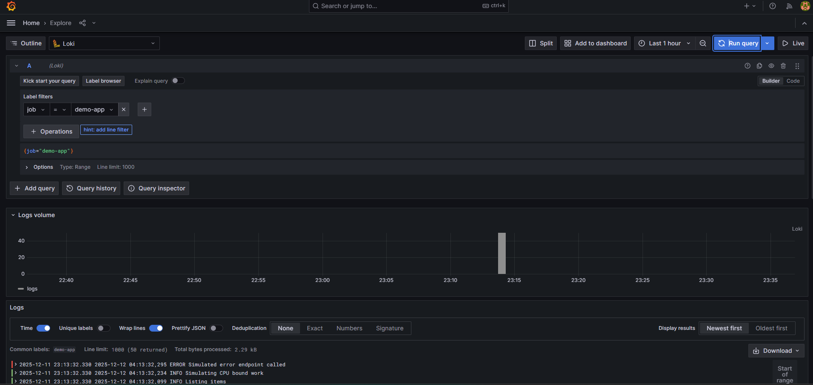
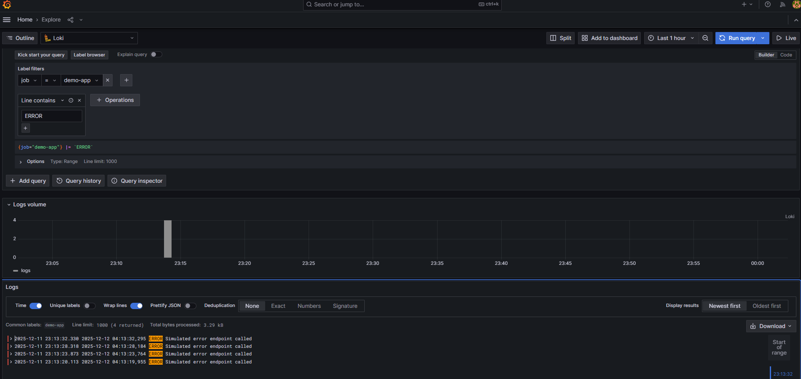
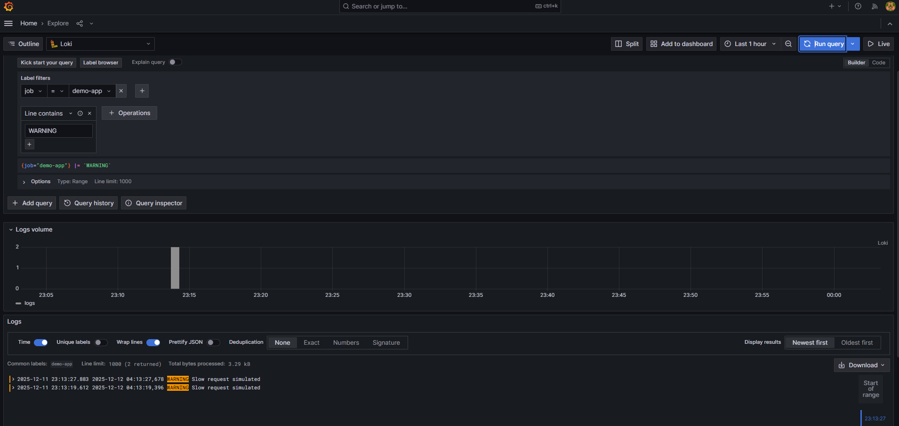
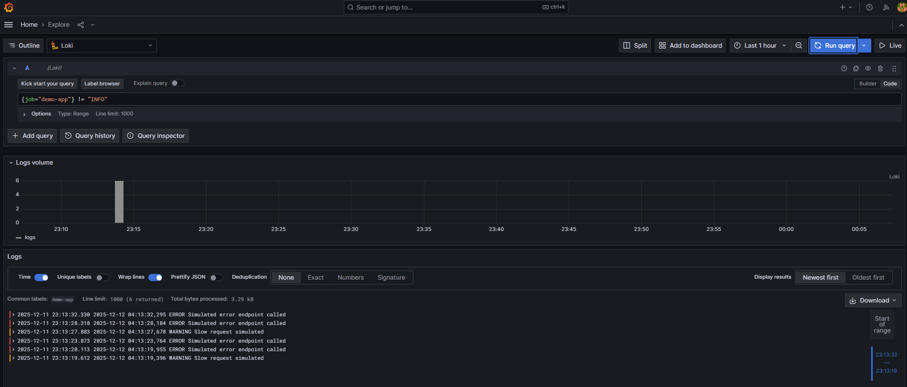

# Logs con Loki y LogQL

## Tarea C1 - Ver logs de la app

### Consulta básica

```logql
{job="demo-app"}
```



### Resultados observados

**Logs volume**: El gráfico muestra un pico de ~40-50 logs alrededor de las 23:15, correspondiente a la ejecución del script `demo-traffic.sh`.

**Ejemplos de líneas de log**:

```
2025-12-11 23:13:32.330 ERROR Simulated error endpoint called
2025-12-11 23:13:32.330 INFO Simulating CPU bound work
2025-12-11 23:13:32.099 INFO Listing items
```

### Labels identificados

Al explorar los logs, identifiqué los siguientes labels disponibles:
- `job="demo-app"`: Identifica el servicio/aplicación
- **Niveles de severidad observados**: ERROR, INFO
- **Endpoints que generan logs**: 
  - `/api/v1/error` (genera ERROR)
  - `/api/v1/work` (genera INFO sobre CPU)
  - `/api/v1/items` (genera INFO sobre listado)
  - `/healthz` (probablemente genera INFO sobre health checks)


## Tarea C2 - Filtrado por severidad y mensajes

### 1. Filtrar por nivel ERROR



**Resultado**: 4 líneas retornadas con logs de nivel ERROR

### 2. Filtrar por nivel WARNING



**Resultado**: 2 líneas retornadas con logs de nivel WARNING

**Observación**: La aplicación genera warnings para peticiones lentas, útil para detectar problemas de rendimiento.

### 3. Filtrar por nivel INFO



**Resultado**: 6 líneas retornadas con logs de nivel INFO

### Operadores LogQL utilizados

| Operador | Función | Ejemplo |
|----------|---------|---------|
| `|=` | Line contains (contiene texto) | `{job="demo-app"} |= "ERROR"` |
| `!=` | Line does not contain (no contiene) | `{job="demo-app"} != "INFO"` |
| `\|~ ` | Regex match | `{job="demo-app"} \|~ "ERROR\|WARNING"` |

### Ejemplo de línea de log completa

```
2025-12-11 23:13:32.330 2025-12-12 04:13:32.295 ERROR Simulated error endpoint called
```

**Estructura**:
- Timestamp de ingesta: `2025-12-11 23:13:32.330`
- Timestamp de generación: `2025-12-12 04:13:32.295`
- Nivel: `ERROR`
- Mensaje: `Simulated error endpoint called`

## Aplicación en DevSecOps

### 1. Detección de patrones de error

**Caso de uso**: Detectar errores recurrentes que indican problemas en producción.

**Consulta**:
```logql
{job="demo-app"} |= "ERROR"
```

**Acción**: 
- Crear alerta en Grafana si `count_over_time({job="demo-app"} |= "ERROR" [5m]) > 10`
- Notificar al equipo SRE/DevOps cuando hay más de 10 errores en 5 minutos

### 2. Monitoreo de rendimiento

**Caso de uso**: Identificar endpoints lentos que degradan la experiencia del usuario.

**Consulta**:
```logql
{job="demo-app"} |= "WARNING" |= "Slow request"
```

**Acción**:
- Correlacionar con métricas de latencia en Prometheus
- Investigar con trazas en Tempo para identificar el cuello de botella
- Optimizar el código o escalar recursos

