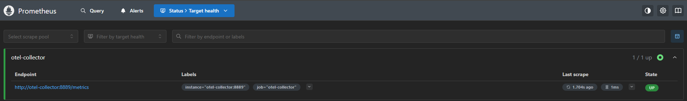
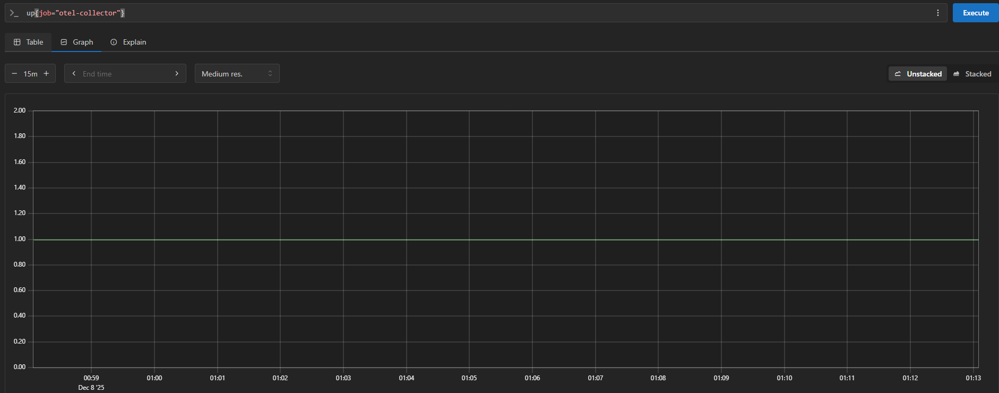
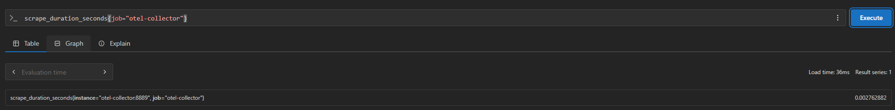
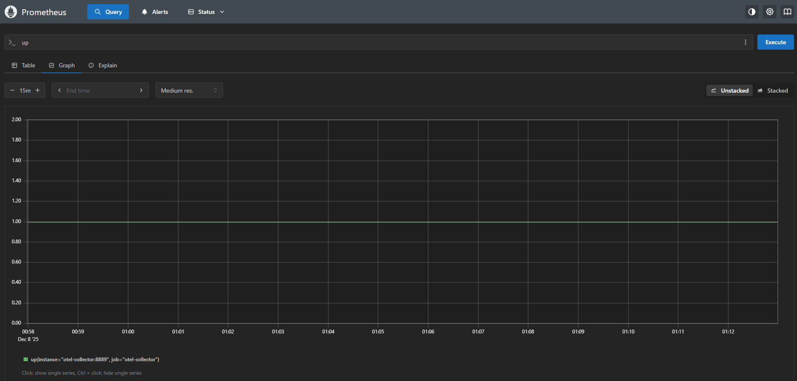
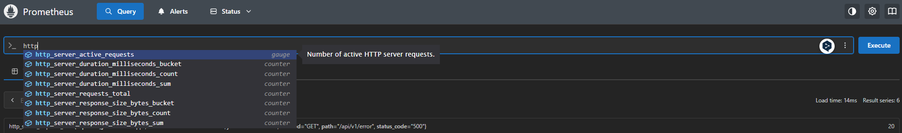
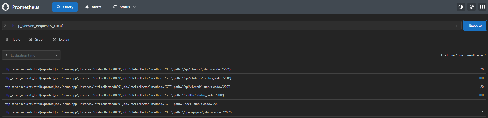
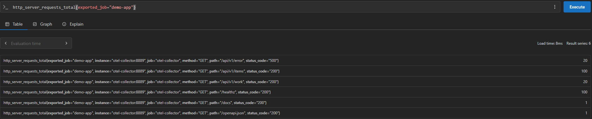
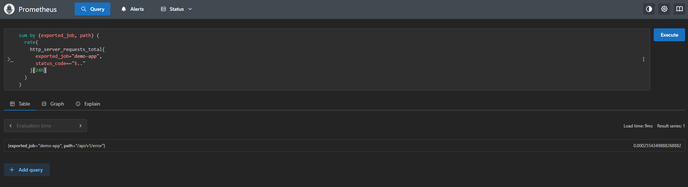

# Métricas con Prometheus y PromQL

Navegamos a **Status → Targets health** para verificar el estado de los targets monitoreados.



### Descripción del target

El target `otel-collector` aparece con estado **UP**, lo que confirma que Prometheus está scrapeando métricas correctamente del OpenTelemetry Collector.

**Detalles del target:**

- **Endpoint:** `http://otel-collector:8889/metrics`
- **State:** UP (1/1 up)
- **Labels:** 
  - `instance="otel-collector:8889"`
  - `job="otel-collector"`

### Explicación de labels

- **`job="otel-collector"`**

    El label `job` identifica el **tipo o grupo de servicios** que Prometheus está monitoreando. En este caso:
    - Es el nombre lógico asignado en la configuración de Prometheus (`prometheus.yml`)
    - Agrupa todos los targets relacionados con el OTEL Collector
    - Permite filtrar métricas específicas de este componente usando `{job="otel-collector"}`

- **`instance="otel-collector:8889"`**

    El label `instance` identifica la **instancia específica** del servicio siendo monitoreado:
    - `otel-collector` es el nombre del contenedor en la red Docker
    - `8889` es el puerto donde el OTEL Collector expone sus métricas en formato Prometheus
    - Útil cuando hay múltiples instancias del mismo job (por ejemplo, varias réplicas)

**¿Por qué son importantes estos labels?**

- Permiten consultas específicas como `up{job="otel-collector"}`
- Facilitan agrupar métricas por servicio o instancia
- Ayudan a identificar qué instancia específica está teniendo problemas
- Permiten monitorear múltiples instancias del mismo servicio

**Ejemplo de uso en PromQL:**

- Verificar que el collector esté activo
    ```promql
    up{job="otel-collector"}
    ```

    

    Y con `{job="otel-collector"}` vemos todas las métricas del collector.

- Ejemplo de métrica específica del collector
    ```promql
    scrape_duration_seconds{job="otel-collector"}
    ```

    

    Esta métrica muestra cuánto tiempo tarda Prometheus en scrapear las métricas del OTEL Collector (aproximadamente 0.002 segundos o 2ms).

## Tarea B2

1. Ejecutamos `up`.

    

    La métrica `up` es un indicador que representa el estado de disponibilidad de todos los targets monitoreados por Prometheus. Esta métrica es fundamental para el monitoreo de salud de la infraestructura. Permite detectar rápidamente si algún servicio deja de responder. En este caso, vemos que el target `otel-collector:8889` está UP (valor = 1).

2. Ejecutamos `up{job="otel-collector"}`.

    

    Igual que `up`, pero filtrada específicamente para el job `otel-collector`. Esto es útil cuando se monitorean múltiples servicios y solo queremos verificar el estado del OTEL Collector. 

3. Exploramos métricas que empiecen por `http`.

    - Al escribir `http` en el autocompletado, aparecen varias métricas relacionadas con peticiones HTTP
        

    - Hacemos la consuta:
        ```promql
        http_server_requests_total
        ```
        

        Es un contador acumulativo del número total de peticiones HTTP recibidas por la aplicación. Los counters solo pueden aumentar y se resetean cuando el servicio se reinicia.

    - Hacemos una consulta filtrada por servicio
        ```promql
        http_server_requests_total{exported_job="demo-app"}
        ```
        

        Filtramos específicamente las peticiones HTTP del servicio `demo-app`. Esto es útil cuando hay múltiples servicios instrumentados y queremos aislar las métricas de uno en particular.

        **Observamos:**

        - Todos los resultados corresponden al servicio `demo-app`
        - Podemos ver claramente la distribución de peticiones por endpoint
        - Los errores 500 están concentrados en `/api/v1/error` (endpoint de prueba)
        - Los health checks (`/healthz`) representan una parte significativa del tráfico

## Tarea B3 - Error Rate 5xx

1. **Consulta - Error rate**:

    Para esto previamente identifiqué mis labels reales.

    
   
    Esta consulta calcula la tasa de errores 5xx por segundo, agrupada por aplicación y endpoint.

2. **Simplificación realizada**:
   
   - **Paso 1**: Consulta base `http_server_requests_total` para identificar labels disponibles
   - **Paso 2**: Filtré solo errores 5xx: `http_server_requests_total{exported_job="demo-app", status_code=~"5.."}`
   - **Paso 3**: Apliqué `rate()` para calcular tasa de cambio: `rate(...[5m])`
   - **Paso 4**: Agrupé por servicio y endpoint con `sum by (exported_job, path)`

   **Labels reales identificados**:
   - `exported_job="demo-app"` (no `service_name`)
   - `status_code="500"` (no `http_status_code`)
   - `path="/api/v1/error"`, `method="GET"`, `instance`, `job`

### Mejores Prácticas

#### 1. Usar Counters para errores (no Gauges)
Los errores son eventos acumulativos, entonces usamos **counters**:
- Counters solo aumentan (o resetean en restart)
- Usar `rate()` para calcular tasas de cambio por segundo
- No usar gauges (valores que suben/bajan arbitrariamente)

#### 2. Normalizar nombres de métricas
Convención: `<namespace>_<subsystem>_<metric>_<unit>`
- Sí: `http_server_requests_total` (sufijo `_total` para counters)
- No: `httpServerRequests`, `requests_count`

#### 3. Labels significativos sin explotar cardinalidad
**Incluir**:
- `status_code`, `method`, `path`, `service` (valores finitos)

**Evitar**:
- `user_id`, `session_id`, `request_id` (millones de valores únicos)
- Paths dinámicos sin normalizar: usar `/api/users/{id}` en vez de `/api/users/12345`

Esto mantiene Prometheus eficiente y evita explosión de series temporales.