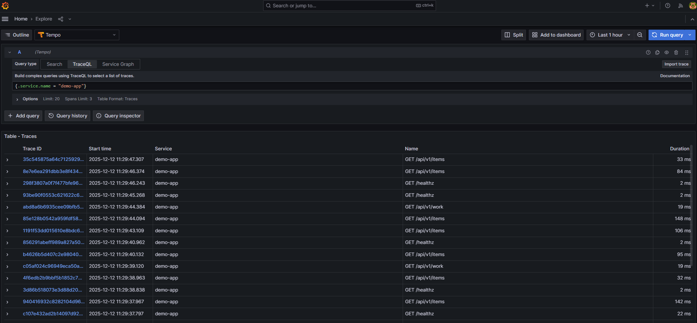
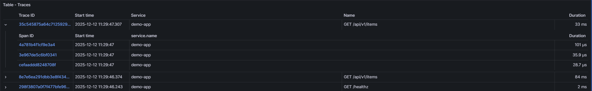
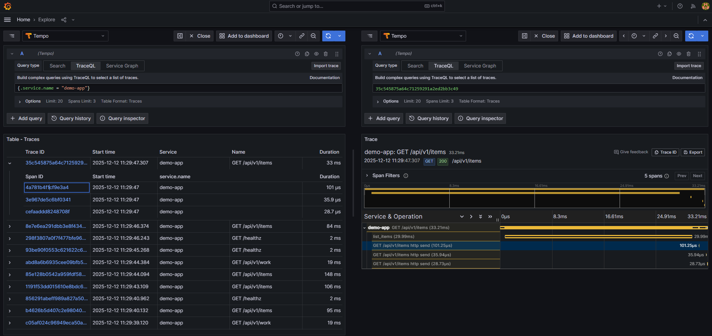
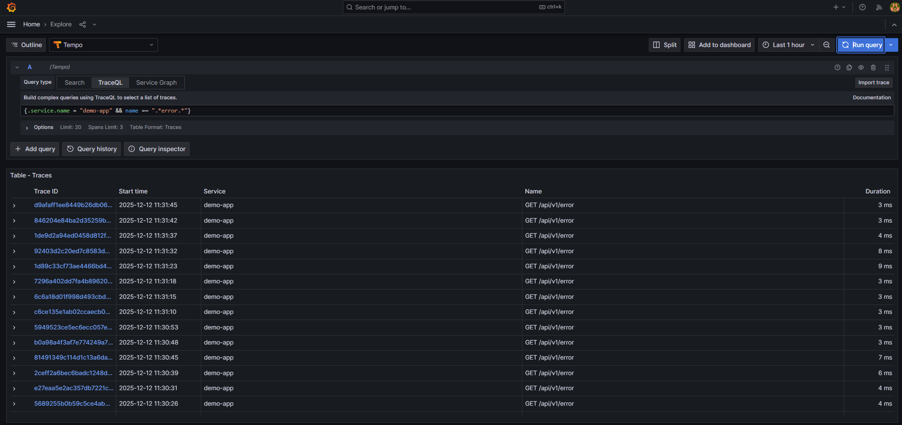
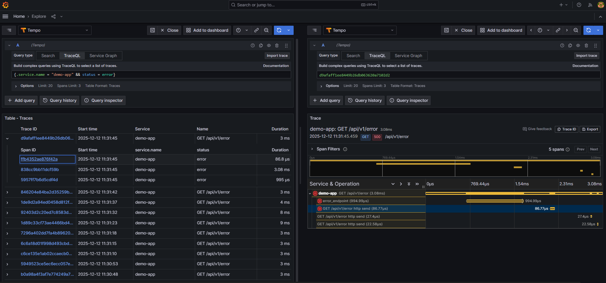

# Trazas con Tempo y TraceQL

## Tarea D1 - Búsqueda básica con TraceQL

### Consulta

**TraceQL**:
```traceql
{.service.name = "demo-app"}
```



**Resultado**: 20 trazas recuperadas del servicio `demo-app`.

### Vista detallada de una traza



**Estructura de la traza**:
- **Traza completa**: Representa una petición HTTP end-to-end
- **Spans**: Cada operación dentro de la traza (en este caso, un solo span para operaciones simples)
- **Timeline visual**: Muestra la duración relativa de cada span
- **Jerarquía**: Los spans pueden tener relaciones padre-hijo (parent-child)

### Atributos de un span



**Atributos clave identificados**:

| Atributo | Valor ejemplo | Descripción |
|----------|---------------|-------------|
| `http.method` | `GET` | Método HTTP de la petición |
| `http.target` o `http.route` | `/api/v1/items` | Endpoint llamado |
| `http.status_code` | `200` | Código de respuesta HTTP |
| `span.kind` | `SERVER` | Tipo de span |
| `service.name` | `demo-app` | Nombre del servicio |

## Tarea D2 - Trazas de errores

### Consultas TraceQL utilizadas

**1. Filtrar por nombre de operación**:
```traceql
{.service.name = "demo-app" && name =~ ".*error.*"}
```



**Resultado**: Todas las trazas cuyo nombre de operación contiene "error" (endpoint `/api/v1/error`).

**2. Filtrar por status error**:
```traceql
{.service.name = "demo-app" && status = error}
```


**Resultado**: Trazas que tienen status `error`, mostrando peticiones al endpoint `/api/v1/error`.

### Spans observados en trazas de error



**Estructura de la traza de error**:
- **Span raíz**: `GET /api/v1/error`
- **Span interno**: `error_endpoint` 
- **Span de HTTP send**: `GET /api/v1/error http send` 

**Atributos del span de error**:
- `http.status_code = 500`
- `status = error`
- `service.name = demo-app`
- Duración total: ~3ms

### Relación con logs y métricas

**Correlación de las 3 señales para `/api/v1/error`**:

| Señal | Qué muestra | Ejemplo |
|-------|-------------|---------|
| **Métrica (Prometheus)** | `http_server_requests_total{status_code="500"}` | Total acumulado: 20 errores |
| **Log (Loki)** | `{job="demo-app"} \|= "ERROR"` | Mensaje: "Simulated error endpoint called" |
| **Traza (Tempo)** | `{status = error}` | Duración: 3-9ms, status_code=500 |

**Flujo**:
1. **Prometheus alerta**: Error rate > umbral
2. **Tempo**: Buscar trazas específicas con `{status = error}` → obtener `trace_id`
3. **Loki**: Buscar logs con ese `trace_id` → ver contexto completo

### OpenTelemetry y propagación de contexto

**Trace ID y Span ID**:
- Cada traza tiene un `trace_id` único
- Cada span dentro de la traza tiene un `span_id` único
- Los spans se relacionan mediante `parent_span_id`

**Propagación de contexto**:
En arquitecturas distribuidas, el `trace_id` se propaga entre servicios mediante headers HTTP:
- `traceparent`: Contiene `version-trace_id-parent_span_id-flags`

**En esta aplicación**:
- OpenTelemetry instrumenta automáticamente FastAPI
- Cada petición HTTP genera una traza con múltiples spans
- Los spans se exportan al OTEL Collector -> Tempo

**Ventaja**: Si `demo-app` llamara a otros microservicios, todos compartirían el mismo `trace_id`, permitiendo seguir la petición completa end-to-end.