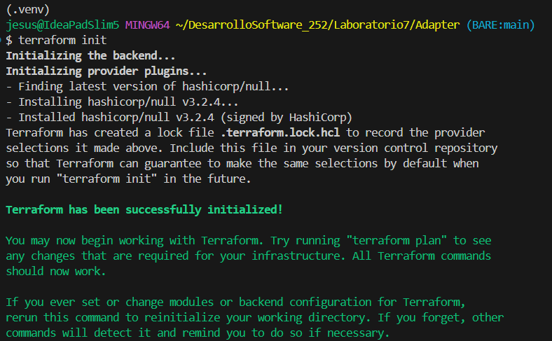
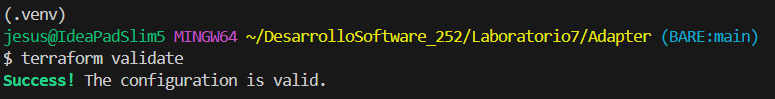
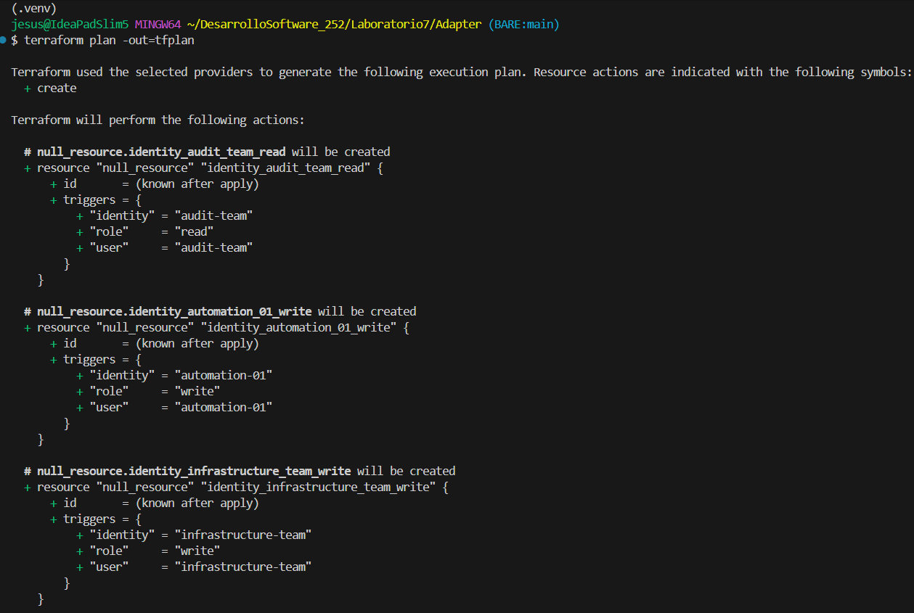
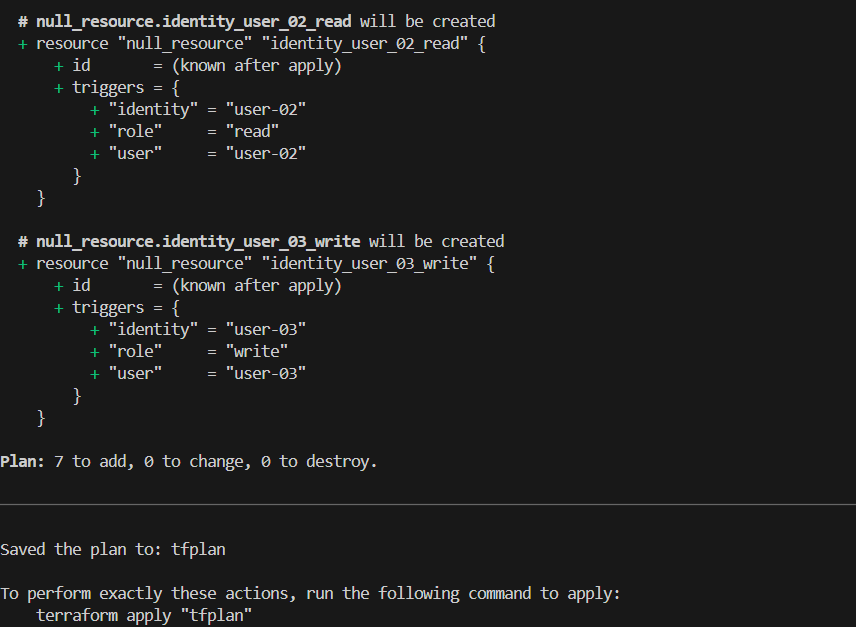
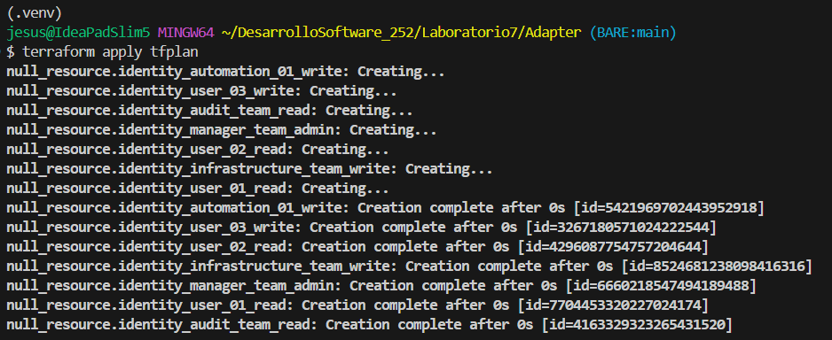
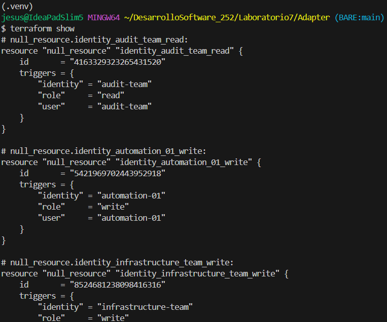
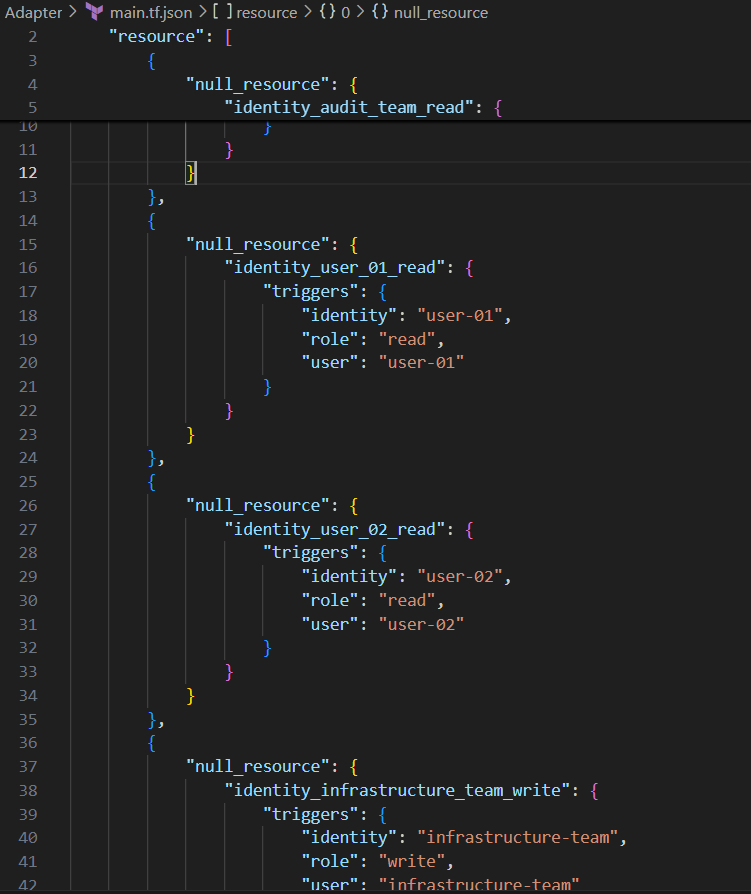
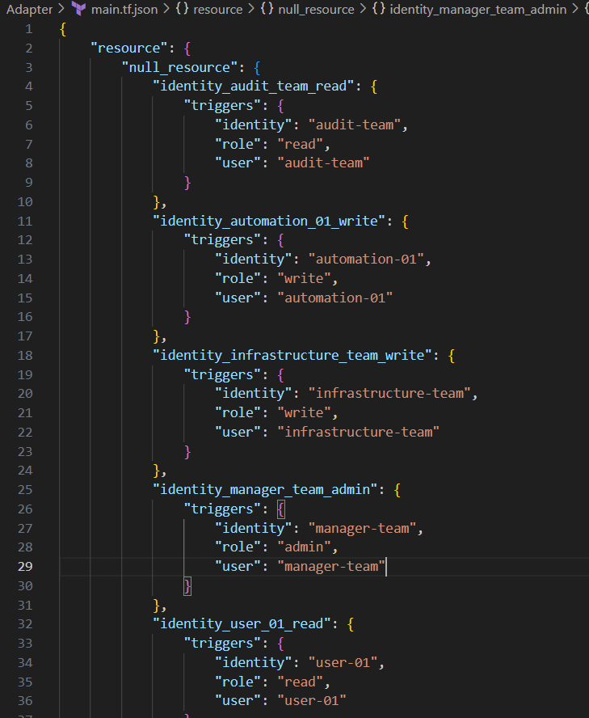
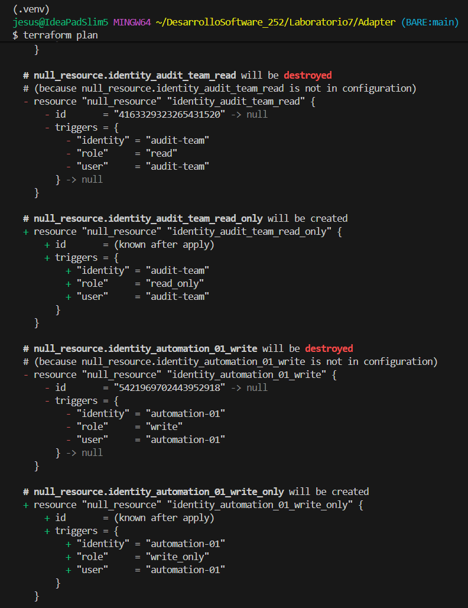

# Patrón Adapter para IaC local con Terraform

## **Flujo de trabajo y comandos de Terraform**

1. **Generar configuración**

   ```bash
   python main.py
   ```

   Genera `main.tf.json` con 7 recursos `null_resource`.

2. **Inicializar Terraform**

   

   Descarga el proveedor `hashicorp/null` y crea los plugins.

3. **Validar configuración**

   

   Verifica estructura JSON válida y tipos de datos correctos.

4. **Planificar**

   

   

   Muestra los 7 recursos a crear y detalla cada `null_resource` con sus triggers (user, identity, role). Genera `tfplan` con el plan de ejecución.

5. **Aplicar**

   

   Crea 7 recursos null_resource. Es una operación instantánea, no hace nada real.  
   Genera un `terraform.tfstate` con el estado actual y registra los triggers de cada recurso en el estado.

6. **Revisar estado**

   

   Muestra el contenido de `terraform.tfstate` e incluye todos los recursos con sus atributos y triggers.

> Optimizamos la generación de la estructura del JSON

Si bien el `main.py` es aceptado por Terraform no es el más óptimo ya que se repite el `null_resource` en cada elemento del array y esto es una redundancia innecesaria.

   

Optimizamos esto para que un solo `null_resource` agrupe todos los recursos, esto es más limpio y compacto y sigue el estándar de Terraform.

   

## **Ejercicios teóricos y prácticos**

1. Describe cómo garantizarías la validez del contrato `outputs()` en un proyecto con tres adaptadores distintos (por ejemplo, para GCP, AWS y fichero CSV). Indica qué pruebas unitarias escribirías para verificar que cada adaptador cumple su interfaz.

   - La estrategia de validación del contrato sería crear una clase base abstracta o interfaz que defina el contrato `outputs()` y que todos los adaptadores hereden de ella. Luego, implementar una suite de pruebas común que se ejecute sobre cualquier adaptador independientemente de su implementación interna. Esta suite verifica tanto aspectos estructurales (tipo de dato, longitud de tuplas) como semánticos (valores válidos, consistencia con metadatos originales). 

      Pruebas unitarias necesarias:

      1. **Test de tipo de retorno**: Verificar que outputs() devuelve una lista
      2. **Test de estructura de tuplas**: Cada elemento debe ser tupla de 3 strings
      3. **Test de no vacío**: Al menos debe haber un elemento si hay metadatos
      4. **Test de unicidad**: No debe haber tuplas duplicadas
      5. **Test de valores válidos**: Los roles deben ser del conjunto permitido (read, write, admin)


2. Analiza la complejidad temporal y espacial de `LocalIdentityAdapter` y de `LocalProjectUsers` en función del número de roles $R$ y usuarios $U$. ¿Cómo escalaría el sistema si duplicas el módulo de metadatos original?

   - La complejidad temporal de `LocalIdentityAdapter` es **O(R * U)**.
      
      - Itera sobre R roles (diccionario `metadata`)
      - Por cada rol, itera sobre U usuarios promedio
   
   - La complejidad espacial de `LocalIdentityAdapter` es **O(R * U)**.
      
      - Almacena lista `local_users` con todas las tuplan
      - Cada tupla ocupa espacio constante
   
   - La complejidad temporal de `LocalProjectUsers` es **O(n)**.
      
      - Itera una sola vez sobre `self._users` (ya procesados por el adapter)
      - Por cada tupla crea un diccionario
   
   - La complejidad espacial de `LocalProjectUsers` es **O(n)**.
      
      - Crea una estructura de diccionario por cada usuario
      - Cada diccionario contiene los triggers
   
   **Escalabilidad al duplicar metadatos**

   Si duplicamos los metadatos (2R roles o 2U usuarios):

   - Tiempo de ejecución: Se duplica linealmente (2 × O(R × U))
   - Memoria utilizada: Se duplica linealmente (2 × O(R × U))
   - Archivo JSON generado: Tamaño se duplica
   - Terraform: Plan y apply se vuelven más lentos proporcionalmente
      

3. Propón un adaptador para exportar los mismos metadatos a un archivo YAML en lugar de JSON para Terraform. Define la clase, los métodos y el contrato que debe respetar.
   
   > `yaml_builder.py` 

   La clase `YAMLProjectUsers` el cual transforma las mismas tuplas `(user, identity, role)` a formato YAML válido para Terraform. Los métodos necesarios serían:

   1. `__init__(users)`: Recibe la lista de tuplas del adapter
   2. `_build()`: Construye la estructura de datos para YAML (idéntica a la de JSON)
   3. `export(filename)`: Escribe el archivo YAML usando librería pyyaml

   La venta de esto es que `LocalIdentityAdapter` no cambia. Solo se crea un nuevo constructor de recursos que consume el mismo `outputs()`. Esto demuestra la composabilidad del patrón Adapter: separamos la transformación de datos (adapter) de la serialización (constructor).

4. Crea un nuevo adaptador `AWSIdentityAdapter` que transforme el diccionario de `access.Infrastructure().resources` en una lista de tuplas `(user, arn, policy)` y genere un `main.tf.json` con recursos `aws_iam_user` y `aws_iam_policy_attachment` usando `null_resource` para simular la asignación de políticas.

   - Diseño de nuestro `AWSIdentityAdapter`

      Transformación requerida:

      - Entrada: `{'read': ['user-01'], 'write': ['user-02'], 'admin': ['user-03']}`
      - Salida: Lista de tuplas `(user, arn, policy)`

   - Estructura del adaptador

      Clase: `AWSIdentityAdapter`

      Método `__init__`:

      - Recibe diccionario de metadatos
      - Mapea roles a ARNs de políticas AWS
      - Genera tuplas (user, arn_del_user, policy_arn)

      Método `outputs()`:

      - Devuelve lista de tuplas respetando el contrato
      - Formato: `('user-01', 'arn:aws:iam::123456789:user/user-01', 'arn:aws:iam::aws:policy/ReadOnlyAccess')`

   - Constructor de recursos AWS

   Clase: `AWSProjectUsers`

   Recursos a generar con `null_resource`:

      1. Simulación de `aws_iam_user`:

         - Triggers: `user_name`, `arn`

      2. Simulación de `aws_iam_policy_attachment`:

         - Triggers: `user`, `policy_arn` 

   >  Usamos `null_resource` porque es simulación local, no conectamos a AWS real

   Nota: Usamos null_resource porque es simulación local, no conectamos a AWS real

5. Introduce deliberadamente un error en el mapeo de roles (por ejemplo, `read` -> `read_only` en `LocalIdentityAdapter`). Ejecuta Terraform `validate` y `plan` para observar y documentar el fallo.

   Al hacer el cambio los roles `read`, `write`, `admin` se transforman en `read_only`, `write_only`, `admin_only`

   

   - Esto pasa porque `null_resource` acepta cualquier valor en triggers
   - No hay validación de valores permitidos
   - Terraform no conoce tu lógica de negocio (qué roles son válidos)
   - El plan se ejecuta sin errores

   **Problema real**

   El error no es detectado por Terraform porque:

   1. Los metadatos originales (access.py) dicen read, pero el adapter genera read_only
   2. No hay tests que verifiquen la consistencia
   3. El sistema funciona técnicamente, pero con datos incorrectos

6. Configura un pipeline sencillo (por ejemplo, con GitHub Actions) que automatice:

   * Ejecución de `python main.py` para regenerar `main.tf.json`.
   * Comandos `terraform validate` y `terraform plan`.
   * Reporte de errores en caso de validación o planificación fallida.

