# Patrón Facade para IaC local con Terraform

## Configuración

1. **Genera los archivos JSON**:

   ```bash
   python main.py
   ```
   Este script de Python generará tres archivos en el directorio:

   - `provider.tf.json`
   - `bucket.tf.json`
   - `bucket_access.tf.json`

2. **Inicializa Terraform**:

   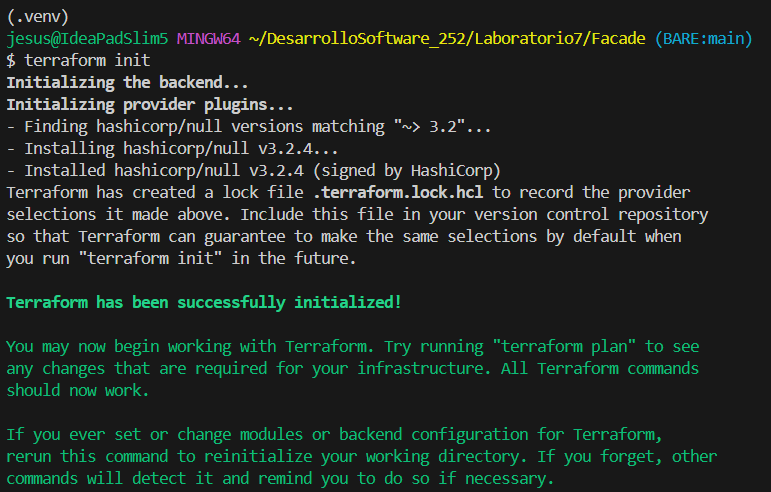

   - Terraform leerá el archivo `provider.tf.json`.
   - Descargará e instalará el proveedor `hashicorp/null` en un nuevo directorio llamado .terraform.

3. **Revisa el plan**:

   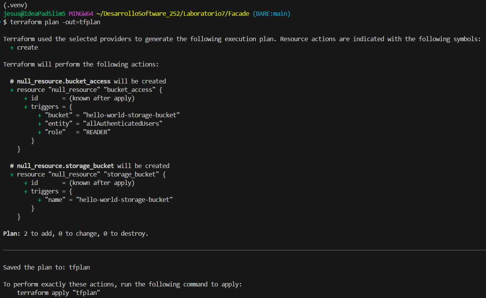

   - Terraform leerá todos los archivos `.tf.json`.
   - Determinará que necesita crear dos nuevos recursos (ya que no existen en el estado de Terraform).

4. **Aplica los cambios**:

   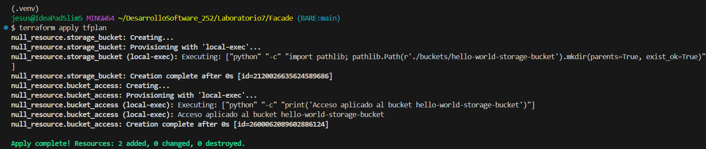

   - Terraform ejecutará el plan guardado. Lo hará en el orden correcto debido al `depends_on`.
      - Se crea `null_resource.storage_bucket`. Esto dispara (triggers) su `provisioner "local-exec"`.
      - Una vez completado el paso anterior, se crea `null_resource.bucket_access`. Esto dispara su propio provisioner.

5. **Destruye los recursos** (opcional):

   ```bash
   terraform destroy
   ```

   - Terraform eliminará los dos recursos (`null_resource.storage_bucket` y `null_resource.bucket_access`) de su archivo de estado.

## Ejercicios teóricos

1. **Comparativa de patrones**

   1. Describe las responsabilidades de cada patrón.

      - **Patrón Facade**

         El objetivo es proveer una interfaz unificada y simple a un conjunto de interfaces en un subsistema complejo.

         - Cliente: StorageBucketAccessModule

            - Responsabilidad: Necesita interactuar con el subsistema (el bucket), pero no quiere (ni debe) conocer su complejidad interna.

            - Se comunica únicamente con el `Facade`.

         - Facade: El método `outputs()` de `StorageBucketModule`

            - Responsabilidad: Es el punto de entrada simplificado.

            - Conoce los componentes del subsistema (la lógica interna de `StorageBucketModule`).

            - Recibe las peticiones del `Cliente` (la llamada a `outputs()`) y las delega a los componentes correctos del subsistema (la lógica que genera el `self.name`).

         - Subsystem_Classes: La lógica interna de `__init__` y `resource()` de `StorageBucketModule`

            - Responsabilidad: Implementan la funcionalidad real y compleja (lógica de nombres, creación de carpetas, etc.).

            - No tienen ninguna referencia o conocimiento del `Facade`. Son independientes.

      - **Patrón Adapter**

      El objetivo es convertir la interfaz de una clase en otra interfaz que el cliente espera, permitiendo que clases con interfaces incompatibles trabajen juntas.

      - Cliente

         - Está diseñado para trabajar con una interfaz específica, llamada `Target`.

      - Target

         - Define la interfaz que el `Cliente` entiende y espera usar.

      - Adaptee (Incompatible)

         - Es la clase existente que tiene la funcionalidad que necesitamos, pero su interfaz es incompatible con la interfaz Target.

      - Adapter (Traductor)

         - Es el intermediario.
         - Implementa la interfaz `Target`, para que el Cliente pueda hablar con él.
         - Recibe llamadas del `Cliente` (en formato `Target`) y las traduce a llamadas que el `Adaptee` entiende.

   2. Explica por qué elegimos Facade para desacoplar módulos de Terraform y Python en lugar de, por ejemplo, Adapter.

      Elegimos Facade porque nuestro objetivo es simplificar, no traducir.  
      El módulo `StorageBucketModule` tiene una lógica interna (cómo construye el nombre, dónde crea la carpeta, el uso de `null_resource`). El módulo `StorageBucketAccessModule` no necesita saber nada de esto; solo le interesa el resultado final: el nombre del bucket. La solución para esto es usar **Facade**, ya que el método `outputs()` actúa como una "fachada" que oculta toda esa complejidad interna y presenta una API limpia y simple: `{"name": "..."}`.  
      
      No usamos Adapter porque no estamos en un escenario donde `StorageBucketAccessModule` espere una interfaz (`get_bucket_id()`) y `StorageBucketModule` provea otra incompatible (`fetch_name_string()`). No estamos traduciendo interfaces incompatibles. Estamos diseñando una interfaz simple (`outputs`) para ocultar la complejidad de un subsistema (`StorageBucketModule`).

   3. Discute los pros y contras de usar Facade en IaC a gran escala (mantenimiento, legibilidad, potencial de acoplamiento).

      **Pros**  

      - Mantenimiento y Refactorización: Este es el mayor beneficio. Podemos cambiar completamente la implementación de un módulo (por ejemplo, cambiar de local-exec a un proveedor real de AWS, GCP o Azure) y, mientras el contrato del Facade (los outputs) se respete, ninguno de los módulos consumidores se romperá.

      - Legibilidad y Abstracción: Los equipos que consumen los módulos no necesitan entender la complejidad interna. Solo ven las salidas relevantes (outputs), lo que hace que el código de alto nivel sea mucho más limpio y fácil de entender.

      - Desacoplamiento: Reduce la dependencia directa entre módulos. Los módulos consumidores dependen de la "abstracción" (el facade), no de la "implementación" (los recursos internos del módulo), alineándose con el Principio de Inversión de Dependencias.

      **Contras**  

      - Riesgo de God Object: A medida que el módulo crece, el Facade (outputs) puede empezar a exponer docenas de valores, volviéndose tan complejo como el subsistema que intentaba ocultar. Esto anula el beneficio de la simplificación.

      - Punto Crítico de Acoplamiento: Aunque desacopla la implementación, acopla fuertemente a los consumidores al contrato del Facade. Como sugiere el ejercicio 3, si necesitamos renombrar un campo en el outputs (name a bucket_name), tenemos que actualizar todos los módulos que lo consumen.

      - Ocultamiento Excesivo: Un facade puede simplificar tanto las cosas que oculta detalles importantes, como el costo o el impacto de rendimiento de crear un recurso. Un equipo podría pensar que "llamar al facade del bucket" es una operación ligera, cuando en realidad podría estar creando un recurso complejo y costoso.

2. **Principio de inversión de dependencias**

   1. Señala en el código dado cuáles son las "abstracciones".

      - El Facade (el `dict` de outputs): Esta es la abstracción principal y más importante.

         - El módulo `StorageBucketAccessModule` (un módulo de alto nivel en esta relación) no depende de la clase `StorageBucketModule` (el módulo de bajo nivel).

         - En su lugar, `StorageBucketAccessModule` depende del diccionario que devuelve el método `outputs()`. Específicamente, depende de que ese diccionario tenga una clave `"name"`.

         - Este dict (`{"name": ...}`) actúa como una interfaz simple. `StorageBucketModule` depende de esta abstracción (porque debe implementarla en `outputs()`) y `StorageBucketAccessModule` también depende de ella (porque la consume). Esto cumple perfectamente con el DIP.

   2. Propón una refactorización que invierta aún más las dependencias (por ejemplo, inyectando el intérprete "python" como parámetro).

      Como se sugiere en las instrucciones, podemos "invertir" la dependencia del intérprete de Python, que actualmente está "hardcodeado" (codificado de forma fija) dentro de los módulos.

      - Modificamos `StorageBucketModule`, cambiamos el `__init__` para aceptar un `interpreter_path` y lo usamos en `resource()`:

         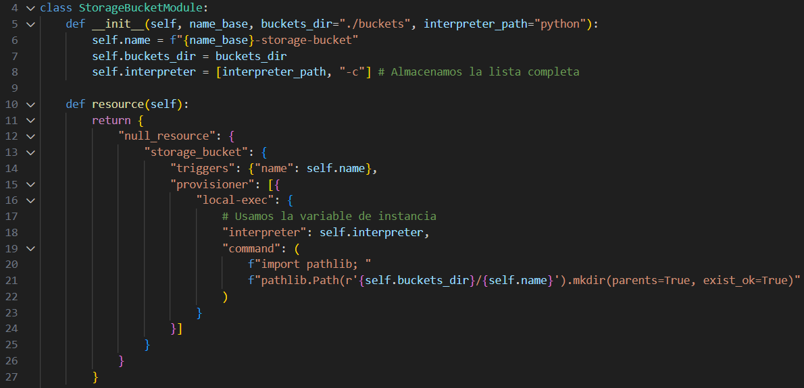

      - Modificamos `StorageBucketAccessModule`, hacemos lo mismo que en la función anterior.

         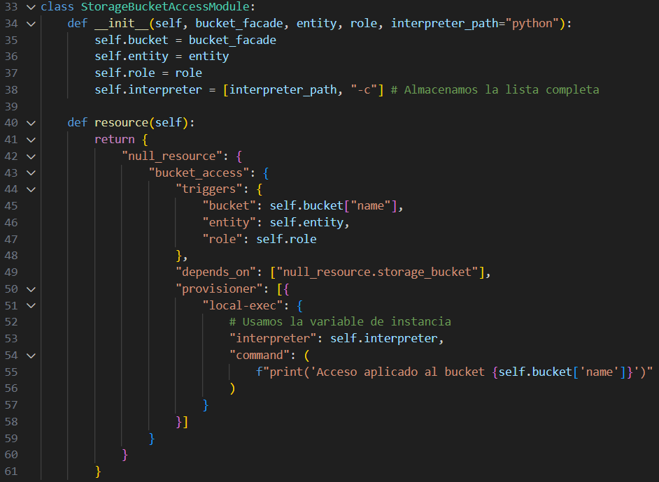

      - Actualizamos `main.py` (el "Inyector"), el bloque principal (`main`) ahora toma la responsabilidad de definir qué intérprete usar.

         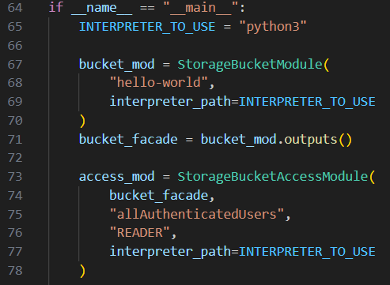

   3. Justifica cómo tu cambio mejora (o no) la adherencia al DIP.

      - Antes:
         - Los módulos de bajo nivel (`StorageBucketModule`, `StorageBucketAccessModule`) dependían de un detalle concreto: la cadena "python".
         - El módulo de alto nivel (`main`) no tenía control sobre este detalle. La dependencia estaba oculta y fija en el nivel inferior.

      - Ahora:
         - Invertimos la dependencia. Ahora, los módulos de bajo nivel ya no dependen del detalle concreto "python". En su lugar, dependen de una abstracción: la variable `interpreter_path` que se les pasa en el constructor.
         - El detalle (`INTERPRETER_TO_USE = "python3"`) se ha movido hacia arriba, al módulo de alto nivel (`main`).
         - Esto es una inyección de dependencias clásica. El módulo de alto nivel (el "ensamblador" en `main`) controla la política (el detalle) y se la inyecta a los módulos de bajo nivel, que ahora solo dependen de la abstracción que se les pasa.

      Este cambio mejora drásticamente la adherencia al DIP, haciendo que los módulos sean más flexibles, reutilizables y fáciles de probar.

3. **Escalabilidad y mantenimiento**

   1. Imagina 10 módulos de alto nivel que consumen el mismo facade del bucket (`name`, `path`, `region`, `labels`, etc.). 

   2. Describe el problema de "explosión de referencias" al renombrar un campo.

      Imaginemos el escenario, tenemos 10 módulos de alto nivel (ej. `vm-instance`, `load-balancer`, `logging-sink`, `backup-policy`, etc.) que consumen el Facade de tu módulo `bucket`.  
      El Facade actual es `{"name": "...", "path": "...", "region": "...", "labels": "..."}`.  
      Ahora el equipo decide que, por coherencia de nombrado, la clave `"name"` debe llamarse `"bucket_name"`.  

      El problema, al cambiar `"name"` por `"bucket_name"` en el `outputs()` del módulo `bucket`:

      1. Los 10 módulos consumidores, que esperaban acceder a `module.bucket.name`, fallarán instantáneamente.
      2. Debemos encontrar y reemplazar cada una de las referencias a `module.bucket.name` por `module.bucket.bucket_name` en los 10 módulos.
      3. Esto demuestra que, aunque el Facade desacopla la implementación, acopla fuertemente al contrato (la estructura y nombres de clave del outputs).

      A esto se le llama explosión de referencias. Un simple cambio de nombre en el proveedor (el Facade) provoca una ola de cambios en todos los consumidores.

   3. Propón dos alternativas arquitectónicas (por ejemplo, subdividir el facade o introducir otro nivel de API interna) y di en qué casos usarías cada una.

      1. Subdividir el Facade

         Esta solución se inspira en el Principio de Segregación de Interfaces (ISP) de SOLID. En lugar de tener un solo Facade "gigante" que lo devuelve todo, creas varios outputs más pequeños y específicos.  

         En lugar de un único `outputs()`, el módulo bucket expondría múltiples outputs agrupados por caso de uso.
         - `output "identity"`: Devuelve `{"name": "...", "id": "..."}`
         - `output "location"`: Devuelve `{"path": "...", "region": "..."}`
         - `output "metadata":` Devuelve `{"labels": "...", "created_at": "..."}`

         Los módulos consumidores solo accederían al output específico que necesitan.

         **¿Cuándo usarla?**

         - Cuando tenemos tipos de consumidores muy diferentes. Por ejemplo, un módulo de redes solo necesita la location, mientras que un módulo de auditoría solo necesita los metadata.
         - Si un consumidor solo necesita saber el nombre, no debería verse forzado a "re-ejecutarse" (como con los triggers de Terraform) solo porque las labels(que no usa) cambiaron.

      2. Introducir una API Interna

         Esta solución introduce otro nivel de indirección, creando una "API" interna.  

         En lugar de que los 10 módulos consuman el Facade del bucket directamente, consumen un nuevo módulo intermedio llamado data_api o core_services. Si ahora necesitamos renombrar "name" a "bucket_name" en el módulo bucket:

         1. Cambiamos el `outputs()` del bucket.
         2. Actualizamos el módulo `data_api`, para que `std_bucket_name` ahora apunte a `module.bucket.bucket_name`.
         3. Ninguno de los 10 módulos consumidores necesita cambiarse, porque ellos siguen leyendo de `module.data_api.std_bucket_name`.

         **¿Cuándo usarla?**

         - Cuando tenemos muchos equipos consumiendo recursos centrales. Este módulo `data_api` se convierte en el "Contrato de Servicio" oficial para toda la organización.
         - Es ideal cuando los módulos centrales (como el bucket) cambian con frecuencia, pero queremos proteger a los equipos de aplicación (los consumidores) de esa volatilidad. Actúa como un amortiguador de cambios.

#### Ejercicios prácticos

4. **Extensión de Facade**

   1. Modifica `StorageBucketModule.outputs()` para devolver `{ "name", "path", "created_at" }`.

      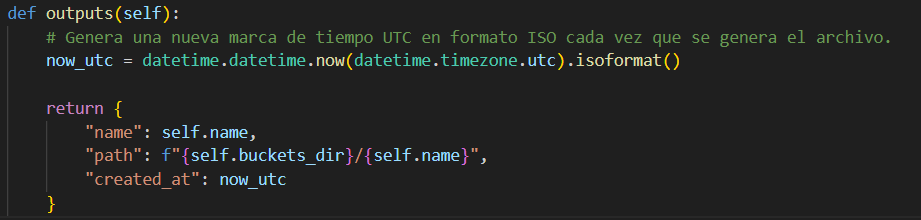

   2. Ajusta `StorageBucketAccessModule` para que imprima también la ruta y la fecha.

      Actualizamos el módulo de acceso para que reaccione a los nuevos campos en sus triggers y los imprima.

      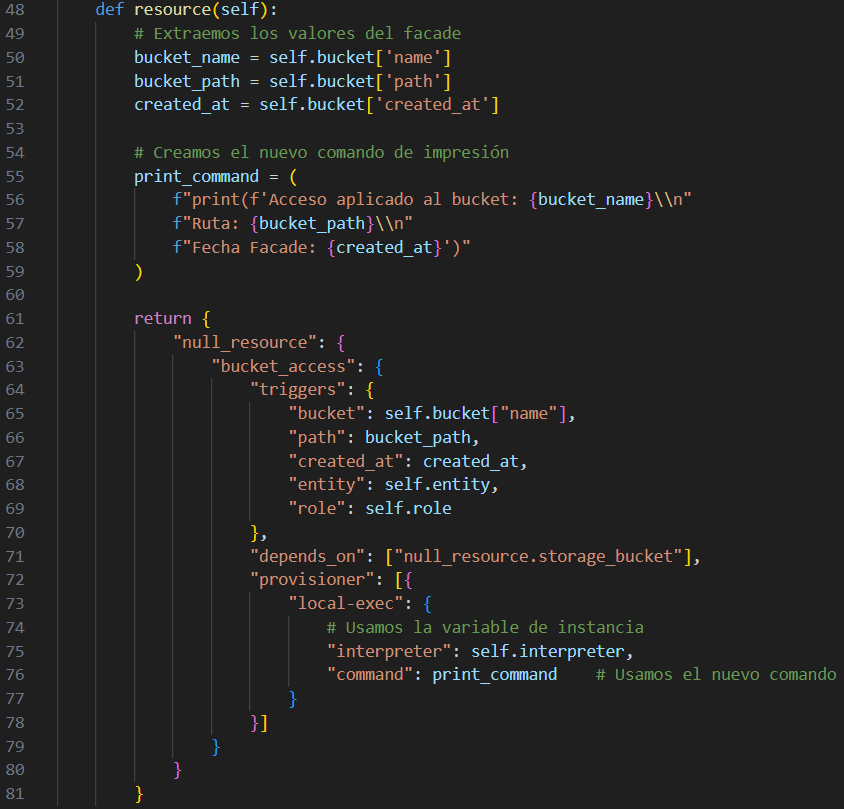

   3. Ejecuta Terraform y verifica que los triggers reaccionen a cambios en `created_at`.

      Terraform nos dice que `null_resource.bucket_access must be replaced` debe ser reemplazado. Ya que la primera vez que aplicamos después de modificar `main.py`, los triggers de este recurso cambiaron.

      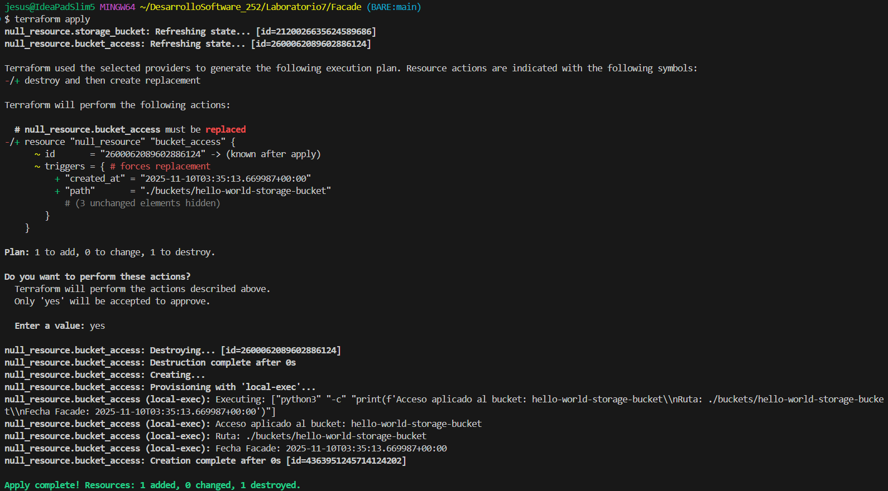

      Ejecutamos nuevamente `main.py` para regenerar los archivos `tf.json`. Luego ejecutamos `terraform plan` y nos dice nuevamente lo mismo que la imagen anterior.

      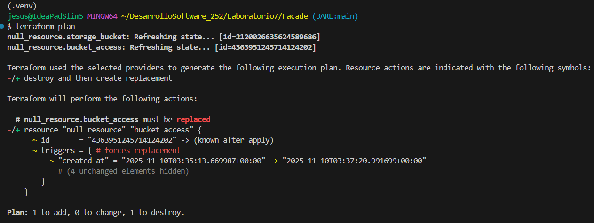

5. **Nuevo módulo de logging**

   1. Crea `LoggingModule` en Python con método `resource()` que use `local-exec` para escribir en `logs/iac.log`.
   2. Haz que dependa de `bucket_access` mediante `depends_on`.
   3. Integra todo en `main.py` y prueba el flujo completo con `terraform apply`.

      Nos muestra que tiene que hacer reemplazos como en el anterior ejercicio, pero lo más importante es que terraform nos muestra `null_resource.iac_logging will be created` ya que esta es la primera vez que Terraform ve este recurso. El archivo `logging.tf.json` es nuevo, por lo que planea crearlo desde cero.

      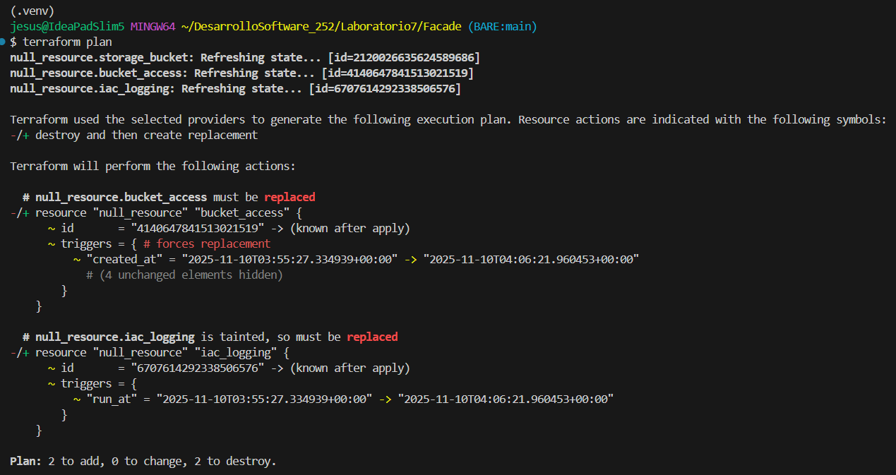

      Terraform realizará esas acciones en el orden correcto debido al depends_on.

      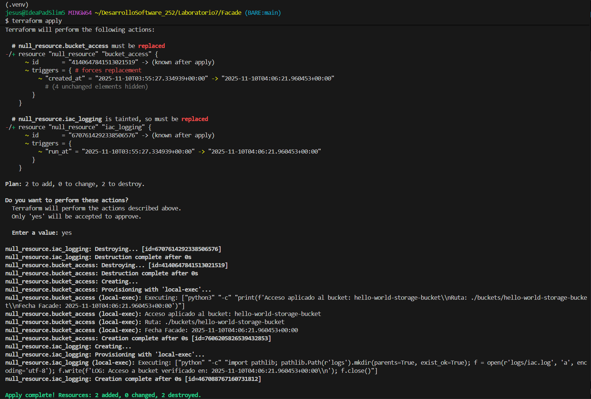

6. **Pruebas automatizadas de IaC**

   1. Escribe un pequeño script de Python (o pytest) que, tras generar los JSON, valide:

        * Que `bucket.tf.json` tiene "resource.null_resource.storage_bucket".
        * Que `bucket_access.tf.json` incluye `depends_on` apuntando a `"null_resource.storage_bucket"`.
   2. Añade un test que modifique el nombre base y compruebe que los triggers cambian correctamente.

      Se creó el archivo `test_iac_generator.py`. Este script no ejecutará terraform, sino que probará la lógica del `main.py` para asegurar que los diccionarios de Python (que luego se convierten en JSON) se generan con la estructura y dependencias correctas.

      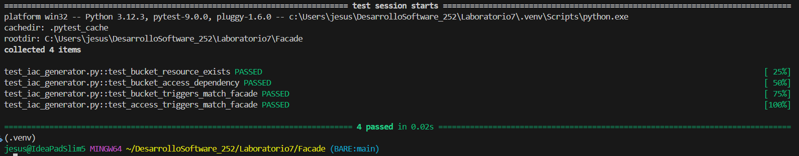

     3. Documenta cómo integrar estas pruebas en un pipeline CI (por ejemplo, GitHub Actions).


