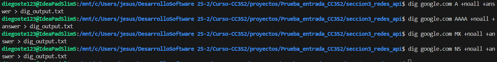

# Jesus Diego Osorio Tello - Prueba de entrada 25-2

## Sección 1 - CLI y Automatización

Para esta sección solo me falta instalar los paquetes de dig y jq. Así que usé los comandos siguientes comandos en WSL:

```bash
sudo apt install dnsutils
sudo apt install jq
```

Con estos paquetes instalados, se me generó correctamente los `reports/` de esta sección. 

## Sección 2 - Python + Tests y Git

### Test


Logré implementar correctamente la función `summarize`, obteniendo así la salida esperada. 
Posteriomente implementé 6 tests más para lograr el 70% de cobertura como mínimo, pero logré solo un 59% ya que la cobertura de las lineas `39-60` solo se logra ejecutando el script como programa, no desde pytest. Si se quisera cubrir el CLI con tests, deberíamos usar el módulo subprocess o pytest con capsys para simular la ejecución del script, pero de mi parte no opté a realizarlo porque aún no conozco mucho acerca de ello.

### Git

Para git, al ser un repositorio clonado, al usar git log me salía el historial del profer Cesar Lara y por lo tanto opté por no realizar nuevamente desde 0 una creación de una carpeta .git con ramas, etc.. Pero igualmente explicaré brevemente Merge FF vs Rebase vs Cherry-pick.

| Método       | Qué hace                                        | Resultado en historial             | Uso principal                               |
|--------------|------------------------------------------------|---------------------------------|---------------------------------------------|
| Merge Fast-Forward   | Avanza la rama destino si es lineal, sin nuevo commit  | Historial lineal sin commit merge | Integrar cambios en ramas sin conflictos    |
| Rebase       | Reaplica commits encima de otra rama            | Historial limpio y lineal, sin commits merge | Actualizar ramas o limpiar historial antes de merge |
| Cherry-pick  | Aplica commits específicos a otra rama          | Nuevos commits duplicados         | Traer cambios puntuales sin fusionar ramas completas |

## Sección 3 - Redes, HTTP/TLS y API

Presenté un probema al ejecutar 
```bash
dig google.com ANY +noall +answer > dig_output.txt
```
ya que no me devolvía nada, y esto es algo normal ya que muchos servidores DNS modernos bloquean consultas ANY por seguridad.  
Así que opté por realizar consultas específicas.

Donde el contenido se observa en `dig_output.txt` así como todo lo requerido en esta sección.

### Sección 3.2 - API + jq

**Content-Type header:** `application/json; charset=utf-8`

La API devuelve datos en formato JSON con codificación UTF-8.